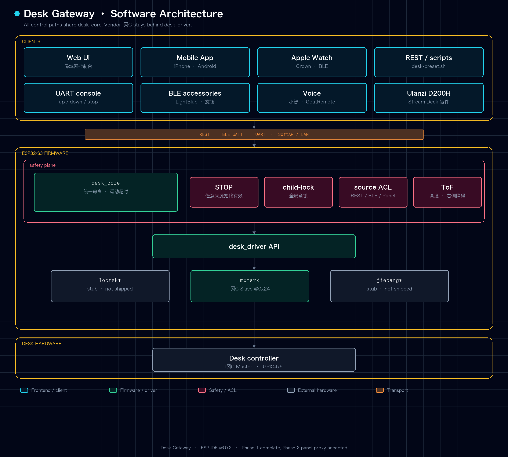
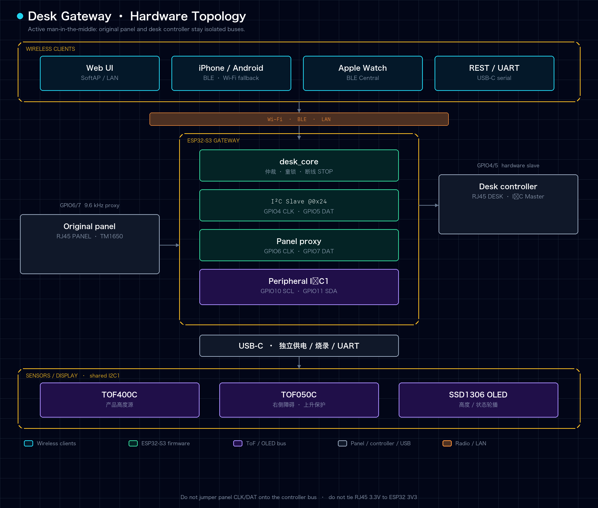

# Desk Gateway

**Language:** English · [简体中文](./README.zh-CN.md)

Open-source **standing-desk smart gateway** for ESP32-S3. Vendor protocols live behind pluggable **Desk Drivers**. Web, UART, BLE, phone, Watch, keyboard, voice, and Stream Deck-style keys share one control plane (`desk_core`).

Phase 1 is complete: the gateway can emulate the original Mxtark panel and move a real desk from multiple clients on the LAN and over BLE. Phase 2 original-panel pass-through, disconnect-STOP, arbitration, and lockout have been accepted on the real desk. Matter / Home Assistant are not in this release.

> **Safety:** Keep a person nearby when the desk moves. TOF400C height and TOF050C right-side clearance take part in upward decisions: upward motion is blocked when height is unknown, the ceiling is reached, or height is below 80 cm while right-side clearance is unknown or below 8 cm. DOWN and STOP stay available. Use **LAN only** — do not expose the Web UI to the public Internet.

## What you can do now

| Client | How it talks to the gateway |
|--------|-----------------------------|
| LAN Web UI | Hold to move, presets, child lock, settings |
| REST / `scripts/desk-preset.sh` | Scripts, curl, automations |
| USB serial | `up` / `down` / `stop` / `p1` / `p4` |
| iPhone App | BLE first, REST fallback |
| Apple Watch | BLE or REST, Digital Crown jog |
| Karabiner / knob | Keyboard shortcuts and 500 ms jog leases |
| GoatRemote | Spoken sit / stand presets |
| XiaoZhi AI | Five fixed MCP tools over REST |
| Ulanzi D200H | Sit / stand / Pomodoro keys |

How to use each client: [docs/guides/control-methods.md](./docs/guides/control-methods.md) (Chinese). REST contract: [docs/guides/rest-api.md](./docs/guides/rest-api.md).

## Features

- **Panel emulation:** ESP32-S3 hardware I²C Slave at key address `0x24`
- **Pluggable drivers:** `mxtark` implemented; Loctek / Jiecang stubs
- **desk_core:** hold up/down, jog, stop, presets, global child-lock, per-source REST/Bluetooth/panel permissions in NVS
- **Dual-ToF:** TOF400C is the product height; TOF050C is right-side clearance; both paths debounce and expire
- **Closed-loop presets:** configurable floor / sit / stand / ceiling, defaults 550 / 550 / 870 / 940 mm; the floor does not force a downward STOP
- **Wi-Fi + SoftAP** and a password-protected **LAN Web UI**
- **BLE Accessory Profile:** up to three Centrals, one motion owner, encrypted Client Info, pairing windows, Bond management, hold leases, disconnect-stop
- **Same height everywhere:** Web / REST / BLE / OLED / original panel use the filtered TOF400C distance

The main firmware builds with **ESP-IDF v6.0.2**. Phase 2 pass-through, the abnormal-stop matrix, three-client concurrency, and the dual-ToF safety matrix have been accepted on the real desk. V1 release still depends on remaining gates such as mobile beta builds; see [docs/5-current-status-and-priorities.md](./docs/5-current-status-and-priorities.md).

## Hardware

| Item | Recommendation |
|------|----------------|
| Board | YD-ESP32-S3 N16R8 (or compatible ESP32-S3) |
| Power | USB-C to the ESP32 — **do not** power the MCU from the desk 3.3V rail |
| Ground | Shared GND with the desk host |
| I²C (mxtark) | RJ45 pin 2 / white CLK → GPIO4; pin 4 / black DAT → GPIO5 |
| Pull-ups | RJ45 pin 1 / red 3.3V → **2 kΩ (2.2 kΩ acceptable)** → CLK, and another → DAT |

The red 3.3V wire is only the pull-up source. **Never connect it directly to the ESP32 3V3 pin.** Removing the original panel also removes its two measured `1.99 kΩ` pull-ups; restore them on the ESP32 setup.

Wiring checklist: [docs/bringup-checklist.md](./docs/bringup-checklist.md)

## Quick start

### Prerequisites

- [ESP-IDF](https://docs.espressif.com/projects/esp-idf/) **v6.0.2** (this repo does not support mixing other versions)
- Target: `esp32s3`

Install the official toolchain. Do not copy another machine's `/Users/.../.espressif` paths. Activate IDF in the **same shell** before any build, flash, or monitor command, then confirm `idf.py --version` prints `ESP-IDF v6.0.2`. Details: [CONTRIBUTING.md](./CONTRIBUTING.md).

### Build and flash

```bash
cd firmware/desk-gateway
idf.py set-target esp32s3
idf.py build
idf.py -p PORT flash monitor
```

For a repeatable compile-only check that avoids a stale local `build/` cache:

```bash
./scripts/check-firmware.sh
```

### Wi-Fi (SoftAP)

If no credentials are stored, the device opens:

| | |
|--|--|
| SSID | `DeskGateway` |
| Password | `desk-gateway` |
| Setup page | http://192.168.4.1/ |

Join your home **2.4 GHz** Wi-Fi, then open `http://<device-ip>/`. Default Web password: `desk-gateway`. Change it after the first login.

A normal flash keeps NVS (Wi-Fi usually survives). `idf.py erase-flash` clears it.

### First motion check

Serial: `up` / `down` / `stop` (type a full line, then Enter). Web hold buttons: **press = move**, **release = stop**. Scripted presets:

```bash
# Edit DESK_BASE_URL and DESK_KEY inside the script first
./scripts/desk-preset.sh 4
./scripts/desk-preset.sh stop
```

Point Web, scripts, phone, Watch, keyboard, and voice at your own IP and password: [local multi-client setup](./docs/guides/local-multi-client-setup.en.md).

## Architecture





## Repository layout

```text
firmware/desk-gateway/     ESP-IDF firmware
mobile/app/                iPhone / Android (React Native + Expo)
mobile/watch/              Independent Apple Watch app
integrations/              Third-party clients (MCP, D200H, Karabiner, GoatRemote)
scripts/                   Firmware check, flash helpers, desk-preset.sh
docs/                      Requirements, architecture, user guides
```

## Documentation

Start at [docs/README.md](./docs/README.md) ([中文](./docs/README.zh-CN.md)). High-traffic pages:

| Doc | Description |
|-----|-------------|
| [CHANGELOG.md](./CHANGELOG.md) | Unreleased snapshot; V1 is not tagged |
| [docs/guides/control-methods.md](./docs/guides/control-methods.md) | All ways to move the desk (Chinese) |
| [docs/guides/local-multi-client-setup.en.md](./docs/guides/local-multi-client-setup.en.md) | IP, password, and path checklist |
| [docs/guides/rest-api.md](./docs/guides/rest-api.md) | REST contract |
| [docs/5-current-status-and-priorities.md](./docs/5-current-status-and-priorities.md) | What is done vs still to accept |
| [docs/12-v1-release-acceptance.md](./docs/12-v1-release-acceptance.md) | V1 release gates |
| [docs/architecture/overview.md](./docs/architecture/overview.md) | Architecture overview |
| [docs/bringup-checklist.md](./docs/bringup-checklist.md) | Wiring and hardware checks |
| [docs/3-protocol-reverse-notes.md](./docs/3-protocol-reverse-notes.md) | Protocol reverse notes |
| [integrations/README.md](./integrations/README.md) | Third-party clients |

## Roadmap

**Phase 1 (done)**

- [x] Hardware I²C Slave `@0x24` as the stable movement transport
- [x] LAN Web, REST, UART, BLE, iPhone App, Watch, keyboard/knob, XiaoZhi MCP, Ulanzi D200H
- [x] Configurable 550 mm preset floor across firmware, Web, App, Watch, REST, BLE Config v3
- [x] Three-client BLE ownership, Client Info, pairing windows, Web/mobile Bond management
- [x] Dual-ToF preset, ceiling, and right-side obstacle hardware safety matrix
- [x] Phase 2 real-desk pass-through, disconnect-STOP, arbitration, true lockout
- [x] Abnormal-stop matrix and Android hardware acceptance
- [x] iPhone + Apple Watch + Android three-client hardware matrix

**Still open**

- [ ] Matter / Home Assistant
- [ ] OTA firmware updates
- [ ] Additional desk drivers (Loctek, Jiecang, …)

## Contributing

See [CONTRIBUTING.md](./CONTRIBUTING.md) ([中文](./CONTRIBUTING.zh-CN.md)) and [CODE_OF_CONDUCT.md](./CODE_OF_CONDUCT.md). Before opening an issue, use the [support guide](./SUPPORT.md) ([中文](./SUPPORT.zh-CN.md)).

## Security

See [SECURITY.md](./SECURITY.md) ([中文](./SECURITY.zh-CN.md)). Do not port-forward the Web UI. Change the default password after first login.

## License

**MIT License** — [LICENSE](./LICENSE). Third-party components keep their own licenses — [NOTICE](./NOTICE).

## Disclaimer

Not affiliated with any desk manufacturer. Reverse-engineered protocol notes are for interoperability on hardware you own. Use at your own risk; moving furniture can cause injury or damage.
