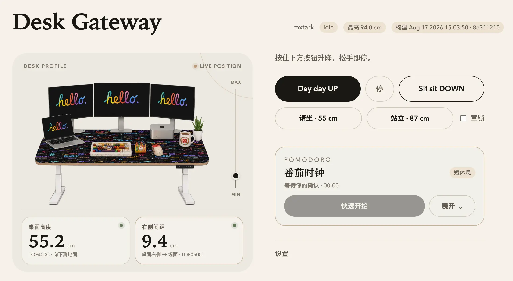
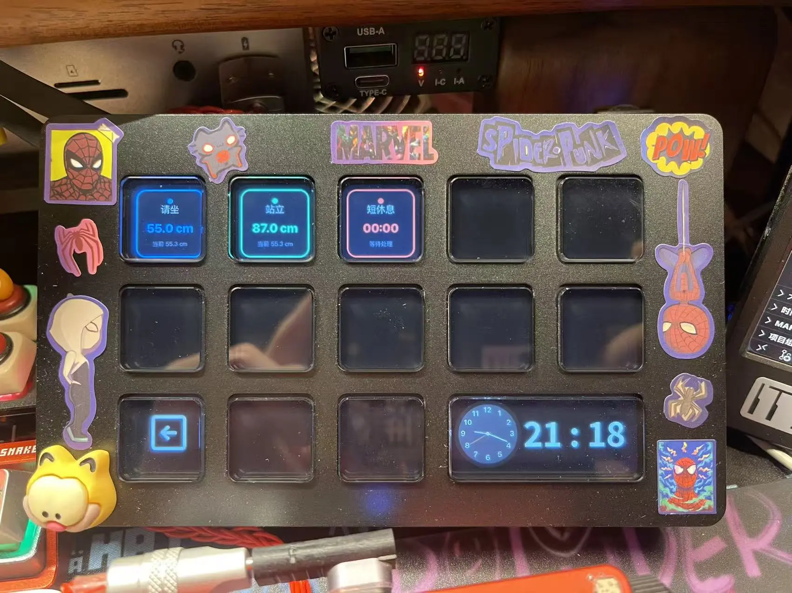
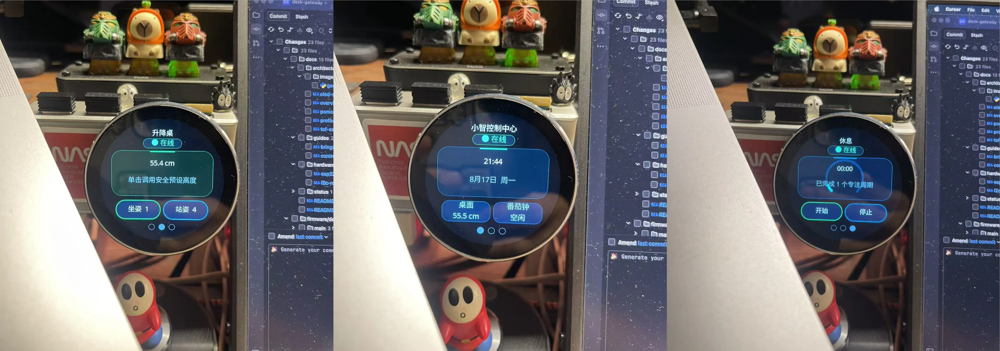
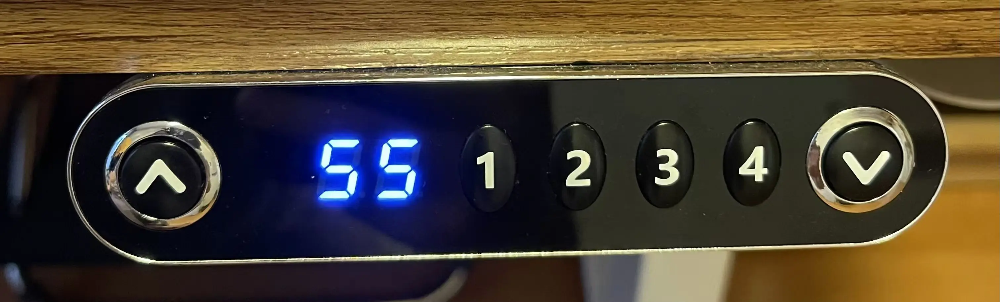
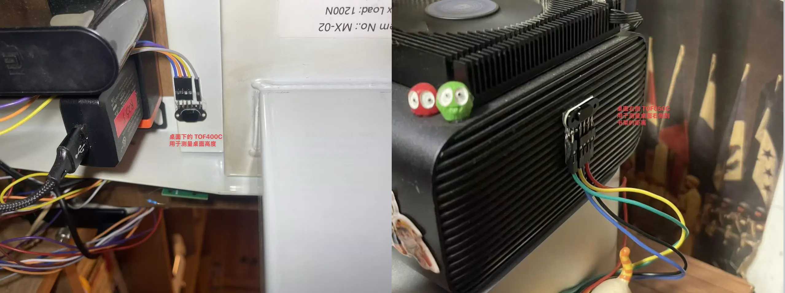
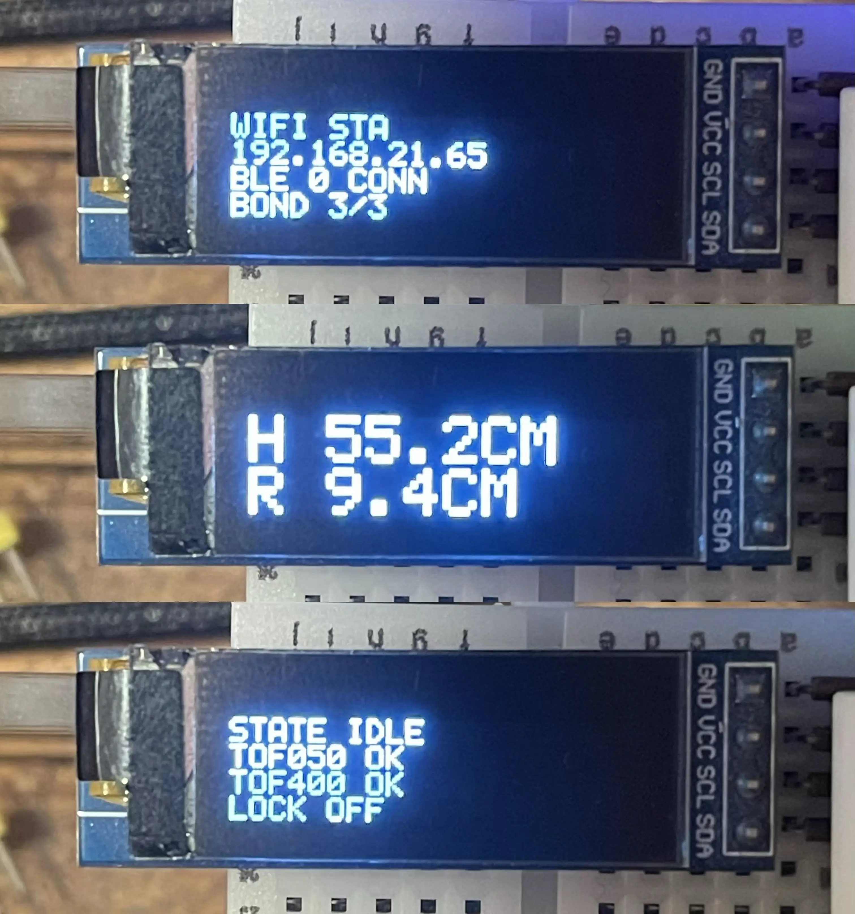
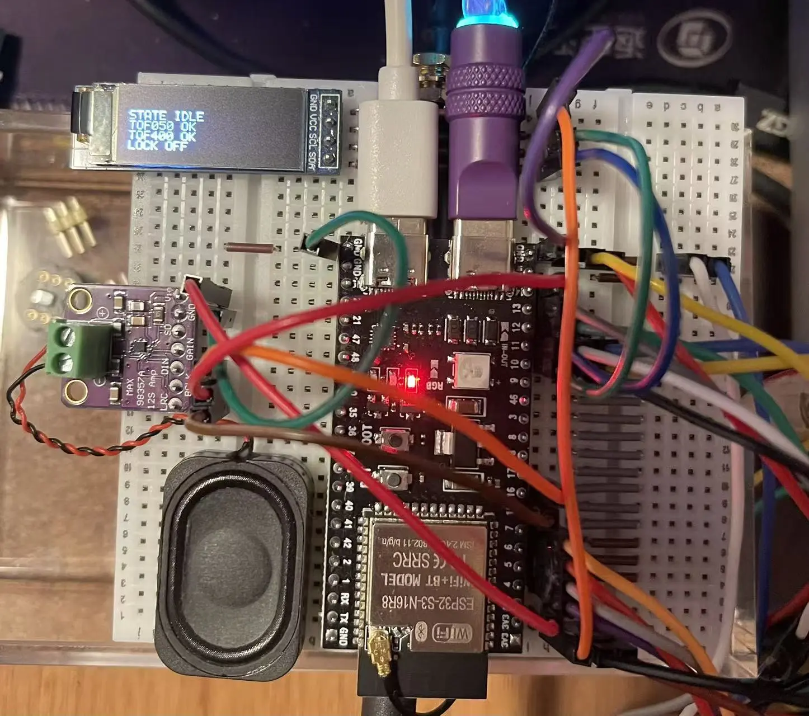

# Desk Gateway

**语言：** [English](README.md) · 简体中文


开源的 **升降桌智能网关**（ESP32-S3）。厂商协议收进可插拔 **Desk Driver**。Web、串口、BLE、手机、Watch、键盘、语音和 Stream Deck 类按键共用控制面 `desk_core`。

Phase 1 已经完成：网关可以模拟原厂 Mxtark 面板，并在局域网和 BLE 上用多种客户端操作真实升降桌。Phase 2 原厂面板透传、断线 STOP、仲裁和童锁真屏蔽已在真桌验收。Matter 不在本阶段。局域网 Home Assistant 可按 [接入说明](docs/guides/home-assistant-mqtt.md) 用 MQTT Cover 控桌，不纳入 V1。




> **安全：** 升降时请有人在旁。TOF400C 高度和 TOF050C 右侧间距已进入上升裁决：高度未知、达到最高高度，或高度低于 80 cm 且右侧间距未知/小于 8 cm 时禁止上升。下降和 STOP 始终可用。Web **仅限局域网**，不要做公网端口映射。

## 现在能怎么控桌

| 入口 | 通道 |
|------|------|
| 局域网 Web | 按住升降、档位、童锁、设置 |
| REST / `scripts/desk-preset.sh` | 脚本、curl、自动化 |
| USB 串口 | `up` / `down` / `stop` / `p1` / `p4` |
| iPhone App | BLE 优先，REST 回退 |
| Apple Watch | BLE 或 REST，Crown 微调 |
| Karabiner / 旋钮 | 快捷键和 500 ms jog 租约 |
| GoatRemote | 语音坐姿 / 站姿 |
| 小智 AI | 五个固定 MCP 工具 |
| Home Assistant | 局域网 MQTT Cover：请坐 / 起立 / 停止 |
| Ulanzi D200H | 请坐 / 站立 / 番茄时刻 |

局域网 Web 是日常入口：升/降是按住才动、松手即停，坐姿 / 站姿走 TOF400C 闭环，童锁和番茄钟也在同一页。iPhone / Android 优先走 BLE，连不上再回退 REST；Apple Watch 用 Digital Crown 做 jog，停转即停。桌上还能用 D200H 三个实体键，以及小智圆屏的坐 / 站 / 番茄页面，指令都落到同一组 REST。





用法见 [多种方式控制升降桌](docs/guides/control-methods.md)。Home Assistant 见 [接入说明](docs/guides/home-assistant-mqtt.md)。REST 契约见 [REST API](docs/guides/rest-api.md)。文档总目录：[docs/README.md](docs/README.md)。

## 当前能力

- **模拟面板：** ESP32-S3 硬件 I²C Slave 处理键地址 `0x24`
- **可插拔驱动：** `mxtark` 已实现；Loctek / Jiecang 为 stub
- **desk_core：** 按住升/降、jog、停止、档位；全局童锁与 REST/蓝牙/面板来源权限写入 NVS
- **双 ToF：** TOF400C 作为产品高度，TOF050C 作为右侧间距；两路都有防抖和失效检测
- **高度闭环：** 最低档位、坐姿、站姿、最高安全高度默认为 550 / 550 / 870 / 940 mm；最低档位不触发下行 STOP
- **Wi-Fi + SoftAP** 与带密码的 **局域网 Web**
- **BLE Accessory Profile：** 最多三个 Central、单一运动所有者、加密 Client Info、配对窗口、Bond 管理、长按租约、断连停止
- **高度一致：** Web / REST / BLE / OLED / 原厂面板都用处理后的 TOF400C 距离

主固件用 **ESP-IDF v6.0.2** 构建。Phase 2 透传、异常停止、三客户端并发和双 ToF 安全矩阵已在真桌验收。V1 发布还取决于移动端内测包等剩余门禁，见 [当前状态与任务优先级](docs/status/current-status-and-priorities.md)。

## 硬件

| 项 | 建议 |
|----|------|
| 开发板 | YD-ESP32-S3 N16R8（或兼容 ESP32-S3） |
| 供电 | ESP32 用 USB-C；**不要**用桌子 3.3V 给 MCU 供电 |
| 地 | 与主机共地 |
| I²C（mxtark） | RJ45 pin 2 / 白线 CLK → GPIO4；pin 4 / 黑线 DAT → GPIO5 |
| 上拉 | RJ45 pin 1 / 红线 3.3V 分别经 **2 kΩ（可用 2.2 kΩ）** 接 CLK、DAT |

红线只作为两个上拉电阻的电源端，**不得直接连接 ESP32 的 `3V3`**。拔掉原厂面板也会拿掉面板上实测为 `1.99 kΩ` 的两只上拉，ESP32 替代面板时必须补回。

原厂面板仍可走双 RJ45 透传。产品高度来自桌板朝地的 TOF400C，右侧间距来自朝向书架的 TOF050C；OLED 轮播高度、传感器和网络状态。当前硬件是 ESP32-S3 开发板加飞线，适合继续调试，不是成品套件。









接线与验收：[docs/guides/bringup-checklist.md](docs/guides/bringup-checklist.md)

## 快速开始

### 环境

- [ESP-IDF](https://docs.espressif.com/projects/esp-idf/) **v6.0.2**（本仓库不混用其他版本）
- 目标芯片：`esp32s3`

请按官方文档安装工具链，不要复制别人机器上的 `/Users/.../.espressif` 路径。任何构建、烧录、监视命令都必须在**同一个 Shell**里先激活 IDF 环境，并确认 `idf.py --version` 输出 `ESP-IDF v6.0.2`。细节见 [CONTRIBUTING.zh-CN.md](CONTRIBUTING.zh-CN.md)。

### 编译烧录

```bash
cd firmware/desk-gateway
idf.py set-target esp32s3
idf.py build
idf.py -p 串口 flash monitor
```

只做可重复编译检查时，用独立临时构建目录，避免旧 `build/` 缓存：

```bash
./scripts/check-firmware.sh
```

### Wi-Fi（SoftAP）

无凭证时设备会开热点：

| | |
|--|--|
| SSID | `DeskGateway` |
| 密码 | `desk-gateway` |
| 配网页 | http://192.168.4.1/ |

配置家里的 **2.4 GHz** Wi-Fi 后，浏览器打开 `http://<设备IP>/`，默认 Web 密码：`desk-gateway`。第一次登录后请改掉。

普通 Flash **不会**清 NVS；`idf.py erase-flash` 才会清空。

### 第一次运动检查

串口输入整行再回车：`up` / `down` / `stop`。Web 升/降为 **按住运动、松手停止**。脚本档位：

```bash
# 先改脚本里的 DESK_BASE_URL 和 DESK_KEY
./scripts/desk-preset.sh 4
./scripts/desk-preset.sh stop
```

把 Web、脚本、手机、Watch、键盘、语音指到你自己的 IP 和密码：见 [本地多端部署清单](docs/guides/local-multi-client-setup.md)。

## 架构


## 目录结构

```text
firmware/desk-gateway/     主固件（ESP-IDF）
mobile/app/                iPhone / Android（React Native + Expo）
mobile/watch/              独立 Apple Watch App
integrations/              第三方入口（MCP、D200H、Karabiner、GoatRemote）
scripts/                   固件检查、烧录辅助、desk-preset.sh
docs/                      需求、架构、使用说明
```

## 文档

从 [docs/README.zh-CN.md](docs/README.zh-CN.md) 进入（[English](docs/README.md)）。常用页：

| 文档 | 说明 |
|------|------|
| [CHANGELOG.md](CHANGELOG.md) | 未发布快照；V1 尚未打 tag |
| [docs/guides/control-methods.md](docs/guides/control-methods.md) | 多种方式控桌 |
| [docs/guides/local-multi-client-setup.md](docs/guides/local-multi-client-setup.md) | 改 IP、密码、路径，把多端部署到本机局域网 |
| [docs/guides/rest-api.md](docs/guides/rest-api.md) | REST 契约 |
| [docs/status/current-status-and-priorities.md](docs/status/current-status-and-priorities.md) | 已完成与待验收 |
| [docs/status/v1-release-acceptance.md](docs/status/v1-release-acceptance.md) | V1 发布门禁 |
| [docs/architecture/overview.md](docs/architecture/overview.md) | 架构总览 |
| [docs/guides/bringup-checklist.md](docs/guides/bringup-checklist.md) | 接线与真机检查 |
| [docs/architecture/protocol-reverse-notes.md](docs/architecture/protocol-reverse-notes.md) | 协议逆向笔记 |
| [integrations/README.zh-CN.md](integrations/README.zh-CN.md) | 第三方入口 |

## 路线图

**Phase 1（已完成）**

- [x] 硬件 I²C Slave `@0x24` 作为稳定运动链路
- [x] 局域网 Web、REST、串口、BLE、iPhone App、Watch、键盘/旋钮、小智 MCP、Ulanzi D200H
- [x] 固件、Web、App、Watch、REST、BLE Config v3 支持可配置的 550 mm 最低档位
- [x] BLE 三连接所有权、Client Info、配对窗口、Web/手机 Bond 管理
- [x] 双 ToF 档位、最高高度、右侧障碍物真机安全矩阵
- [x] Phase 2 真桌透传、断线 STOP、仲裁、童锁真屏蔽
- [x] 异常停止矩阵和 Android 真机验收
- [x] iPhone、Apple Watch、Android 三台真机并发矩阵

**仍开放**

- [ ] Matter
- [ ] OTA 固件升级
- [ ] 更多厂商 Driver

## 参与贡献

提交 Issue 或 PR 前，请阅读 [CONTRIBUTING.zh-CN.md](CONTRIBUTING.zh-CN.md)（[English](CONTRIBUTING.md)）和 [CODE_OF_CONDUCT.md](CODE_OF_CONDUCT.md)，并通过 [SUPPORT.zh-CN.md](SUPPORT.zh-CN.md) 确认渠道和所需证据。

## 安全说明

见 [SECURITY.zh-CN.md](SECURITY.zh-CN.md)（[English](SECURITY.md)）。请修改默认 Web 密码，勿映射公网。

## 许可证

本项目采用 **MIT License**，见 [LICENSE](LICENSE)。ESP-IDF、cJSON 等第三方组件遵循各自许可证，见 [NOTICE](NOTICE)。

## 免责声明

与任何升降桌厂商无关联。协议笔记仅用于你拥有的设备上的互通。使用风险自负；家具运动可能导致人身或财物损伤。

## 作者的另一个项目：Starcat

<div align="center">
<a href="https://starcat.ink"></a>
<p><a href="https://starcat.ink">Starcat</a> 是一款原生 macOS 应用，面向 GitHub Stars 已经超出普通收藏夹规模的用户。</p>
<p>
<a href="https://starcat.ink"></a>
<a href="https://dong4j.app/starcat/"></a>
<a href="https://starcat.ink/downloads/Starcat-1.3.0-arm64.dmg"></a>
<a href="https://github.com/starcat-app/starcat-pro"></a>
</p>
</div>

它把 starred repositories 同步到本地优先的桌面工作区，渲染 README，支持标签、私有笔记和阅读状态，追踪 Release，评估仓库健康度，并把收藏升级为可检索、可追问的本地知识库。从 1.3.0 起还可以集中管理「我的项目」、查看全局与单仓库洞察、使用 macOS 桌面小组件，并通过 Alfred / uTools / Raycast 快速找回仓库。启用 AI 后，Starcat 可以生成 README 摘要、翻译项目文档、推荐标签，并基于仓库上下文问答。

<div align="center">

</div>

当前公开版本为 **Starcat 1.3.0**（macOS 15 Sequoia 或更高，Apple Silicon）。核心整理能力可免费使用；Pro / AI 工作流通过 App Store 内购或 Direct 授权开通。

- 官网：[starcat.ink](https://starcat.ink)
- Mac App Store：[Starcat for GitHub](https://apps.apple.com/app/starcat-for-github/id6788809803?mt=12) · 落地页 [dong4j.app/starcat](https://dong4j.app/starcat/)
- 文档：[starcat.mintlify.app](https://starcat.mintlify.app/)
- 支持与更新日志：[starcat-app/starcat-pro](https://github.com/starcat-app/starcat-pro)

首选用 Homebrew 安装 Direct 版本：

```bash
brew tap starcat-app/starcat
brew trust starcat-app/starcat
brew install --cask starcat
```
