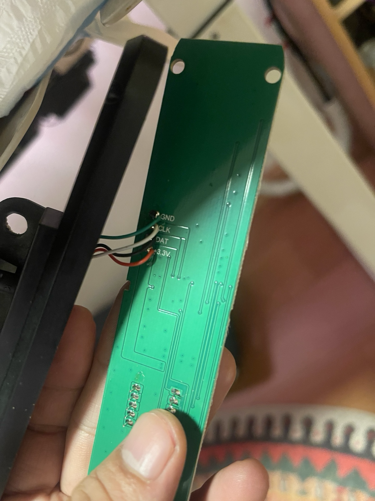

# Desk Gateway 需求文档

| 项 | 内容 |
|---|---|
| 项目 | Desk Gateway（多厂商升降桌智能网关平台） |
| 文档编号 | DG-REQ-001 |
| 版本 | 0.2.9 |
| 日期 | 2026-08-13 |
| 状态 | 草案 |
| 仓库 | 本 Git 仓库根目录 |
| 架构 | [architecture/overview.md](./architecture/overview.md)、[平台设计定稿](./superpowers/specs/2026-08-06-desk-gateway-platform-design.md)、[MQTT / Home Assistant](./architecture/mqtt-home-assistant.md)、[小米/华为生态调研](./architecture/ecosystem-xiaomi-huawei.md)、[BLE 外设](./architecture/ble-accessory-profile.md) |

本文是本项目的第一篇正式文档，定义要做什么、做到什么算完成，以及分阶段怎么推进。硬件原理图、协议细节、固件实现另立文档。**平台分层与 Web/Driver 契约以架构设计定稿为准**；本文侧重需求与门禁。

> **实现状态（2026-08-15）**：Web、REST、BLE、iPhone App、童锁和来源权限的基础代码已落地。
> 当前产品固件通过硬件 I²C Slave `@0x24` 稳定输出升、降和停止键码；控制盒 digit
> 高度解析与软件模拟 I²C 已停用。TOF400C 已作为产品高度接入档位闭环和最高高度保护，
> TOF050C 已接入低位右侧障碍物保护，配置值仍持久化和同步。BLE 三连接、运动所有权、配对窗口、Bond 管理、
> Watch 和手机端适配已经通过自动化与静态构建；三台真机并发、异常停止矩阵、Android
> 真机以及双 RJ45 原厂面板
> 透传仍待完成；唯一汇总状态以 [当前状态与任务优先级](./5-current-status-and-priorities.md)
> 为准，排查决策见 [硬件 I²C 恢复排查记录](./7-hardware-i2c-restoration-investigation.md)。

---

## 1. 背景与目标

### 1.1 背景

现有升降桌通过左侧控制面板控制：档位 1–4、上升/下降；数字档位单击前往预设高度，长按保存当前高度；上下键长按持续升降。面板经 RJ45 线缆连接电机控制板（主机）。

RJ45 只是物理接口形态，**不是以太网**。面板 PCB 背面已标出测试点：



| 丝印 | 含义 |
|---|---|
| GND | 地 |
| CLK | 时钟 |
| DAT | 数据 |
| 3.3V | 面板供电 |

据此判断：面板与主机之间是 **3.3V 同步串行通信**，不是标准网口，也不宜直接套用 [Upsy Desky](https://github.com/tjhorner/upsy-desky) 默认的双向 UART 方案。可复用其“中间人 + 智能控制”产品思路，但协议层需按本桌逆向结果单独实现。

### 1.2 要解决什么问题

1. 保留原厂面板可用。
2. 增加无线与电脑侧控制能力（Web、手机、键盘/滚轮等）。
3. 为后续接入 Home Assistant、Siri、小米等智能家居留扩展口。
4. 不因接入网关而降低安全性（尤其是停止与防失控）。

### 1.3 终局目标

做一个 **可适配多家厂商升降桌** 的智能网关平台（Desk Gateway）。对单桌用户：插在 **原厂面板** 与 **升降桌主机** 之间（Phase 2）；对平台：厂商差异收进 **Desk Driver**，Web / BLE / HA / Matter / OTA 等共用控制面。

能力清单：

1. **透明透传**（Phase 2）：接入后原面板行为与接入前一致。
2. **协议代理**：手机 / Web / 键盘等下发指令时，经统一控制面调用当前 Driver，向主机发送等价命令。
3. **状态同步**：运动状态必报；高度在 Driver 支持时对外暴露；Web 示意图可实时反映升降。
4. **优先级**：童锁 OFF 时原厂面板按键优先于无线；童锁 ON 时除停止和解锁外，所有来源均失效。
5. **可扩展**：新增厂商 ≈ 新增 Driver；连通与生态层复用（含 Matter；米家/华为原生见生态调研）。
6. **童锁**：开启后 REST、串口、蓝牙、原厂控制面板及后续 HA/MQTT 等入口都不能控桌。
7. **原厂面板锁**：默认禁止原厂面板按键控制，但继续向面板显示 ToF 高度；用户可独立开放，不影响 Web 等其他入口。
8. **国内生态**：规划接入小米米家、华为智慧生活（适用性）；路径见架构生态调研。

### 1.4 当前阶段目标（验证优先）

终局架构是主动中间人桥接，但 **当前必须先做“模拟面板控桌”验证**：

> 只有证明 ESP32 能按逆向协议发令并稳定控制主机之后，才开始做双 RJ45 中间人网关。

---

## 2. 产品定义

### 2.1 一句话

Desk Gateway 是面向多厂商的升降桌智能平台：先用可插拔 Driver 验证能控桌（含局域网 Web），再做成保留原面板的透传网关，并逐步接入 HA / Matter 等生态。

### 2.2 产品形态（终局）

```text
                 WiFi / BLE / LAN
                        │
                 ┌──────┴──────┐
                 │ Desk Gateway │  ← 本项目盒子
                 │ ESP32-S3 等  │
                 └──────┬──────┘
                   ▲          ▲
                   │          │
            原厂面板协议    智能控制协议
                   │          │
                   ▼          ▼
           原装控制面板   升降桌主机（电机控制板）
```

盒子对外接口（终局硬件）：

| 接口 | 用途 |
|---|---|
| RJ45 PANEL | 接原厂控制面板 |
| RJ45 DESK | 接升降桌主机 |
| USB-C | 独立供电与调试 |
| WiFi / BLE | 无线控制与状态同步 |

**首版盒子不做本地旋钮、不做本地显示屏**（纯网关）。日常交互依赖原厂面板 + Web / 手机 / **外接 BLE 旋钮·OLED 等配件**（Phase 2 起提供数据面）。

### 2.3 用户与场景

| 角色 / 场景 | 需求 |
|---|---|
| 日常坐站切换 | 原面板照常；也可用手机 / Web / 键盘快捷操作 |
| 编程时手不离键 | 键盘旋钮或快捷键控制升降与停止 |
| 远程/跨房间 | 局域网 Web 或后续 HA 控制 |
| 调试与逆向 | 能抓包、能日志、能安全停机 |

---

## 3. 范围

### 3.1 首版（MVP）范围内

对应此前确认的选项 **C：带无线控制的完整网关能力**，但按阶段交付：

| 能力 | Phase 1（模拟面板 + 平台骨架） | Phase 2（中间人网关） |
|---|---|---|
| 协议逆向与命令复现 | 必做（yourdesk_v1） | 沿用 |
| Desk Driver 框架 + desk_core | 必做 | 沿用 |
| 上升 / 下降 / 停止 | 必做 | 必做 |
| 档位前往 / 档位保存（若协议支持） | 必做 | 必做 |
| 高度读取与状态上报 | 尽量；运动状态必报 | 必做 |
| 原面板并行透传 | 不做 | 必做 |
| 原面板优先仲裁 | 不适用 | 必做（童锁 OFF 时） |
| **童锁（锁后原厂面板无效）** | API/UI/状态 **必做**；真屏蔽面板待 Phase 2 | **必做**（MITM 丢弃面板意图） |
| WiFi + 本地 Web（REST/短轮询）+ 简单认证 | **必做** | 必做 |
| Web 现代化 UI + 升降示意图动效 | **必做** | 增强（跟真实高度） |
| 其他厂商 Driver | stub 占位 | 按需实现 |
| BLE 外设总线（OLED/旋钮等 GATT） | 三连接、运动所有权、配对窗口和 Bond 管理已实现；LightBlue 和 iPhone App 核心路径已验收，三台真机并发待验收 | **必做正式**（与 Web 同级数据面） |
| 键盘 / 滚轮侧控制（经电脑或 BLE） | 可选 | 必做 |
| USB-C 独立供电 | 开发板可先用 | 成品必做 |

### 3.2 明确不在首版范围

- Home Assistant / MQTT / HomeKit / Matter / Siri / OTA（预留边界，首版不交付）
- **小米米家 / 华为智慧生活原生上架**（通常需认证模组与合作；见 [生态调研](./architecture/ecosystem-xiaomi-huawei.md)；Phase 3+）
- 盒子上的旋钮、OLED / 数码管（**板载**不做；外接配件使用已实现的 BLE Accessory Profile）
- 从 RJ45 取电作为主供电
- 云端账号体系、远程公网控制（**仅局域网**；Web 有简单密码，仍勿做端口映射）
- 多品牌桌子「刷固件即开箱即用」（框架就绪；真协议逐个适配）
- 商业量产认证（FCC/CE 等）

### 3.3 后续扩展（Backlog）

当前完成度和实施顺序统一维护在
[《当前状态与任务优先级》](./5-current-status-and-priorities.md)，本节只保留产品范围。

- **Matter**（现有 ESP32 软件栈；进米家/华为 App 的默认开放路径，见生态调研）
- **小米米家原生**：MIIO 认证模组 + IoT 开放平台 + 认证（可选独立硬件 SKU）
- **华为智慧生活 / 鸿蒙智联原生**：HarmonyOS Connect 认证模组 + 伙伴流程（可选独立 SKU）
- MQTT + Home Assistant Cover / Number 实体
- SoftAP 配网页、HTTPS
- 原厂「上+下同时约 5s → 重置」协议逆向与网关侧等价注入（见协议笔记）
- 久坐提醒、自动坐站切换日程
- 开源/文档化 BLE 旋钮+OLED 参考配件（对接 Gateway Accessory Profile）
- 旋钮面板或一体智能面板变体（板载，非 MVP）
- 更多桌型协议驱动（Loctek / Jiecang / Upsy 兼容 UART 等）

> 小米/华为要不要加硬件：原生上架 **通常要加各自认证模组**；若走 Matter 配件形态，**多数情况不必换主控**。详见 [ecosystem-xiaomi-huawei.md](./architecture/ecosystem-xiaomi-huawei.md)。

---

## 4. 阶段划分与成功标准

### 4.1 总览

```text
Phase 0  抓包与协议逆向
   ↓
Phase 1  平台骨架 + yourdesk_v1 Driver + 串口/Web 控桌
   ↓  门禁：控桌可靠 + 停止可靠 + 局域网 Web 可用
Phase 2  双 RJ45 主动中间人网关（透传 + 注入 + 面板优先）
   ↓
Phase 3  智能家居与多厂商 Driver 扩展
```

### 4.2 Phase 0 — 协议逆向

**目标**：弄清 CLK/DAT 上的物理层与帧格式，能区分按键、高度、心跳、校验。

**必做动作**：

1. 断电确认 PCB 测试点与 RJ45 针脚对应关系。
2. 通电用万用表确认电压范围（预期约 3.3V；若更高必须先电平转换再接分析仪）。
3. 逻辑分析仪只监听：`GND / CLK / DAT`（不接分析仪 3.3V 给面板供电）。
4. 分别录制：静置、单击/长按上下、档位单击/长按、全程升降等。
5. 判断主机还是面板产生 CLK；DAT 是否半双工双向。

**退出标准**：

- 已知 RJ45 针脚定义与最高电压。
- 能解释至少：上升按下/松开、下降按下/松开、停止（或等价）、静置是否有心跳。
- 有可复现的抓包文件（如 PulseView `.sr`）与初步字节/位域笔记。

### 4.3 Phase 1 — 平台骨架 + 模拟面板 + Web（当前主攻）

**硬件形态**：ESP32（优先 ESP32-S3 N16R8）开发板，经合适电平连接主机侧 CLK/DAT/GND；**原面板可不接**。供电用 USB。

**目标**：证明协议可执行，并落地 **Driver 框架 + 局域网 Web 控制台**（认证 + 现代化 UI + 升降动效）。

**功能要求**：

| ID | 要求 |
|---|---|
| P1-F01 | 能发送上升，桌子上升（串口与 Web） |
| P1-F02 | 能发送下降，桌子下降（串口与 Web） |
| P1-F03 | 能发送停止/松开，桌子在合理时间内停下；Web 急停最醒目 |
| P1-F04 | 若协议支持，能前往已验证档位（yourdesk：1/4） |
| P1-F05 | 若协议支持，能保存已验证档位 |
| P1-F06 | 运动状态必报；高度尽量（无高度时 UI 用命令驱动相对动效） |
| P1-F07 | 通信异常或固件重启后，默认不发出任何运动命令 |
| P1-F08 | `desk_driver` / `desk_core` 就位；yourdesk_v1 为默认驱动；其他厂商 stub |
| P1-F09 | WiFi STA + Web：简单密码登录、REST 控桌、短轮询刷新状态 |
| P1-F10 | Web UI：品牌、升降桌示意图、升/降时示意图实时动画 |
| P1-F11 | 童锁：可开关、进入 status；语义为「原厂面板不可控」（Phase1 预埋；Phase2 真屏蔽） |

**退出标准（进入 Phase 2 的门禁）**：

1. 连续多次上升/下降/停止测试无失控续跑。
2. 停止指令在正常条件下可靠生效（串口与 Web）。
3. 关键协议命令有文档化说明（帧格式、时序、注意事项）。
4. 固件按平台目录组织；局域网登录 Web 后可完成升降停，动效随状态变化。
5. 童锁状态可经 Web 开关并反映在 status（面板真屏蔽在 Phase 2 验收）。

### 4.4 Phase 2 — 主动中间人网关（终局 MVP）

**硬件形态**：双 RJ45 + ESP32-S3 + USB-C 供电 + ESD/电平保护；切断 CLK/DAT，由 MCU 两侧桥接。

**目标**：插上盒子后，原面板照常用；同时可通过 WiFi/BLE/Web/键盘控制。

**功能要求**：见第 5 节。

**退出标准**：

1. 拔掉无线客户端，仅用原面板，体验与无盒子时一致。
2. 无线控制可完成升降、停止、档位（协议允许范围内）。
3. 原面板按键可立即打断并覆盖进行中的无线运动指令。
4. 局域网可查询高度与运动状态。

### 4.5 Phase 3 — 扩展

MQTT / HA / 久坐提醒 / 更多桌型等，另开需求修订，不阻塞 Phase 1–2。

---

## 5. 功能需求

说明：下列 **G-*** 为终局（Phase 2）需求；Phase 1 仅需覆盖其中与“模拟发令 / 读状态”直接相关的子集。

### 5.1 透明透传

| ID | 需求 | 优先级 |
|---|---|---|
| G-P01 | 网关上电且空闲时，原面板与主机通信等效直通 | P0 |
| G-P02 | 透传不得引入可感知的按键延迟异常（具体阈值逆向后标定） | P1 |
| G-P03 | 网关故障或固件崩溃时，应尽量进入安全态（停止运动或断开驱动输出策略在设计文档中规定） | P0 |

### 5.2 运动控制

| ID | 需求 | 优先级 |
|---|---|---|
| G-M01 | 支持上升开始 / 上升保持 / 上升停止（或协议等价语义） | P0 |
| G-M02 | 支持下降开始 / 下降保持 / 下降停止 | P0 |
| G-M03 | 支持前往预设档位 1–4（若主机协议支持） | P0 |
| G-M04 | 支持保存当前高度到档位 1–4（若由主机保存；若仅面板本地保存则记录限制） | P1 |
| G-M05 | 支持移动到指定高度（仅当协议存在绝对高度命令时；否则用模拟按住升降 + 高度闭环近似，并在文档标明误差与风险） | P2 |
| G-M06 | 任何控制通道都必须能发停止；停止优先级高于运动 | P0 |
| G-M07 | 连续运动应有最长时长保护（建议默认 15–20s，可配置） | P0 |

### 5.3 状态与反馈

| ID | 需求 | 优先级 |
|---|---|---|
| G-S01 | 对外提供当前高度（单位与面板显示一致，通常 mm 或 0.1cm） | P0 |
| G-S02 | 对外提供运动状态：静止 / 上升 / 下降 / 未知 | P0 |
| G-S03 | 对外提供连接状态：主机链路是否正常、面板是否在线（Phase 2） | P1 |
| G-S04 | Phase 1 通过短轮询刷新状态；未来如需推送，使用不阻塞控制请求的异步 SSE / WebSocket / BLE notify | P0 |

### 5.4 优先级与仲裁

| ID | 需求 | 优先级 |
|---|---|---|
| G-A01 | **原厂面板优先（童锁关闭时）**：检测到面板有效按键时，立即中断无线发起的运动意图，并转发/执行面板侧意图 | P0 |
| G-A02 | 面板停止/松开类信号不得被无线指令吞掉（童锁关闭时） | P0 |
| G-A03 | 无线侧在面板占用期间应进入抑制态，并向客户端回报「被面板抢占」（童锁关闭时） | P1 |
| G-A04 | **童锁**：开启后除 `STOP` 和解除童锁外，REST/UART/BLE/Panel 及后续来源均不能启动或维持运动；状态持久化 | P0 |
| G-A05 | 童锁开启时，立即停止当前运动；面板意图不转发，解除后必须先检测到物理按键松开才能重新接管 | P0 |
| G-A06 | 仲裁优先级：急停 > 全局童锁 > 来源权限 >（童锁关且允许时）面板优先 > 其他入口 | P0 |

### 5.5 无线与本地控制（Web 已交付；BLE 核心路径已实现并通过 iPhone 真机验收）

| ID | 需求 | 优先级 |
|---|---|---|
| G-W01 | WiFi STA 接入局域网；提供本地 Web 控制页 | P0 |
| G-W02 | 提供 REST：auth / up / down / stop / preset / child-lock / access / status | P0 |
| G-W03 | 提供短轮询状态刷新，驱动 UI 升降动效（含 `child_lock`） | P0 |
| G-W04 | 简单密码认证（Bearer token）；默认仅局域网；无云账号 | P0 |
| G-W05 | Web UI：现代化；含升降桌示意图；运动中实时动画；童锁开关可见 | P0 |
| G-W06 | **BLE Accessory Profile**：Gateway 为 GATT Server；向 OLED/无限旋钮等外设 Notify 高度与状态；Write 控升降/停止；与 `desk_core` 对齐 | P0（代码已实现；LightBlue 与 iPhone App 核心路径已验收） |
| G-W07 | BLE 未绑定设备默认不可下发运动指令；已绑定外设仍受全局童锁和 Bluetooth 来源权限约束 | P1 |
| G-W08 | 支持由电脑侧程序或键盘工作流触发（如经 BLE/HTTP）；本仓库不强制实现具体键盘固件 | P1 |
| G-W09 | 最多三个 BLE Central 同时在线；单一运动所有者，非所有者返回 Desk Busy，任意 STOP 始终有效 | P0（代码与自动化已完成；真机待验收） |
| G-W10 | 已认证 Web / 手机端支持 120 秒配对窗口、匿名 Bond 列表、单删和全删；Bond 满额不得自动淘汰旧设备 | P0（代码与自动化已完成；真机待验收） |
| G-W11 | （可选）Gateway 作 Central 适配「仅 Peripheral」的成品旋钮——独立适配层，不替代 G-W06 | P2 |

### 5.6 配置与运维

| ID | 需求 | 优先级 |
|---|---|---|
| G-O01 | 可通过串口或 Web 查看日志（协议帧可开关） | P1 |
| G-O02 | WiFi 凭据可配置；支持配网流程（具体方案设计阶段定） | P1 |
| G-O03 | OTA 可选，不阻塞 MVP | P2 |

---

## 6. 非功能需求

### 6.1 安全

1. **禁止**把桌子 RJ45 直接插入电脑网口、交换机或 USB 网卡。
2. 未知电压前，**禁止**把信号直接接到普通逻辑分析仪或 MCU GPIO。
3. 先万用表 / 示波器确认电压，再监听；再注入。
4. 固件默认安全：上电静默、通信异常停机、最长运行保护、停止指令最高优先。
5. 无线接口默认仅局域网；后续若开放更高权限，需另做鉴权设计。

### 6.2 可靠性

1. 透传路径应可长时间稳定工作（日常办公小时级无异常重启）。
2. 心跳/轮询若存在，网关必须正确维护，避免主机因“面板掉线”拒动。
3. 断电恢复后不自动升降。

### 6.3 性能

1. 面板按键到主机的透传延迟应低于可感知阈值（逆向后给出数值目标）。
2. 状态查询接口应能支持 UI 轮询（例如 ≥ 5 Hz，以实际总线负载为准）。

### 6.4 可维护性

1. 协议解析与具体桌型驱动分离，便于以后加第二种桌子。
2. 关键阶段产出可独立复现：抓包、命令表、最小固件、网关固件。

---

## 7. 硬件需求（概要）

### 7.1 Phase 1（验证台）

| 项 | 要求 |
|---|---|
| MCU | **YD-ESP32-S3 N16R8**（见 [主控选型文档](./2-esp32-s3-n16r8-platform.md)） |
| 连接 | 飞线/转接至主机 CLK、DAT、GND；按需电平保护 |
| 供电 | USB |
| 工具 | 万用表；3.3V 逻辑分析仪（推荐 PulseView/sigrok）；示波器更佳；流程见 [抓包文档](./1-protocol-capture-with-logic-analyzer.md) |
| 参考 | Upsy Desky 思路可参考，协议不可照搬 |

### 7.2 Phase 2（网关成品方向）

| 项 | 要求 |
|---|---|
| MCU | ESP32-S3-WROOM-1-N16R8（与开发板同规格，见主控选型文档） |
| 接口 | RJ45 ×2（PANEL / DESK）、USB-C |
| 总线 | CLK/DAT 切断后由 MCU 桥接；GND 共地；3.3V 是否旁路到面板在设计中论证 |
| 保护 | ESD（如 CLK/DAT TVS）、必要时双向电平转换 |
| 供电 | **USB-C 独立供电**（不采用 RJ45 取电作为主方案） |
| 人机 | 无旋钮、无屏幕（MVP） |
| 成本目标 | 研发样机元器件约百元量级（非硬性 KPI） |

详细原理图、BOM、外壳在后续《硬件设计》文档中给出。

---

## 8. 软件与接口需求（概要）

### 8.1 固件分层（建议）

```text
App / API（HTTP、BLE、未来 MQTT）
        │
Arbitration（面板优先、停止优先、超时保护）
        │
Desk Protocol Driver（本桌 CLK/DAT 驱动）
        │
Link（Phase1: 单侧主机；Phase2: 双端桥接）
```

### 8.2 HTTP API 草案（Phase 2，可调）

| 方法 | 路径 | 说明 |
|---|---|---|
| POST | `/api/v1/desk/up` | REST 来源开始上升；受童锁和 REST 权限约束 |
| POST | `/api/v1/desk/raise-to-max` | 使用设备侧真实高度闭环升到最高安全高度；不支持时拒绝，禁止退化为普通持续上升 |
| POST | `/api/v1/desk/down` | REST 来源开始下降；受童锁和 REST 权限约束 |
| POST | `/api/v1/desk/stop` | 立即停止；始终放行 |
| POST | `/api/v1/desk/preset/{n}/goto` | 前往档位 n；受童锁和 REST 权限约束 |
| POST | `/api/v1/desk/preset/{n}/save` | 保存档位 n（若支持） |
| POST | `/api/v1/desk/child-lock` | 设置全局童锁 `{ "enabled": bool }` |
| POST | `/api/v1/desk/access` | 设置来源权限 `{ "source": "rest|bluetooth|panel", "enabled": bool }` |
| GET | `/api/v1/desk/status` | 高度、运动、童锁、`raise_to_max_supported` 及 `control_sources` 等 |

请求/响应 JSON 字段在接口设计文档中冻结。

### 8.3 与外部系统关系

| 系统 | 关系 |
|---|---|
| 原厂面板 | Phase 2 主输入之一；仅在童锁关闭且 Panel 权限开启时拥有运动优先级 |
| 升降桌主机 | 唯一运动执行端 |
| Upsy Desky | 参考项目；默认 UART 协议不直接兼容本桌 |
| Keyboard / 桌面滚轮 | 经 HTTP/BLE 调用网关，不直接接电机总线 |
| Home Assistant 等 | Phase 3 |

---

## 9. 约束与假设

1. 本项目优先适配 **当前这张带 CLK/DAT/3.3V/GND 测试点的面板与对应主机**。
2. 假设通信逻辑电平为 3.3V；若实测不符，硬件方案必须先修正再继续。
3. 假设存在可复现的数字命令（非纯电阻矩阵按键）；若实测为模拟电阻按键，需求需修订为“电阻网络模拟”方案。
4. 档位高度可能由主机保存，也可能由面板保存；以抓包结果为准，并在协议文档中写清限制。
5. 绝对高度闭环控制不是 P0；有原生命令才做 P0 级绝对移动。

---

## 10. 风险

| 风险 | 影响 | 应对 |
|---|---|---|
| 协议含心跳/认证，模拟不完整则主机拒动 | Phase 1 失败 | 静置长抓包；完整复现心跳 |
| DAT 半双工，方向难判 | 注入冲突 | Phase 2 双侧切断；Phase 1 单侧仔细时序 |
| 漏发松开/停止导致持续升降 | 安全事故 | 停止优先、超时保护、先测停止再测长按 |
| CLK/DAT 实际是调试口而非总线 | 方向推倒 | Phase 0 用导通与抓包尽早证伪 |
| 无线与面板同时操作体验混乱 | 投诉/失控感 | 面板优先 + 客户端占用状态提示 |
| 过早做双 RJ45 成品 | 返工 | 严格执行 Phase 1 门禁 |

---

## 11. 验收清单（摘要）

### Phase 1

- [x] 针脚与电压确认完成（含四线线序及原厂面板两只 `1.99 kΩ` 上拉）
- [x] 关键抓包集齐全并可复现分析
- [x] ESP32 可上升 / 下降 / 松手停止（2026-08-10 真机）
- [x] 下降 15s 运动超时已有真机停止日志；上升当前由松手或显式停止结束
- [ ] 断连、重启、掉电和网络中断等异常停止保护完成矩阵验收
- [x] 命令表文档已写

### Phase 2

- [ ] 双 RJ45 样机透传正常
- [ ] 原面板优先仲裁验证通过（童锁 OFF）
- [ ] 童锁 ON：REST/UART/BLE/原厂面板均无法启动运动；STOP 和解锁仍有效
- [x] Web/REST 可控制并读状态（需登录）
- [x] 短轮询驱动升降示意图动效
- [x] 简单密码认证可用；仅局域网
- [ ] （可选/后门禁）上+下≈5s 重置协议已抓包并文档化
- [x] 键盘/HTTP 通道可用；BLE GATT 已通过 LightBlue 和 iPhone App 核心真机控制
- [x] BLE 三连接、运动所有权、配对窗口、Bond 管理和三端 Client Info 代码与自动化完成
- [ ] iPhone、Apple Watch、Android 三台真机并发与 Bond 删除安全矩阵通过
- [ ] 异常与上电安全态验证通过

---

## 12. 文档与交付物规划

| 顺序 | 文档 | 说明 |
|---|---|---|
| 0 | [本文《需求文档》](./0-requirements.md) | 范围与阶段门禁 |
| 1 | [《用逻辑分析仪破解协议》](./1-protocol-capture-with-logic-analyzer.md) | Phase 0 抓包流程 |
| 2 | [《ESP32-S3 N16R8 主控选型》](./2-esp32-s3-n16r8-platform.md) | 开发板与主控冻结 |
| 3 | [《协议逆向笔记》](./3-protocol-reverse-notes.md) | 抓包结论、帧格式、命令表、复现算法 |
| — | 《Phase 1 验证记录》 | 可控性证据（待写） |
| — | 《硬件设计》 | 原理图 / BOM / 接口（待写） |
| — | 《固件与 API 设计》 | 分层、仲裁、接口冻结（待写） |
| — | 《Phase 2 验收》 | 网关 MVP 验收（待写） |

---

## 13. 已确认决策记录

| 决策 | 结论 | 日期 |
|---|---|---|
| 仓库位置 | `/Users/dong4j/Developer/1.AI/ai-incubator/desk-gateway` | 2026-08-05 |
| MVP 能力范围 | 透传终局 + 无线控制（Web/手机/键盘）；智能家居后置 | 2026-08-05 |
| 盒子本地交互 | 纯网关，**板载**无旋钮无屏幕；可外接 BLE 旋钮/OLED | 2026-08-06 |
| 供电 | USB-C 独立供电 | 2026-08-05 |
| 仲裁 | 童锁 OFF：按来源权限仲裁；童锁 ON：屏蔽所有运动入口，仅保留 STOP 和解锁 | 2026-08-11 |
| 架构终局 | 方案 2：主动中间人桥接 | 2026-08-05 |
| 当前执行 | 先做方案 3（模拟面板）验证，再做方案 2 | 2026-08-05 |
| MCU | YD-ESP32-S3 N16R8（https://github.com/vcc-gnd/YD-ESP32-S3） | 2026-08-05 |

---

## 14. 参考

- [Upsy Desky](https://github.com/tjhorner/upsy-desky) — 升降桌智能中间件参考实现（多为 UART）
- 原厂面板 PCB 测试点：`GND` / `CLK` / `DAT` / `3.3V`
- 既有分析结论：同步串行；优先排查自定义 CLK+DAT，其次 I²C/类 TM1637 等

---

## 15. 修订历史

| 版本 | 日期 | 说明 |
|---|---|---|
| 0.1 | 2026-08-05 | 首版需求：整理对话结论与阶段策略 |
| 0.1.1 | 2026-08-05 | 同步抓包文档与 YD-ESP32-S3 N16R8 主控选型 |
| 0.1.2 | 2026-08-05 | 链接《协议逆向笔记》；静置通信已确认 I²C @ 0x24 |
| **0.2** | **2026-08-06** | 升级为多厂商平台定位；Phase1 必含 Driver 框架 + 局域网 Web（认证/SSE/现代化 UI 动效）；链到架构定稿 |
| **0.2.1** | **2026-08-06** | 童锁（锁后面板无效）；登记上+下≈5s 原厂重置为待逆向；修正仲裁与「面板永远优先」在童锁下的关系 |
| **0.2.2** | **2026-08-06** | Backlog 明确小米/华为；链到生态调研（原生需认证模组，Matter 可走现有 ESP32） |
| **0.2.3** | **2026-08-06** | BLE 外设总线（OLED/旋钮）；板载无屏无旋钮不变；链到 ble-accessory-profile |
| **0.2.4** | **2026-08-09** | 同步已落地的 Phase 1 代码边界；状态通道统一为短轮询；区分编译证据与真机验收 |
| **0.2.5** | **2026-08-10** | 记录 RJ45 四线线序、原厂 `1.99 kΩ` 上拉及补回后升降真机通过；保留档位、超时、童锁状态流和真实高度门禁 |
| **0.2.6** | **2026-08-11** | 同步当前固件、LightBlue、iPhone App 与 Config v2 真机状态；未完成项改由统一状态文档管理 |
