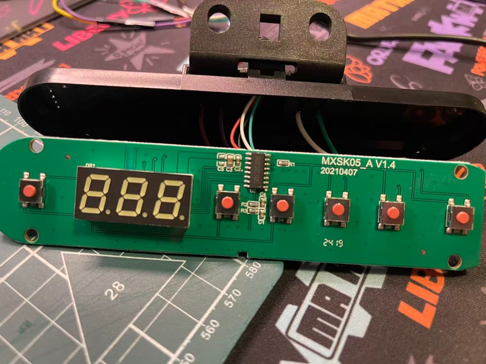
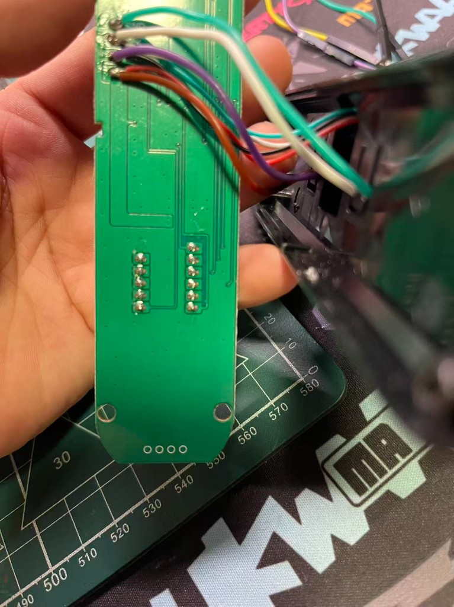
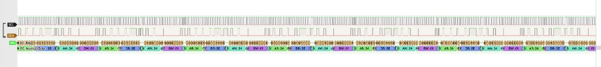
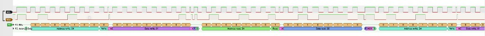

# 升降桌面板协议逆向：从「未知串行」到 TM1650

| 项 | 内容 |
|---|---|
| 文档编号 | DG-PROTO-001 |
| 版本 | **1.6** |
| 日期 | 2026-08-10 |
| 状态 | 进行中（**面板 IC = TM1650**；软件多地址 Slave 已通过升降与真实高度真机验收） |
| 对应阶段 | Phase 0 |
| 前置文档 | [需求文档](./0-requirements.md)、[抓包指南](./1-protocol-capture-with-logic-analyzer.md) |

本文记录升降桌 **原厂面板 ↔ 主机（控制盒）** 通信协议的实测结论，供 Desk Gateway 后续固件与博客成稿使用。随抓包推进持续更新。

> **给实现者 / AI**：技术复现请读 [§2](#2-协议原理principles) 与 [§8](#8-复现解析逻辑给实现者--ai)；**ESP32 控桌对照表见文末 [§18](#18-esp32-控桌实用速查汇总)**。§6 是博客叙事。

> **相对 v0.6 的纠偏（已并入 v0.7 / 1.0）**：更早版本把写往 `0x34–0x37`（8-bit `0x68/0x6A/0x6C/0x6E`）的帧判为电机 EMI。PCB 确认面板从片为 **TM1650** 后重解：这些正是数码管 digit 寄存器写；**高度经段码上总线**。先前「高度不在本 I²C」仅对「经典键轮询 `DR`」成立，对 digit 写不成立。

---

## 1. 写在前面 / 摘要结论

先给结论，方便博客读者一眼看懂，也方便自己回来查表。

| 问题 | 答案 |
|---|---|
| RJ45 是以太网吗？ | **不是**。面板线里跑的是 **类 I²C**（TM1650 时序），不是 TCP/IP。 |
| 面板上有独立 MCU 吗？ | **没有**。板号 `MXSK05_A V1.4`；主 IC 是 **U2 = TM1650**（显示驱动 + 键扫描）。 |
| 面板 ↔ 控制盒几根线？ | **仅 4 线**：`GND` / `3.3V` / `CLK` / `DAT`。 |
| 实测 RJ45 线序 | pin1 红=`3.3V`；pin2 白=`CLK`；pin3 绿=`GND`；pin4 黑=`DAT`。 |
| 面板总线上拉 | `3.3V↔CLK`、`3.3V↔DAT` 均实测 **`1.99 kΩ`**；替换面板时必须补回。 |
| 谁是 Master？ | **控制盒 = Master**；**面板 TM1650 = Slave**。 |
| 按键怎么传？ | Master 对控制地址做写+读轮询；键态在 **`DR`（读数据）**。 |
| 高度怎么传？ | Master **写 digit 段码寄存器**；旁路嗅探即可还原显示高度。 |
| 高度单位 | 面板显示为 **整数厘米（cm）**（观测值；未见小数点高度） |
| 控制 / 键地址 | 7-bit **`0x24`**（= TM1650 控制 8-bit **`0x48`**） |
| Digit 写地址 | 7-bit **`0x34–0x37`** / 8-bit **`0x68/0x6A/0x6C/0x6E`** |
| Digit 写序（总线） | 多为 **DIG3 → DIG2 → DIG1 → DIG4**（个→十→百→第四位） |
| 静置无按键 | `DW=0x01`，`DR=0x2E` |
| UP / DOWN 按住 | `DR=0x47` / `0x4F` |
| Preset1 / 4 短码（goto） | `DR=0x17` / `0x2F` |
| Preset1 / 4 长按保存 | `DR=0x57` / `0x6F`（短码 \| `0x40`，即 bit6） |
| Preset2 / 3 | **未知**（未抓包；勿臆造键码） |
| 上+下同时约 5s | **重置**（用户确认有此面板操作；`DR` 未知；待 `reset_up_down_hold_5s.sr`） |
| 有效采样 | **12 MHz**；短窗 5 M ≈ 417 ms；长窗 **100 M ≈ 8.33 s**。20 kHz 只能验接线，不能解码。 |

一句话：**同一根 CLK/DAT 上有两条逻辑通道，键轮询读 `0x24`，高度显示写 `0x34–0x37`。**

---

## 2. 协议原理（PRINCIPLES）

本节说明「为什么是这样」，与后文算法互补；实现解码时以本节约束为准。

### 2.1 为什么是 TM1650

- 面板 PCB 的 U2 已确认为 **TM1650**：集成 **LED 驱动 + 按键扫描**，不是通用 MCU。
- 手册地址与抓包一致：控制/键基址 8-bit `0x48`，digit 写 `0x68/0x6A/0x6C/0x6E`。
- 因此总线上不会出现「面板主动上报高度字」；高度只能以 **Master 写段码到数码管** 的形式出现（旁路嗅探可见）。

### 2.2 为什么同一总线有两条逻辑通道

物理上只有一对 `CLK`/`DAT`，但 TM1650 用 **不同从机地址** 区分功能：

| 通道 | 7-bit 地址 | 方向（相对 Master） | 载荷 |
|---|---|---|---|
| **键通道** | `0x24` | 先写后读 | 写控制字节 `DW`；读键态 `DR` |
| **显示通道** | `0x34`–`0x37` | 只写 | 各 1 字节七段段码 |

解码器应把两类事务 **分流处理**，再合并成 `key_state` + `height_cm`。

### 2.3 Master / Slave 角色

| 角色 | 设备 | 行为 |
|---|---|---|
| **Master** | 升降桌控制盒 | 产生 SCL、发起 START、写 `DW`、读 `DR`、写 digit |
| **Slave** | 面板 TM1650 | 应答 ACK、在读周期驱动 SDA 给出键码、接收段码刷新显示 |

**含义**：模拟「按键」时，ESP32 必须做 **I²C Slave** 应答键读；「读高度」只需旁路听 Master 的 digit 写，不必扮演 Master（除非还要自己刷数码管）。

### 2.4 `DW` / `DR` 含义

PulseView / 本文记法：

| 符号 | 全称 | 含义 |
|---|---|---|
| `AW` | Address Write | 7-bit 地址 + 写位（R/W=0） |
| `AR` | Address Read | 7-bit 地址 + 读位（R/W=1） |
| **`DW`** | Data Write | Master→Slave 的数据字节；键轮询中实测恒为 **`0x01`**（显示控制/亮度类；位域未完全标定） |
| **`DR`** | Data Read | Slave→Master 的数据字节；**键态码**在此 |

不要把 `DW` 当成键码；也不要在 `DR` 里找高度十进制字面量。

### 2.5 7-bit 地址 vs 8-bit 地址（原则）

TM1650 手册常用 **8-bit 写地址**（已含 R/W=0）；PulseView I²C decoder 常用 **7-bit 地址**（R/W 单独显示）：

```text
8-bit_write_addr = (7-bit_addr << 1) | 0
8-bit_read_addr  = (7-bit_addr << 1) | 1
7-bit_addr       = 8-bit_addr >> 1
```

例：`0x48`（手册写）↔ `0x24`（PulseView）；`0x68` ↔ `0x34`。实现时 **统一成一种表示**，再比较。

### 2.6 高度单位与 DIG 编号约定

- **单位**：面板显示为 **整数 cm**（例：64、102、121）；本文 `height_cm` 即该整数值。
- **DIG 编号（与 TM1650 / 本文一致）**：

| 逻辑位 | 7-bit | 8-bit 写 | 显示含义 |
|---|---|---|---|
| **DIG1** | `0x34` | `0x68` | **百位**（两位高度时常写 `0x00` 消隐） |
| **DIG2** | `0x35` | `0x6A` | **十位** |
| **DIG3** | `0x36` | `0x6C` | **个位** |
| **DIG4** | `0x37` | `0x6E` | 第 4 位；静态时常 **= DIG3**；运动中可滞后 |

- **总线写序**（观测多数）：`DIG3 → DIG2 → DIG1 → DIG4`，**不是** DIG1→2→3→4。组装高度时按 **逻辑编号** DIG1/2/3，不要按总线时间顺序当百/十/个。

### 2.7 事务边界：Repeated Start 与 分开的 START–STOP

解析器应兼容写后 Repeated Start 和写完整 STOP 后再 START 两种边界；但本桌
`idle_12mhz_full.sr` 的原始采样明确是后者，硬件代理必须以该 STOP 分隔波形为准，不能把
解析兼容能力误写成面板实测行为。digit 写仍是每次独立 `S … P`。

**解码器必须两种都接受**：以「完整地址 + 数据 + ACK 语义」为准，不以「必须 Sr」为硬条件。
本控制盒在读完单字节 `DR` 后实测使用 **ACK + STOP**，不是常见的 NACK + STOP；解析器不得把
该 ACK 当成“还要继续读”的异常。

---

## 3. 背景与问题

Desk Gateway 要把原厂升降桌接到智能家居 / Agent 侧，需要先搞清楚「面板和主机之间到底在说什么」。市面不少升降桌把手线做成 RJ45 外壳，容易让人以为是以太网；拆开看，往往只是四线电源 + 同步串行。

本项目 Phase 0 的目标不是立刻写 ESP32 固件，而是：

1. 旁路监听面板与控制盒的通信；
2. 锁定物理层、地址、读写事务；
3. 差分出按键码与高度通道；
4. 给 Phase 1（模拟面板 / 嗅探高度）留下可实现的契约。

前置材料见需求文档与抓包指南；本文只沉淀 **已验证事实** 与 **仍开放的问题**。

---

## 4. 硬件解剖：MXSK05_A V1.4

### 4.1 面板正面

板丝印 **MXSK05_A V1.4**（日期码 `20210407`）。可见三位七段数码管、六个轻触键，以及 **U2**（SOIC 封装）。拆板确认 U2 为 **TM1650**：既驱数码管，又扫按键矩阵。板级没有「再算一遍高度」的独立 MCU；对外只要四线就够。

厂家线从壳体引出四色线焊在板边。万用表已经确认 RJ45 pin1 红=`3.3V`、pin2 白=`CLK`、
pin3 绿=`GND`、pin4 黑=`DAT`；该映射适用于本台 `MXSK05_A V1.4`，其他桌型仍须重新实测。



### 4.2 面板背面与飞线说明

背面几乎是焊盘与过孔。图中多出的飞线是 **作者焊给逻辑分析仪做旁路探针的**，不是厂家多出来的第五根通信线。原厂仍是四线进壳体；探针从测试点或焊盘引出 `GND` / `CLK` / `DAT`（必要时再引出 `3.3V` 作参考，分析仪供电端一般不接面板电源）。



### 4.3 原厂上拉与 Phase 1 替换约束

原厂面板断电并与控制盒完全断开后，双向测量均稳定为：

```text
红线 3.3V ↔ 白线 CLK = 1.99 kΩ
红线 3.3V ↔ 黑线 DAT = 1.99 kΩ
```

这说明面板为 CLK、DAT 各提供一只约 `2 kΩ` 的外部上拉。旁路抓包时原厂面板仍在线，
所以原始 `.sr` 文件包含这些上拉形成的电气条件；它们不能证明拔掉面板后总线仍能正常拉高。

ESP32 完全替换面板时必须补回：

```text
红线 3.3V ── 2 kΩ（可用 2.2 kΩ）── 白线 CLK / GPIO4
红线 3.3V ── 2 kΩ（可用 2.2 kΩ）── 黑线 DAT / GPIO5
绿线 GND ─────────────────────────── ESP32 GND
```

红线只能作为上拉电源，不能直接连接 ESP32 `3V3`；ESP32 继续由 USB 独立供电并与控制盒共地。

### 4.4 拓扑小结

| 项 | 结论 |
|---|---|
| 面板驱动 IC | **TM1650**（已确认） |
| 面板↔控制盒线 | **仅 4 线**：`GND` / `3.3V` / `CLK` / `DAT` |
| 角色 | **控制盒 = Master**；**面板 TM1650 = Slave** |
| 按键 | Master 读控制地址 → 键码 |
| 高度显示 | Master **写 digit 段码寄存器** → 数码管；旁路可嗅探 |

TM1650 地址映射（与抓包一致）：

| 用途 | 8-bit 写地址 | PulseView 7-bit | 说明 |
|---|---|---|---|
| 显示控制 / 键扫描基址 | **`0x48`** | **`0x24`** | 写亮度/开显；读回键码 |
| DIG1（百位） | **`0x68`** | **`0x34`** | + 1 字节段码 |
| DIG2（十位） | **`0x6A`** | **`0x35`** | + 1 字节段码 |
| DIG3（个位） | **`0x6C`** | **`0x36`** | + 1 字节段码 |
| DIG4（第 4 位 / 镜像） | **`0x6E`** | **`0x37`** | 静态时常 = DIG3；运动中常滞后一帧个位 |

总线写序多为 **DIG3→DIG2→DIG1→DIG4**；高度单位为面板显示的 **整数 cm**。

---

## 5. 工具、接线与采样参数演进

### 5.1 测试环境

| 项 | 值 |
|---|---|
| 逻辑分析仪 | [nanoDLA](https://github.com/wuxx/nanoDLA)（FX2 / `fx2lafw`） |
| 上位机 | PulseView（sigrok） |
| 有效采样 | **12 MHz**；短窗 5 M samples（约 417 ms）；长窗 **100 M samples（约 8.33 s）** |
| 无效采样 | 20 kHz（欠采样，仅作接线验证，不可解码） |
| PulseView 驱动 | **`fx2lafw`**（[nanoDLA](https://github.com/wuxx/nanoDLA)）。macOS 一般无需 Zadig；Windows 才需要 WinUSB |

### 5.2 接线（旁路监听）

原厂面板保持与主机正常连接；分析仪只监听：

| 面板测试点 | 分析仪 |
|---|---|
| GND | GND |
| CLK | CH0 → PulseView 中作 **SCL**（`D0`） |
| DAT | CH1 → PulseView 中作 **SDA**（`D1`） |
| 3.3V | **不接** |

### 5.3 采样参数怎么从失败走到可用

| 设置 | 结果 |
|---|---|
| 20 kHz / 1 M | 能看到「有信号」，但欠采样，比特不可信 |
| **12 MHz / 5 M** | 可稳定 I²C 解码；推荐短动作默认；窗口约 **417 ms**；若先按键再点 Run，易整段都是按住态、错过边沿 |
| **12 MHz / 100 M** | 长窗约 **8.33 s**；适合长按保存全流程；仍可能截断首尾 idle |
| 24 MHz | 可选，用于更细边沿；本协议 SCL ≈ 10 kHz 下非必须 |

SCL 实测约 **9.6 kHz**（周期约 104 µs，高低各约 52 µs）。逻辑电平为 3.3V 数字（面板丝印 `3.3V`）。

**抓边沿提示**：

1. **先点 Run（静置中）**，再在窗口内完成 press→（可选长按）→release，尽量看到 `0x2E`→按键码→`0x2E`；或
2. 用 **100 M** 长窗，但仍建议从静置起采；或
3. 对 **SDA 变化** 设触发，对准 `DR` 跳变再采。

### 5.4 抓包归档索引（摘要）

详细路径与用途见文末 [§15](#15-抓包文件索引)。此处只强调：项目根目录临时 `.sr` 复制进 `captures/` 时一律用 `/bin/cp`（非 rmtrash），避免覆盖已归档的 `idle_12mhz_full.sr` 等文件。

---

## 6. 发现叙事：一次纠错完整的逆向过程

这一节是博客故事线。技术契约以 [§2](#2-协议原理principles) / [§8](#8-复现解析逻辑给实现者--ai) 为准；这里按时间顺序写清「为什么会错、怎么改过来」。

### 6.1 先当未知同步串行

最初只知道四线里有 CLK/DAT，不知道是不是标准 I²C。20 kHz 采样只能证明「线上有边沿」，解不出比特。把 CLK/DAT 当成未知同步串行是合理起点：先保证接线、再抬采样率。

### 6.2 PulseView I²C 解出 `0x24` 轮询

改到 **12 MHz** 后，PulseView 的 I²C decoder 能稳定解出 START / 地址 / ACK / DATA / STOP。静置时总线上不是空闲，而是持续轮询：

```text
写： AW:24  DW:01
读： AR:24  DR:2E   （然后 ACK + Stop）
```

7-bit 地址 **`0x24`**，写数据恒为 **`0x01`**，读回 **`0x2E`**。地址相位比特（高清截图）：

```text
写：0 1 0 0 1 0 0  0   → 7-bit 0x24 + W
读：0 1 0 0 1 0 0  1   → 7-bit 0x24 + R
```

完整事务骨架（常见形态；**亦接受写 STOP 后再 START 读**，见 §2.7 / §8.2）：

```text
S
  Address write: 0x24
  AC
  Data write:    0x01      ← 显示控制 / 亮度等（后来才知道是 TM1650 控制数据）
Sr（Repeated Start，无中间 Stop）—— 或改为 P 后再 S
  Address read:  0x24
  AC
  Data read:     0x2E      ← 键码（静置 = 无按键）
  ACK              ← 本控制盒实测：ACK 后直接结束读
P
（随后再次 S → 写 0x01 … 循环）
```

键轮询周期约 **3.7 ms** / 完整写+读（100 M 窗内约 2240 次读）。





### 6.3 差分出按键码表

对比 idle / UP 按住 / DOWN 按住：`DW` 始终 `0x01`，变化全在 `DR`。

| 状态 | `DW` | `DR` | 十进制 | 二进制 |
|---|---|---|---|---|
| 静置 | `0x01` | **`0x2E`** | 46 | `0010_1110` |
| UP 按住 | `0x01` | **`0x47`** | 71 | `0100_0111` |
| DOWN 按住 | `0x01` | **`0x4F`** | 79 | `0100_1111` |

UP 与 DOWN 仅差 bit3（`0x47 ⊕ 0x4F = 0x08`）。后续 Preset 长按又确认 **bit6（`0x40`）** 是长按标志：`0x17→0x57`、`0x2F→0x6F`。键信息落在 `DR` 的状态位上，事务骨架始终不变。

### 6.4 质疑：只有四线，高度怎么显示？

面板数码管会变高度，总线却只有四线。早期在键通道 `DR`/`DW` 里搜显示值（64、102 等字面量）为零；连续按住 UP 时 `DR` 主导 `0x47`，没有随高度单调变化的斜坡。于是得出一个 **半对半错** 的结论：

- 对的一半：**高度不在经典键轮询 `DR` 里**；
- 错的一半：**「高度不在本 I²C」**（把 digit 写当成电机 EMI 丢掉了）。

### 6.5 拆板确认 TM1650，误判翻案

拆板看到 U2 = TM1650 后，地址立刻对上：

- PulseView 的 **`0x24`** = 手册里的控制写地址 **`0x48`**（7-bit 形式）；
- 先前当噪声丢掉的 **`0x34–0x37`** = digit 寄存器 **`0x68/0x6A/0x6C/0x6E`**。

也就是说：控制盒一边用 `0x24` 读键，一边用 digit 地址把段码刷到数码管。旁路监听同一 CLK/DAT，两条通道都能看到。

### 6.6 用保存包静态帧解出 64 / 102

`preset_1_save` / `preset_4_save` 里与键轮询交错的四元组，每段抓包各 **精确重复 3 次**、段码不变：

```text
AW:36 DW:C5 / AW:35 DW:DB / AW:34 DW:00 / AW:37 DW:C5   → 经验解 = 64
AW:36 DW:9E / AW:35 DW:5F / AW:34 DW:44 / AW:37 DW:9E   → 经验解 = 102
```

（上表为 7-bit 地址；8-bit 即 `0x6C/0x6A/0x68/0x6E`。）

这不是 EMI，而是 TM1650 显示刷新。v0.4–v0.6 将其排除是错误的；v0.7 起写入协议。

---

## 7. 协议总览

```text
                    ┌─────────────────────┐
                    │   控制盒 (Master)    │
                    │  产生 SCL / START    │
                    └──────────┬──────────┘
                               │
              CLK ─────────────┼───────────── SCL
              DAT ─────────────┼───────────── SDA
              GND / 3.3V       │
                               │
                    ┌──────────▼──────────┐
                    │ 面板 TM1650 (Slave)  │
                    │  无独立高度 MCU       │
                    └──────────┬──────────┘
                               │
              ┌────────────────┴────────────────┐
              │                                 │
     键通道 @ 0x24 (0x48)              显示通道 @ 0x34–0x37
     写 DW=0x01 后读 DR 键码            写 DIG1–4 各 1 字节段码
     idle=2E  UP=47  DOWN=4F            旁路嗅探 → 还原高度 cm
     P1:17/57  P4:2F/6F                 写序多为 DIG3→2→1→4
```

物理层 / 链路层要点：

| 结论 | 说明 |
|---|---|
| 协议 | **类 I²C**（TM1650 时序；PulseView `I²C` decoder 可解） |
| 逻辑电平 | 3.3V 数字 |
| SCL 频率 | 约 **9.6 kHz** |
| 静置行为 | **持续键轮询**；digit 写在静置短窗内可为 0 |
| 显示刷新 | 静态约每 **2–3 s** 一整帧四写；运动中更密（goto 约 0.3–0.4 s/帧） |
| 键轮询边界 | **Sr（Repeated Start）或 分开的 START–STOP 均可**；解码器两种都接受 |
| 高度单位 | **整数 cm**（面板显示观测值） |

---

## 8. 复现解析逻辑（给实现者 / AI）

> **目标**：仅凭本节 + §2，即可从 I²C 事务流（或原始 SCL/SDA 波形）确定性产出 `key_state` 与 `height_cm`。  
> **金标准样本**：`captures/preset_1_save.sr` 中 digit 四元组 `DIG1..4 = 00 DB C5 C5` → **`height_cm = 64`**（已用离线解码复核：3 帧 shaped、完全一致）。

### 8.0 从原始波形到字节（不依赖 PulseView 时）

若输入是逻辑分析仪原始采样（如 `.sr` 里 `logic-1-*`，每样本 1 字节：`bit0=SCL`，`bit1=SDA`）：

1. **采样沿**：在 **SCL 上升沿** 采样 SDA，得到数据比特（与常见 I²C 一致）。
2. **比特序**：每字节 **MSB first**（先传高位）。
3. **START**：SCL 为高时，SDA 出现 **高→低**。
4. **STOP**：SCL 为高时，SDA 出现 **低→高**。
5. **ACK/NACK**：第 9 个时钟周期；SDA 低 = ACK，高 = NACK。
6. **字节组帧**：START 之后依次：地址字节（含 R/W）→ ACK → 数据字节 → ACK/NACK → … → STOP（或 Sr）。
7. 地址字节：`addr8 = (addr7<<1)|rw`；PulseView 显示的是拆开后的 `addr7` + Write/Read。

组出事务列表后，交给 §8.1 起的上层逻辑。若已有 PulseView / libsigrok 解出的 I²C 注解，可跳过本节，直接从事务流开始。

本桌 SCL ≈ **9.6 kHz**；原始采样建议 ≥ **12 MHz**（每比特约 1000+ 点），否则 START/比特会欠采样。

### 8.1 地址规范化（PulseView 7-bit vs 手册 8-bit）

输入可能是下列任一表示，先归一到 **7-bit 地址 + R/W**：

```python
def normalize_addr(addr_value, *, form):
    """
    form:
      '7bit'  — PulseView Address write/read 字段（如 0x24, 0x34）
      '8bit'  — 含 R/W 的首字节（写 0x48/0x68…；读 0x49/…）
    返回: (addr7, rw)  where rw: 0=W, 1=R
    """
    if form == '7bit':
        # R/W 由事务类型单独给出，不在本函数
        return addr_value & 0x7F
    if form == '8bit':
        return (addr_value >> 1) & 0x7F, addr_value & 0x1
    raise ValueError(form)

# 常量（统一用 7-bit）
ADDR_KEY   = 0x24          # 8-bit W=0x48, R=0x49
ADDR_DIG1  = 0x34          # 8-bit W=0x68  百位
ADDR_DIG2  = 0x35          # 8-bit W=0x6A  十位
ADDR_DIG3  = 0x36          # 8-bit W=0x6C  个位
ADDR_DIG4  = 0x37          # 8-bit W=0x6E  第四位
DIG_ADDRS  = {ADDR_DIG1, ADDR_DIG2, ADDR_DIG3, ADDR_DIG4}
```

对照表（勿混用列）：

| 用途 | 7-bit | 8-bit 写 | 8-bit 读 |
|---|---|---|---|
| 控制 / 键 | `0x24` | `0x48` | `0x49` |
| DIG1 百位 | `0x34` | `0x68` | — |
| DIG2 十位 | `0x35` | `0x6A` | — |
| DIG3 个位 | `0x36` | `0x6C` | — |
| DIG4 | `0x37` | `0x6E` | — |

### 8.2 解析一笔键轮询事务

**合法键轮询解析**（两种边界均可解析；本桌硬件实测采用形态 B）：

```text
形态 A（解析兼容，Repeated Start）：
  S  AW:24  ACK  DW:01  ACK  Sr  AR:24  ACK  DR:xx  ACK  P

形态 B（本桌实测，分开 START–STOP）：
  S  AW:24  ACK  DW:01  ACK  P
  S  AR:24  ACK  DR:xx  ACK  P
```

判定规则（确定性）：

1. 写半段：`addr7==0x24` 且 `rw==W`，恰好 1 字节数据，且 **`DW == 0x01`**（否则丢弃 / 标噪声）。
2. 读半段：`addr7==0x24` 且 `rw==R`，恰好 1 字节数据；本控制盒实测以 **ACK + STOP** 结束读。
   不得套用“最后一字节必须 NACK”的通用规则过滤本协议。
3. 写与读可被 Sr 粘合，也可被独立 STOP/START 分开；关联时用时间邻近（例如 < 1 个键周期 ≈ 3.7 ms）即可。
4. 输出：`last_dr = DR`；`last_dw = DW`（诊断用）。

**非法 / EMI（忽略）**：

- 地址不是 `0x24` / digit 集合；
- 键写 `DW != 0x01`；
- 缺 ACK、字节数不对、读未完成即 STOP；
- 运动抓包中散落的怪异地址帧。

### 8.3 检测 digit 写帧并组装高度

单次 digit 写（常见每次独立 STOP）：

```text
S  AW:3x  ACK  DW:seg  ACK  P
```

其中 `3x ∈ {0x34,0x35,0x36,0x37}`，`seg` 为段码字节。

**组装一帧显示（shaped 四元组）**：

1. 在短时间窗内（典型整帧 ~7 ms；固件使用 **≤20 ms**）收集：
   - `dig[1] ← 写往 0x34 的 seg`
   - `dig[2] ← 写往 0x35 的 seg`
   - `dig[3] ← 写往 0x36 的 seg`
   - `dig[4] ← 写往 0x37 的 seg`
2. **总线写序**为 `0x36 → 0x35 → 0x34 → 0x37`（DIG3→2→1→4）。固件严格要求该顺序且每个地址只出现一次；乱序、重复或超时碎片立即丢弃，禁止跨刷新周期拼帧。收集时仍按地址归档，不要把「第 1 个到达的字节」当百位。
3. **shaped 规则**（滤波）：四个地址齐全，且静态场景下常有 `dig[4] == dig[3]`。运动中 DIG4 可滞后；仍要求四地址齐全才称完整帧。缺字节 / 单地址碎片 → **丢弃（EMI）**。
4. 用经验段码表（§8.5）解 `dig[1], dig[2], dig[3]` → 百/十/个位数字；`dig[4]` 不参与数值（仅完整性 / 镜像校验）。
5. `height_cm = hundreds*100 + tens*10 + ones`；若百位为空白（`None`），则 `height_cm = tens*10 + ones`。

**金标准**：

```text
总线写序:  AW:36 DW:C5 / AW:35 DW:DB / AW:34 DW:00 / AW:37 DW:C5
按 DIG 归档: DIG1=00, DIG2=DB, DIG3=C5, DIG4=C5
段码解码:   空白, 6, 4  → height_cm = 64
```

### 8.4 端到端伪代码：事务流 → key_state + height_cm

```python
# --- preset_1_goto 连续高度序列标定出的完整经验段码表 ---
SEG_TO_DIGIT = {
    0x00: None,          # 百位消隐
    0x5F: 0,
    0x44: 1,
    0x9E: 2,
    0xD6: 3,
    0xC5: 4,
    0xD3: 5,
    0xDB: 6,
    0x46: 7,
    0xDF: 8,
    0xD7: 9,
}

KNOWN_KEYS = {
    0x2E: 'idle',
    0x47: 'up',
    0x4F: 'down',
    0x17: 'preset1_short',
    0x57: 'preset1_long',
    0x2F: 'preset4_short',
    0x6F: 'preset4_long',
    # preset2 / preset3: 未知 — 不要填入臆造码
}

LONG_PRESS_BIT = 0x40  # bit6

def decode_stream(transactions):
    """
    transactions: 可迭代的 I2C 事务
      每项至少含: addr7, rw ('W'|'R'), data: list[int], complete: bool
    接受 Sr 粘合的写+读，或分离的写事务 / 读事务。
    """
    key_state = 'idle'
    last_dr = None
    height_cm = None
    dig_buf = {}          # addr7 -> seg
    dig_buf_t0 = None

    def flush_digits():
        nonlocal height_cm, dig_buf, dig_buf_t0
        if set(dig_buf.keys()) != DIG_ADDRS:
            dig_buf, dig_buf_t0 = {}, None
            return  # incomplete → EMI
        d1, d2, d3, d4 = (dig_buf[a] for a in
                          (ADDR_DIG1, ADDR_DIG2, ADDR_DIG3, ADDR_DIG4))
        # 静态 shaped：DIG4==DIG3；运动帧可放宽，但仍要求四地址齐全
        h = SEG_TO_DIGIT.get(d1, 'UNK')
        t = SEG_TO_DIGIT.get(d2, 'UNK')
        o = SEG_TO_DIGIT.get(d3, 'UNK')
        if 'UNK' in (h, t, o) or t is None or o is None:
            # 未知段码：保留 raw，不更新 height
            dig_buf, dig_buf_t0 = {}, None
            return
        # 百位空白（None）→ 两位数；百位为 0 则仍按三位数（少见）
        if h is None:
            height_cm = t * 10 + o
        else:
            height_cm = h * 100 + t * 10 + o
        dig_buf, dig_buf_t0 = {}, None

    last_dw_ok = False  # 最近一次键写是否为 DW=0x01

    for tr in transactions:
        if not tr.complete:
            continue  # 不完整帧 → 忽略

        if tr.addr7 == ADDR_KEY and tr.rw == 'W':
            last_dw_ok = (tr.data == [0x01])
            continue

        if tr.addr7 == ADDR_KEY and tr.rw == 'R':
            # 写/读可 Sr 粘合或分离；要求近期见过合法 DW=0x01
            if not last_dw_ok or len(tr.data) != 1:
                continue
            last_dr = tr.data[0]
            key_state = classify_key(last_dr)  # 见 §8.6
            continue

        if tr.addr7 in DIG_ADDRS and tr.rw == 'W' and len(tr.data) == 1:
            # 新簇：若间隔过大则先尝试 flush 旧的不完整簇（丢弃）
            dig_buf[tr.addr7] = tr.data[0]
            if len(dig_buf) == 4:
                flush_digits()
            continue

        # 其它地址 → EMI，忽略

    return key_state, last_dr, height_cm
```

### 8.5 段码解码与完整数字映射

1. **优先查表** `SEG_TO_DIGIT`；命中则输出 0–9 或 `None`（空白）。
2. `preset_1_goto.sr` 的连续下降序列逐帧显示 `77→76→…→64`，再结合 64、82、102、121
   四个锚点，已经锁定全部数字；`0x46=7` 不再是猜测。
3. 高位不是可随意清除的 DP 位：**`0x5F=0`，而 `0xDF=8`**。旧版把两者视为同一数字的
   假设已被连续序列否定，固件必须按完整字节精确匹配。
4. **标准共阴表 `0x3F/0x06/…` 不可用**；这是本面板的经验字模，不做 bit 重排。
5. 未知段码或解码后超出 `40–200 cm`：**不更新高度**，记录 raw 四元组用于排查。

### 8.6 键态状态机（idle / up / down / preset 短 / 长）

输入为连续合法 `DR` 字节流（约每 3.7 ms 一次）。

```python
def classify_key(dr: int) -> str:
    if dr in KNOWN_KEYS:
        return KNOWN_KEYS[dr]
    return f'unknown_0x{dr:02X}'

def is_long_press_code(dr: int) -> bool:
    """Preset 长按 = 短码 | 0x40（bit6）。UP/DOWN 按住码本身已带 bit6。"""
    return (dr & LONG_PRESS_BIT) != 0

# 时长规则（实测）：
# - preset 保存：长码持续约 4–5 s（短→长→短）
# - preset goto：长码仅闪 ~0.1–0.2 s，随后短码维持数秒
# - 模拟 goto：优先持续回传短码；不要持续长码（会走保存）

def key_fsm(dr_stream, sample_period_s=0.0037):
    """
    将 DR 流映射为高层事件（实现网关逻辑时用）。
    """
    state = 'idle'
    long_ticks = 0
    LONG_SAVE_S = 2.0          # 低于保存实测 4s，作判定阈值
    for dr in dr_stream:
        label = classify_key(dr)
        if label == 'idle':
            state, long_ticks = 'idle', 0
            yield 'idle', dr
            continue

        if label in ('up', 'down'):
            state, long_ticks = label, 0
            yield label + '_hold', dr
            continue

        if label.endswith('_long'):
            long_ticks += 1
            if long_ticks * sample_period_s >= LONG_SAVE_S:
                yield label.replace('_long', '_save'), dr  # 确认保存意图
            else:
                yield label, dr  # 仍可能是 goto 开头的短促 bit6
            continue

        if label.endswith('_short'):
            long_ticks = 0
            yield label, dr  # goto / 短按主导
            continue

        yield label, dr  # unknown，含 0x07/0x0F 前缀等
```

**bit6 规则小结**：

| `DR` | bit6 | 语义（已验证） |
|---|---|---|
| `0x17` / `0x2F` | 0 | Preset1 / 4 **短**（goto 主导） |
| `0x57` / `0x6F` | 1 | Preset1 / 4 **长**（`短码 \| 0x40`） |
| `0x47` / `0x4F` | 1 | UP / DOWN 按住（本身带 bit6） |
| Preset2 / 3 | — | **未知** |

### 8.7 滤波规则（必须遵守）

| 规则 | 做法 |
|---|---|
| 不完整帧 | 缺地址 / 缺数据 / 无 ACK → 丢弃 |
| 非 shaped 四元组 | digit 缺一即丢；优先要求四地址齐全 |
| 非 `DW=0x01` 的键写 | 不计入协议 |
| 非 `0x24`/`0x34–0x37` 地址 | 运动段多视为 EMI |
| **优先静态保存包** | `preset_*_save.sr` 段码 100% 干净，作字库与回归金标准 |
| 运动包 | 完整帧占比低（约 7–17%）；严格 20 ms 组帧，并按运动方向与最大速度过滤；反向/跳变值不更新高度 |
| 未知键码 | 标记 `unknown`，**勿把 Preset2/3 写成假码** |

### 8.8 最小自检向量

| 输入（摘要） | 期望输出 |
|---|---|
| 键：`DW=01, DR=2E` 循环 | `key_state=idle` |
| 键：`DR=47` 持续 | `up` |
| 键：`DR=4F` 持续 | `down` |
| 键：`17 → 57(≥2s) → 17` | Preset1 长按保存意图 |
| digit：`00 DB C5 C5` | `height_cm=64` |
| digit：`44 5F 9E 9E` | `height_cm=102` |
| digit：缺 `0x34` 的三写 | 不更新高度 |

---

## 9. 键通道详解

### 9.1 静置轮询（核心模式）

见 §6.2。简化记法：

```text
写： AW:24  DW:01
读： AR:24  DR:2E
```

`0x2E` = 十进制 46，静置样本中是「无按键」态。Goto 抓包中运动期间 `DR` 可长时间保持档位短码，高度改走 digit 写。

对 `idle_12mhz.sr` 的离线分析也表明：按 SCL 上升沿采样 SDA，存在稳定重复的比特周期；与上述 I²C 交替读写一致。

### 9.2 UP / DOWN 按住

| 文件 | 采样 | 说明 |
|---|---|---|
| `captures/up_hold.sr` | 12 MHz / 5 M，约 417 ms | 由根目录 `up.sr` 复制归档；全程按住上升键 |
| `captures/down_hold.sr` | 同上 | 由根目录 `down.sr` 复制；全程按住下降键 |

| 对比项 | 静置 | UP 按住 | DOWN 按住 |
|---|---|---|---|
| `DW` | `0x01` | **`0x01`** | **`0x01`** |
| `DR` | `0x2E` | **`0x47`（至少 39 个干净读事务）** | **`0x4F`（约 108 个干净读事务）** |

要点：

1. 事务骨架未变：`AW:24` → `DW:01` → `AR:24` → `DR:??` → ACK → Stop。
2. 按键信息落在 `DR`。
3. 本两文件 **无 press / release 边沿**（全程已是按住态）。
4. `up_hold.sr` 噪声较重，不能再表述为“109 个完整合法事务”；其他完整上升抓包中大量
   `0x47` 与之交叉印证，因此键码可信，但单文件计数只采用至少 39 个干净读事务。
5. DOWN 抓包约 383–391 ms 偶见非 `0x24` 地址毛刺，更像采样/同步噪声，**不以之为协议字节**。

### 9.3 Preset 长按保存时的 `DR` 时间线

| 文件 | 操作 | 采样 |
|---|---|---|
| `captures/preset_1_save.sr` | 长按档位 1，保存高度 **64** | 12 MHz / **100 M**，约 8.333 s |
| `captures/preset_4_save.sr` | 长按档位 4，保存高度 **102** | 同上 |

metadata：`probe1=SCL`，`probe2=SDA`，`unitsize=1`，`samplerate=12 MHz`；logic 分片合计 **100 000 000** 字节。

| 项 | preset_1_save | preset_4_save |
|---|---|---|
| START/STOP 对数 | ≈4517 | ≈4509 |
| 合法 `DW=0x01` 次数 | ≈2245 | ≈2239 |
| 合法 `DR` 次数 | 2242 | ≈2238 |
| 合法轮询中的 `DW` | **始终 `0x01`** | **始终 `0x01`** |
| 本窗是否出现 idle `DR=0x2E` | **否** | **否** |

两段均未覆盖静置：一开始已是按键短码，结束时仍停在短码（手指可能尚未完全松开，或松开边沿落在窗外）。

**Preset 1（保存高度 64）**

| t (s) | `DR` | 持续 | 约读次数 | 假设语义 |
|---|---|---|---|---|
| 0.0038 | **`0x17`** | 0.277 s | ~75 | 档位 1 按下 / 短按态 |
| 0.2805 | **`0x57`** | **5.048 s** | ~1358 | 档位 1 **长按 / 保存激活** |
| 5.3287 | **`0x17`** | 至窗末 ~3.00 s | ~809 | 回到短按态（仍按住或未回 idle） |

**Preset 4（保存高度 102）**

| t (s) | `DR` | 持续 | 约读次数 | 假设语义 |
|---|---|---|---|---|
| 0.0023–0.0059 | **`0x2F`** | ~0.16 s | ~43 | 档位 4 按下 / 短按态 |
| 0.1610 | **`0x6F`** | **4.221 s** | ~1131 | 档位 4 **长按 / 保存激活** |
| 4.3821 | **`0x2F`** | 至窗末 ~3.95 s | ~1064 | 回到短按态 |

合法事务的 `DW` **无变迁**。偶发非 `0x48`/`0x49` 地址帧与怪异 `DW` **不计入协议**。

要点：

1. **长按标志 = bit6（`0x40`）**；与 UP/DOWN 按住码本身已带 bit6 一致。
2. Preset1 vs Preset4：`0x17 ⊕ 0x2F = 0x38`，`0x57 ⊕ 0x6F = 0x38`（bits 3–5），键位身份在这些位上区分。
3. 保存动作体现为面板在 `DR` 上报不同状态，而非主机另写「高度寄存器」到键通道。

### 9.4 Preset 单击前往（goto）

| 文件 | 操作 | 采样 |
|---|---|---|
| `captures/preset_1_goto.sr` | 先 Run，再 **短按** 档位 1 | 12 MHz / **100 M**，约 8.333 s |
| `captures/preset_4_goto.sr` | 同上，短按档位 4 | 同上 |

| 项 | preset_1_goto | preset_4_goto |
|---|---|---|
| 合法 `AW=0x48` 的 `DW` | **始终 `0x01`**（2209 次） | 前 ~1.1 s 稳定 `0x01`；其后电机噪声导致大量误帧 |
| 合法 `AR=0x49` 的 `DR` | 2194 次，几乎无毛刺 | 约 917 次可关联；运动中段噪声大 |
| 本窗是否出现 idle `DR=0x2E` | **否** | **否** |

实验者说明含「到达后一段静置」，但两窗解码均 **未** 见到 `0x2E`。可能松手/回 idle 落在窗外，或前往过程中面板持续上报短码。

**Preset 1 goto**（干净）

| t (s) | `DR` | 持续 | 约读次数 | 假设语义 |
|---|---|---|---|---|
| 0.005 | **`0x07`** | 0.426 s | 116 | 未知前缀（相对 `0x17` 仅清 bit4）；**不是** idle `0x2E` |
| 0.435 | **`0x57`** | **0.131 s** | 34 | 短促出现长按码（远短于保存的 4–5 s） |
| 0.570 | **`0x17`** | **至窗末 ~7.76 s** | 2043 | 档位 1 **短码**主导 |

**Preset 4 goto**（开头干净，约 1.1 s 后疑似电机 EMI）

| t (s) | `DR` | 持续 | 约读次数 | 假设语义 |
|---|---|---|---|---|
| 0.005 | **`0x0F`** | 0.630 s | 171 | 未知前缀（相对 `0x2F` 仅清 bit5）；**不是** idle |
| 0.639 | **`0x6F`** | **0.202 s** | 53 | 短促长按码 |
| 0.844 | **`0x2F`** | 至窗末（多数时间） | 497（合法帧中最多） | 档位 4 **短码**主导 |

P4 在 t≳1.1 s 后出现大量非 `0x48`/`0x49` 地址与散落 `DR`（含偶发 `0x17`/`0x57` 单点），**按噪声处理**；与 P1 干净长段对照，更像运动干扰而非第二套协议。

### 9.5 完整键码表（截至当前）

| 状态 | `DW` | `DR` | 二进制 | 备注 |
|---|---|---|---|---|
| 静置 | `0x01` | **`0x2E`** | `0010_1110` | 无按键 |
| UP 按住 | `0x01` | **`0x47`** | `0100_0111` | bit6=1 |
| DOWN 按住 | `0x01` | **`0x4F`** | `0100_1111` | bit6=1；相对 UP 差 bit3 |
| Preset1 短 / goto | `0x01` | **`0x17`** | `0001_0111` | 单击前往主导码；可维持数秒 |
| Preset1 长按保存 | `0x01` | **`0x57`** | `0101_0111` | `0x17 \| 0x40`；需持续数秒 |
| Preset4 短 / goto | `0x01` | **`0x2F`** | `0010_1111` | 单击前往主导码 |
| Preset4 长按保存 | `0x01` | **`0x6F`** | `0110_1111` | `0x2F \| 0x40` |
| Preset2 短 / 长 | — | **未知** | — | **未抓包；禁止臆造** |
| Preset3 短 / 长 | — | **未知** | — | **未抓包；禁止臆造** |
| Goto 前缀？ | `0x01` | `0x07` / `0x0F` | — | P1/P4 goto 开头各见；语义未证实 |

### 9.6 连续上升时的键通道（`full_up_*.sr`）

四段拼接覆盖显示高度 **64 → 129**：

| 文件 | 显示高度 | 采样 |
|---|---|---|
| `captures/full_up_64_82.sr` | 64→82 | 12 MHz / **100 M**，约 8.333 s（由根目录 `64->82.sr` 复制） |
| `captures/full_up_82_102.sr` | 82→102 | 同上（由 `82-102.sr`） |
| `captures/full_up_102_121.sr` | 102→121 | 同上（由 `102->121.sr`） |
| `captures/full_up_121_129.sr` | 121→129 | 同上（由 `121-129.sr`） |

| 文件 | classic 轮询数 | 主导 `DR` | 次要 | 窗内 idle `0x2E` |
|---|---|---|---|---|
| 64→82 | ≈477 | **`0x47`（UP）** ≈58% | 开头 ≈0.5 s 为 `0x17`（P1 短码） | **无** |
| 82→102 | ≈518 | **`0x47`** ≈65% | 首尾夹杂 `0x07` | **无** |
| 102→121 | ≈481 | **`0x47`** ≈64% | 首尾夹杂 `0x07` | **无** |
| 121→129 | ≈1320 | 运动段 **`0x47`**；首 ≈0.9 s / 末 ≈2.2 s 为 **`0x07`** | — | **无** |

键事务中 `DW` **恒为 `0x01`**。

| 候选编码 | 结果 |
|---|---|
| uint8 显示值于 classic `DR`/`DW` | **0 次** |
| `DR` 单调斜坡随高度 | **否**；mid-window 众数均为 **`0x47`** |

结论：运动中键通道主导 `DR=0x47`（UP），**不**携带高度字；`0x07` 在若干窗首尾再现，语义未证实，**不是高度**。

---

## 10. 显示通道详解

### 10.1 可读性总判据

| 问题 | 答案 |
|---|---|
| 高度是否在本 CLK/DAT 总线上？ | **YES**（digit 段码写，非 `DR`） |
| 标准共阴段码表 `0x3F/0x06/…` 能否直接解？ | **NO**（与观测段码 popcount 不兼容；需经验字库） |
| 静态保存高度能否稳定解出？ | **YES**（64、102 各 3 帧完全一致） |
| 运动全程能否逐步跟踪？ | **部分**：锚点可靠；电机段完整帧少、需滤波 |

### 10.2 一次典型显示刷新

约 7 ms 内连写 4 次（高度 **64** 的经验段码）：

```text
S AW:36 DW:C5 P   → DIG3（个位）
S AW:35 DW:DB P   → DIG2（十位）
S AW:34 DW:00 P   → DIG1（百位，两位高度时为空白）
S AW:37 DW:C5 P   → DIG4（常与个位相同）
```

写序在总线上多为 **DIG3 → DIG2 → DIG1 → DIG4**（个→十→百→第四位）。组装高度时按逻辑 DIG1/2/3（百/十/个），**不要**按到达顺序当百位。单位为 **整数 cm**。

### 10.3 经验段码字库（由连续高度序列标定）

| 段码 | 数字 |
|---|---|
| `0x00` | 空白（百位消隐） |
| `0x5F` | **0** |
| `0x44` | **1** |
| `0x9E` | **2** |
| `0xD6` | **3** |
| `0xC5` | **4** |
| `0xD3` | **5** |
| `0xDB` | **6** |
| `0x46` | **7** |
| `0xDF` | **8** |
| `0xD7` | **9** |

完整表由 `preset_1_goto.sr` 的连续 `77→64` 下降序列与 `64/82/102/121` 锚点交叉确认。
标准 TM1650 字库不能经简单 bit 重排得到上表；网关按本面板经验字模做精确匹配。

### 10.4 标定实例

| 场景 | DIG1,2,3,4 段码 | 解码 |
|---|---|---|
| `preset_1_save`（×3） | `00 DB C5 C5` | **64** |
| `preset_4_save`（×3） | `44 5F 9E 9E` | **102** |
| `full_up_64_82` 首帧 | `00 DB C5` | **64** |
| `full_up_102_121` 首帧 | `44 5F 9E` | **102** |
| `full_up_121_129` 首帧 | `44 9E 44` | **121** |
| `preset_1_goto` 末帧 | `00 DB C5` | **64**（目标档） |

保存流程模型（修订）：

- 面板经键码报告「哪个键被长按」（`DR`）；
- 控制盒本地持有高度，并把当前高度写成 TM1650 段码刷新数码管；
- 旁路嗅探 digit 写即可读出保存时的显示高度。

### 10.5 Clean vs 噪声量化

| 抓包 | digit AW 数 | 完整 HTO 四元组 | 可解码帧 | 说明 |
|---|---|---|---|---|
| `idle`（0.42 s） | **0** | 0 | 0 | 静置短窗无刷新 |
| `preset_*_save` | 12 | **3 / 3 shaped** | 3/3 | **100% 干净** |
| `preset_1_goto` | 64 | 16 | 15 | 运动刷新密 |
| `full_up_64_82` | 64 | 4 | 3（含 1 误解） | 多数为单点碎片 |
| `full_up_82_102` | 68 | 2 | 2（值偏低） | EMI 重 |
| `full_up_102_121` | 69 | 3 | 2（102→116） | 中段可部分跟踪 |
| `full_up_121_129` | 29 | 2 | 1（121） | digit 更稀 |

运动段：**shaped 完整帧约占 digit 簇的 7–17%**；其余多为缺字节 / 单地址碎片（EMI）。静态保存：**shaped = 100%**。因此 v0.6「`0x34–0x37` 全是 EMI」不成立：协议帧真实存在，运动时叠加 EMI。

Goto 时：经典 `DR` 中无字面量 64/102，也不随高度变；digit 段码写有（P1 末帧经验解 **64**；P4 digit 有但电机 EMI 更重）。

---

## 11. Preset 保存 vs goto 时序

| 问题 | 结论 |
|---|---|
| 前往是否主要靠短码（无 bit6）？ | **是**。P1 以 `0x17` 为主（~7.8 s）；P4 以 `0x2F` 为主 |
| 是否出现长按保存码？ | **仅短暂**：P1 的 `0x57` ≈0.13 s；P4 的 `0x6F` ≈0.20 s |
| 与保存如何区分？ | 保存需长码持续 **数秒**（§9.3）；goto 长码闪一下即回短码，随后短码可维持数秒 |

固件含义：模拟「前往档位 N」应回传 **短码**（`0x17`/`0x2F`），保持足够轮询次数让控制盒识别单击；**不要**发持续长码（那会走保存）。短促 bit6 脉冲是否必要仍不确定，P1/P4 都有，但也可能是按键抖动；首版可只发短码做注入实验。

高度侧：保存与 goto 都不把高度字塞进 `DR`；控制盒一边（可能）驱电机，一边刷 TM1650 digit。

---

## 12. 踩坑清单

| 坑 | 表现 | 正确做法 |
|---|---|---|
| 采样率过低 | 20 kHz 能看到波形，解不出比特 | 至少 **12 MHz**；短动作 5 M，长流程 100 M |
| 先按键再 Run | 整窗都是按住态，看不到 idle↔press 边沿 | 先 Run 再按键，或触发 SDA |
| 把 digit 当 EMI | `0x34–0x37` 被丢弃；误判「高度不上总线」 | 对照 TM1650 手册；静态保存包看重复四元组 |
| 标准共阴字库硬套 | `0x3F/0x06/…` 解不出 64/102 | 用经验表；静置多高度补全 0–9 |
| 主从角色反了 | 以为面板发高度、主机听 | **控制盒 Master**；面板只做 Slave 应答 + 被写显示 |
| 运动段当协议 | P4 goto / full_up 中散落非 `0x48`/`0x49` 地址 | 多数表决 / 时间滤波；以静态帧为金标准 |
| `DR` 里找高度字面量 | 永远找不到 64、102 | 去 digit 写通道 |
| 拔掉原厂面板后仍假设有上拉 | ESP32 本地 `DR` 日志变化，但控制盒读不到、桌子不动 | 从红线 3.3V 分别用 `2 kΩ` 上拉 CLK/DAT |

### 12.1 Phase 1 上拉缺失故障记录（2026-08-10）

首次用 ESP32 替换原厂面板时，Web 操作会打印 `DR=0x47/0x4F`，桌子却不动作。该日志只表示
ESP32 内部待回传字节改变，不能证明控制盒已经发起 `0x24` 轮询、收到 ACK 或读到该值。

当时万用表测得红线 `3.3V`、CLK 约 `2V`、DAT 约 `1.4V`。后两项是活动信号的平均值，不能
证明高电平幅度合格。断电拆下面板后确认 CLK/DAT 各有 `1.99 kΩ` 上拉；补回两个 `2 kΩ`
电阻后，Web 按住升、按住降和松手停止均通过真机验证，故根因确认为替换面板时遗漏总线上拉。

---

## 13. 对 Desk Gateway / ESP32 的含义

面板 = **TM1650 Slave**；控制盒 = **Master**。当前主固件已实现 `0x24` Slave 应答和已知键码注入。
段码解码器已通过离线金标准向量；“硬件 `0x24` Slave + GPIO 边沿嗅探”在真机上干扰升降且没有
收到高度 data，已默认关闭。统一软件多地址 Slave 已同时 ACK `0x24` 与 `0x34–0x37`，真机升降
不回归，并连续解出 `64–80 cm`。曾加入“高度反馈超过 `2.5s` 未刷新就停止并清空高度”的
策略；该策略随后被真机日志否决：正常显示帧间隔本身可能超过 `2.5s`，会导致档位
运动被错误打断。当前保留最后可信高度，不因普通停止或无效下降清空；上升限高由独立 `50ms`
看门狗从最后可信锚点按最坏速度提前制动，不等待下一帧。桌子最低位已真机确认为 `64 cm`；
高度只允许由控制盒完整 digit 帧更新，不再提供人工 `64 cm` 覆盖。每次新运动的首个完整高度帧
自动成为重新同步基准，后续帧再执行方向和速度过滤。预测触顶只锁住继续上升，不清空主机高度；
下降收到安全区新帧后自动解除该锁。

### 13.1 Phase 1 **必须**实现

| 能力 | 说明 |
|---|---|
| **模拟按键（I²C Slave）** | ESP32-S3 应答 `@0x24`：收到写 `DW=0x01` 后，在读周期回传 `DR`（键码表见 §9.5）。漏应答可能导致主机认为面板掉线。 |
| **已知键码注入** | 至少支持：`idle=0x2E`、`UP=0x47`、`DOWN=0x4F`、Preset1 `0x17/0x57`、Preset4 `0x2F/0x6F`。 |
| **Preset 短/长区分** | goto 持续短码；保存用长码（bit6）并保持数秒。短促 bit6 脉冲非必须。 |
| **多地址接收高度** | 同一软件 I²C 状态机同时 ACK `0x24` 和 digit `0x34–0x37`；收到 digit data 后按 §8 组装 `height_cm`。已通过主机波形测试与真机验收。 |

### 13.2 Phase 1 **可选** / 可延后

| 能力 | 说明 |
|---|---|
| 驱动原厂数码管 | 需 Master 角色或插入 digit 写；与纯 Slave 拓扑不同 |
| 跨桌型段码兼容 | 本台完整 0–9 已锁定；其他面板型号仍须重新抓包标定 |
| Preset2 / Preset3 | **键码未知**；等抓包后再实现 |
| Goto 开头的 `0x07`/`0x0F` | 语义未证实；首版可忽略 |
| 运动段高度的精细跟踪 | 已加入严格帧边界、方向/速度过滤与预测上限处理；普通稀疏帧不再触发误停，仍需真机覆盖全行程验收 |
| `DW=0x01` 位域细化 | 亮度等；当前恒写 `0x01` 即可 |

### 13.3 明确不做的假设

1. **不必**指望键轮询 `DR` 出高度字。
2. 高度是控制盒写到 TM1650 的 **显示镜像**，不是面板「上报传感器」。
3. 细节写入《固件与 API 设计》前，建议先完成静置段码全表标定（高优先，但不阻塞键注入原型）。

---

## 14. 证据截图（PulseView）

### 14.1 静置总览（I²C 解码开启）

连续出现 `AW:24` / `DW:01` 与 `AR:24` / `DR:2E` 交替。


### 14.2 静置单次读写放大

`idle_12mhz_full.sr` 中一次完整轮询实际由两笔事务组成：

1. `S` → `Address write: 24` → `AC` → `Data write: 01` → `AC` → `P`
2. 约 `29 us` 后重新 `S` → `Address read: 24` → `AC` → `Data read: 2E` → `AC` → `P`
3. 约 `95 us` 后进入下一轮；SCL 周期约 `104.4 us`，完整轮询约 `3.727 ms`

> 注：解析器仍可接受 Repeated Start，但当前硬件代理必须复刻上述实测 STOP 分隔时序。


硬件照片见 [§4](#4-硬件解剖mxsk05_a-v14)。

---

## 15. 抓包文件索引

| 归档路径 | 来源 / 说明 | 采样 |
|---|---|---|
| `captures/idle_12mhz_full.sr` | 完整静置；项目根目录若另有缩略 `111.sr` 勿覆盖此归档 | 12 MHz / 5 M，约 417 ms |
| `captures/up_hold.sr` | 由根目录 `up.sr` 复制；全程按住上升键 | 12 MHz / 5 M |
| `captures/down_hold.sr` | 由根目录 `down.sr` 复制；全程按住下降键 | 12 MHz / 5 M |
| `captures/preset_1_save.sr` | 由根目录 `preset_1_save.sr` 复制；长按档位 1 保存高度 **64** | 12 MHz / **100 M**，约 8.33 s |
| `captures/preset_4_save.sr` | 由根目录 `preset_4_save.sr` 复制；长按档位 4 保存高度 **102** | 12 MHz / **100 M** |
| `captures/preset_1_goto.sr` | 由根目录 `preset_1_goto.sr` 复制；先 Run 再短按档位 1 | 12 MHz / **100 M** |
| `captures/preset_4_goto.sr` | 由根目录 `preset_4_goto.sr` 复制；先 Run 再短按档位 4 | 12 MHz / **100 M** |
| `captures/full_up_64_82.sr` | 由根目录 `64->82.sr` 复制；面板显示 64→82 | 12 MHz / **100 M** |
| `captures/full_up_82_102.sr` | 由 `82-102.sr`；高度 82→102 | 12 MHz / **100 M** |
| `captures/full_up_102_121.sr` | 由 `102->121.sr`；高度 102→121 | 12 MHz / **100 M** |
| `captures/full_up_121_129.sr` | 由 `121-129.sr`；高度 121→129 | 12 MHz / **100 M** |

归档一律 `/bin/cp`，非 rmtrash。

---

## 16. 待办

### 16.1 待验证清单

- [ ] 记录静置时面板显示高度，与键通道对照（高度应在 digit，不在 `DR`）
- [x] 长按上升（按住态）：独立按住抓包确认 **`DR=0x47`**；`DW` 仍为 `0x01`（无 idle 边沿）
- [x] 长按下降（按住态）：独立按住抓包确认 **`DR=0x4F`**；`DW` 仍为 `0x01`（无 idle 边沿）
- [ ] **含 idle→press→release 边沿** 的上升 / 下降抓包（当前 `up_hold` / `down_hold` 均无边沿）
- [ ] 单击上升：哪些字节变化（尤其 `DW`/`DR`）
- [ ] 单击下降
- [ ] 长按上升 / 松开（按下 vs 松开是否不同，需边沿抓包）
- [x] 档位 1 长按保存：`DR` `0x17`→`0x57`→`0x17`；高度 64 在 **digit 写** `00 DB C5 C5`（见 §10）
- [x] 档位 4 长按保存：`DR` `0x2F`→`0x6F`→`0x2F`；高度 102 在 digit 写 `44 5F 9E 9E`
- [x] 档位 1 **单击 goto**：主导 **`0x17`**；digit 末帧解出 64；未见回 `0x2E`
- [x] 档位 4 **单击 goto**：主导 **`0x2F`**；digit 有但 EMI 重
- [ ] 解释 goto 开头 `0x07` / `0x0F`（是否半按、其它键、或解码伪影）
- [ ] 档位 2 / 3 短按与长按（补全键位表）
- [ ] Preset 保存 / goto 全流程含首尾 `0x2E`（确认释放回到 idle）
- [x] 桌子运动过程中 `DR` 是否随高度变化 → **否**（键通道）；高度走 digit 写（§10）
- [x] **连续按住 UP、高度 LED 64→129**：`DR` 主导 `0x47`；digit 锚点可解 64/102/121（§9.6 / §10）
- [x] 确认 Master / Slave → **控制盒 Master，面板 TM1650 Slave**（§2 / §4）
- [x] 其它从机地址 → digit `0x34–0x37`；其余运动散落仍多按 EMI
- [ ] `DW:01` 控制字节语义细化（亮度位）
- [x] 用 `preset_1_goto.sr` 连续高度序列标定完整 0–9 段码全集
- [ ] 档位 2 / 3：`DR` **仍未知**；抓包前不得写入假键码

### 16.2 下一步操作（给实验者）

保持接线与 **12 MHz**、I²C 解码器不变。键码表 + digit 高度通道已够支撑网关原型。

**A. 软件多地址 I²C Slave（已完成）**

1. `CONFIG_DESK_YOURDESK_HEIGHT_SNIFFER_EXPERIMENTAL=n`，不再使用被动 GPIO 嗅探。
2. `CONFIG_DESK_YOURDESK_SOFT_I2C_MULTI_ADDRESS=y`，统一处理 `0x24` 键读写和 `0x34–0x37` digit 写。
3. 主机波形向量、IRAM 符号检查、真机升降和真实高度均已通过；后续只需补逻辑分析仪电气波形存档。

**B. 补全键位（中优先）**

| 文件名 | 操作 | 优先级 |
|---|---|---|
| `preset_2_save.sr` / `preset_3_save.sr` | 长按保存 | 中 |
| `up_edge.sr` / `down_edge.sr` | idle→press→release | 中 |
| **`reset_up_down_hold_5s.sr`** | **同时按住上升+下降约 5s**（用户确认会触发原厂**重置**；`DR`/副作用未知） | **高（待办）** |

抓包注意：

1. 从静置开始录，覆盖「双手按下 → 维持 ≥5s → 松开 → 再静置」。  
2. 记录面板显示变化（是否清高度、闪码、进设置等）。  
3. **未解出前禁止在固件中臆造组合键码**；Desk Gateway 仅文档登记，Driver 返回 `NOT_SUPPORTED`。  
4. 假设可能是「两键同时有效时 `DR` 出现新码」或「先某一键再叠加」——以原始事务为准，勿先入为主。

**C. ESP32 阶段（高优先）**

1. **嗅探高度**：旁路听 `0x68/0x6A/0x6C/0x6E` 写，经验字库还原 cm
2. **模拟按键**：I²C Slave `@0x24`，应答 `DR` 键码（既有表）
3. 注入 goto 短码验证控制盒是否接受

抓包时记下：面板高度、是否运动、digit 四元组截图。

---

## 17. 修订历史

| 版本 | 日期 | 说明 |
|---|---|---|
| 0.1 | 2026-08-05 | 首版：确认 I²C、地址 0x24、静置读写 `01`/`2E`；收录截图 |
| 0.2 | 2026-08-05 | UP 按住：`up_hold.sr` 归档；`DR=0x47` 候选；无 press/release 边沿；更新清单与抓边沿提示 |
| 0.3 | 2026-08-05 | DOWN 按住：`down_hold.sr` 归档；`DR=0x4F` 候选；三联对照表 idle/UP/DOWN；清单与下一步改为优先边沿抓包 |
| 0.4 | 2026-08-05 | Preset1/4 长按保存：100 M @ 12 MHz 归档；`0x17/0x57` 与 `0x2F/0x6F`；长按=bit6；当时结论「高度未上总线」（后由 0.7 纠正）；下一步优先 goto 抓包 |
| 0.5 | 2026-08-05 | Preset1/4 单击 goto：主导短码 `0x17`/`0x2F`；长码仅闪 ~0.1–0.2 s；运动中键通道无高度、未见 `0x2E`；前缀 `0x07`/`0x0F`；下一步 Preset2/3 或 ESP32 注入 |
| 0.6 | 2026-08-05 | 连续上升 64→129（`full_up_*.sr`）：键通道无高度字/斜坡；运动主导 `DR=0x47`；误判 digit 为 EMI |
| 0.7 | 2026-08-05 | **TM1650 确认**：`0x24`=`0x48` 控制；高度在 digit `0x68–0x6E`；经验字库解出 64/102/121；纠正「高度不上总线」；Master=控制盒 |
| **1.0** | **2026-08-06** | 博客向重写：摘要结论、硬件解剖（正反面照片）、发现叙事、协议总览图、分通道详解、踩坑清单、抓包索引与待办重组；事实集与 v0.7 对齐 |
| **1.1** | **2026-08-06** | 实现向补强：新增 §2 协议原理（TM1650 / 双通道 / Master·Slave / DW·DR）；新增 §8 复现解析逻辑（地址规范化、键轮询、digit 组装、伪代码、滤波、键态机、自检向量）；澄清 Sr vs START–STOP、DIG 写序、高度单位 cm、Phase1 必须 vs 可选；Preset2/3 标未知；`preset_1_save` 复核 `00 DB C5 C5→64` |
| **1.1.1** | **2026-08-06** | 增补 §8.0：原始 SCL/SDA 波形 → 字节的比特级规则（上升沿采样、MSB first、START/STOP/ACK），便于无 PulseView 时复现 |
| **1.2** | **2026-08-06** | 文末新增 §18：ESP32 控桌实用速查（应答何字节=升/降/档位、停止、读高度） |
| **1.2.1** | **2026-08-06** | 登记用户面板操作：同时按上+下约 5s → 重置（协议未解）；§16 抓包待办 + §18 表项；明确勿臆造码 |
| **1.2.2** | **2026-08-09** | 同步主固件现状：键通道模拟已实现并通过编译，真实高度 digit 嗅探仍待开发与真机验收 |
| **1.3** | **2026-08-10** | 修正单字节读结束为实测 ACK+STOP；降低噪声 `up_hold` 计数结论；补全 RJ45 线序、`1.99 kΩ` 上拉故障与升降真机结果 |
| **1.4** | **2026-08-10** | 从 `preset_1_goto` 连续序列锁定完整 0–9 段码；记录只读 GPIO 高度嗅探实现及真机验收分支 |
| **1.5** | **2026-08-10** | 真机否决 GPIO 边沿嗅探：影响升降且无高度 data；稳定版默认关闭，后续改统一软件多地址 Slave |
| **1.6** | **2026-08-10** | 软件多地址 Slave 同时 ACK `0x24` 与 `0x34–0x37`；主机波形、IRAM、真机升降及 `64–80 cm` 高度通过，默认关闭 SIM |

---

## 18. ESP32 控桌实用速查（汇总）

> 本节给实现者一眼对照：**用 ESP32 模拟原厂面板时，控制盒来读，你回什么字节，桌子就会怎么动。**  
> 细节与滤波见 §2 / §8；此处只保留可直接写进固件的契约。

### 18.1 角色（先搞清谁发谁收）

```text
控制盒 = I²C Master（产生 CLK，主动轮询）
ESP32  = I²C Slave（取代 TM1650 面板，地址 7-bit 0x24）

控制盒每约 3.7 ms：
  写 DW=0x01 到 0x24
  再读 1 字节 DR  ← ESP32 在这里「交卷」键态
```

- **控桌 = 改你回的 `DR`**，不是 ESP32 主动往总线上「发一条升桌命令帧」。
- 静置时必须持续回 **`0x2E`**；不要静默不应答（主机可能判面板掉线）。
- 上电默认：`DR = 0x2E`，不主动制造运动。

接线（Phase 1 验证，原厂面板可拔掉）：

| RJ45 | 信号 | ESP32 / 外部元件 |
|---|---|---|
| pin1 红 | 3.3V | 仅分别经 `2 kΩ` 上拉至 CLK、DAT；不直连 ESP32 `3V3` |
| pin2 白 | CLK | GPIO4 |
| pin3 绿 | GND | ESP32 GND |
| pin4 黑 | DAT | GPIO5 |

ESP32 用 USB 独立供电。原厂面板拔掉后，其两只实测 `1.99 kΩ` 上拉也随之移除，因此不能省略
上表中的两个外部上拉。

### 18.2 动作 → 应回的 `DR`（核心表）

| 你想让桌子做的事 | ESP32 在读周期回的 `DR` | 维持多久 | 备注 |
|---|---|---|---|
| **停止 / 无操作** | **`0x2E`** | 一直 | 松开升/降后立刻改回这个 |
| **升高（按住上升）** | **`0x47`** | 需要升多久就回多久 | 等同按住上升键 |
| **降低（按住下降）** | **`0x4F`** | 需要降多久就回多久 | 等同按住下降键 |
| **前往档位 1** | **`0x17`** | 建议持续数百 ms～数秒 | **短码**；不要用长码 |
| **保存当前高度到档位 1** | **`0x57`** | **约 ≥ 4 s** | `0x17 \| 0x40`；短了可能只当单击 |
| **前往档位 4** | **`0x2F`** | 同档位 1 | **短码** |
| **保存当前高度到档位 4** | **`0x6F`** | **约 ≥ 4 s** | `0x2F \| 0x40` |
| 前往/保存档位 2、3 | （未知） | — | **尚未抓包，勿瞎编** |
| **上+下同时约 5s → 重置** | （未知） | ~5s | **用户确认面板有此操作；协议未逆向，勿瞎编** |

旋钮 / App 映射示例：

```text
顺时针旋转中     → 持续回 0x47
逆时针旋转中     → 持续回 0x4F
停止旋转（超时） → 立刻回 0x2E          ← 安全关键
单击「坐姿档」   → 持续回 0x17 一段时间
长按「保存坐姿」 → 持续回 0x57 ≥ 4 秒，再回 0x2E
```

### 18.3 控制盒写过来时你要做什么

| Master 行为 | Slave（ESP32）行为 |
|---|---|
| `AW:24` + `DW:0x01` | ACK；可先忽略 `0x01` 位域含义 |
| `AR:24` 读 1 字节 | ACK 地址后，把当前 `DR` 驱动到 SDA；本控制盒实测以 ACK + STOP 结束读 |
| 写 digit `0x34–0x37`（`0x68–0x6E`） | 必须 ACK 后接收 data；纯 GPIO 旁路监听已真机否决 |

### 18.4 读高度（接收 digit 写，不是改 `DR`）

高度不是 ESP32「发送」出来的，而是控制盒写给数码管的段码。替代原厂面板时：

1. 监听写往 `0x68 / 0x6A / 0x6C / 0x6E`（7-bit：`0x34–0x37`）的 1 字节段码  
2. 收齐 DIG1/2/3（+DIG4）后查经验字库 → `height_cm`  
3. 金标准：`00 DB C5 C5` → **64 cm**；`00 DF 9E 9E` → **82 cm**；
   `44 5F 9E 9E` → **102 cm**；`44 9E 44 44` → **121 cm**（字库见 §8.5 / §10.3）
4. 被动 GPIO 边沿监听已真机否决；统一软件多地址 Slave 已完成并默认启用。
5. 真机连续解出 `64–80 cm`，停止超过 7 秒后 API 仍返回最后有效值；默认关闭 SIM。

### 18.5 安全与时序（必须遵守）

1. **停止优先**：异常、断连、任务切换时，先把 `DR` 置 **`0x2E`**。  
2. **升/降 = 按住**：回 `0x47`/`0x4F` 就会持续动；要有最长连续运动超时（建议 15–20 s）自动回 `0x2E`。  
3. **goto 用短码，save 用长码**：前往用 `0x17`/`0x2F`；保存用 `0x57`/`0x6F` 维持约 4–5 s。搞反会错成保存或召回失败。  
4. **不要**伪造未验证的 Preset2/3 键码。  
5. Phase 1 验收顺序：先 `0x47` 升 → `0x2E` 停 → `0x4F` 降 → `0x2E` 停；再测档位。

### 18.6 一句话备忘

```text
ESP32 @ I²C Slave 0x24
  空闲     → DR = 0x2E
  升高     → DR = 0x47（按住多久回多久，松手改 0x2E）
  降低     → DR = 0x4F（同上）
  去档位1  → DR = 0x17（短码，维持一段时间）
  存档位1  → DR = 0x57（长码，≥4s）
  去档位4  → DR = 0x2F
  存档位4  → DR = 0x6F（≥4s）
  上+下≈5s重置 → （未知，待 reset_up_down_hold_5s.sr）
  读高度   → ACK 并接收 0x68/6A/6C/6E 段码（不是改 DR）
```
