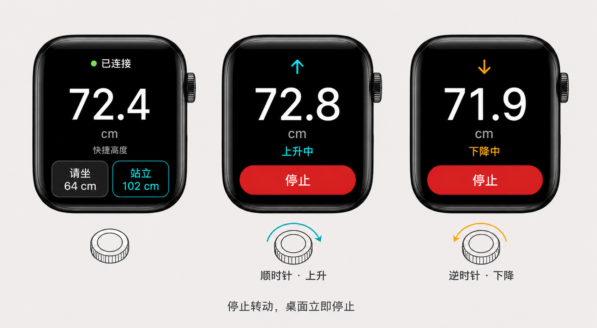

# Apple Watch 控制方案

| 项 | 内容 |
|---|---|
| 文档编号 | DG-ARCH-WATCH-001 |
| 版本 | 0.10 |
| 日期 | 2026-08-12 |
| 状态 | W0 代码与 watchOS Simulator 安装完成；Apple Watch 真机验收待完成 |
| 关联协议 | [BLE 外设扩展 Profile v1](./ble-accessory-profile.md) |
| 移动端方案 | [移动端技术选型与 Phase 0 方案](./mobile-app-technology-selection.md) |

本文定义 Desk Gateway 的 Apple Watch 控制方案、已确认原型和实现验收边界。
首版创建独立 watchOS App，直接复用 ESP32 GATT v1，不修改固件协议。

---

## 1. 结论

Apple Watch 首版采用原生 **SwiftUI + CoreBluetooth**，由 Watch 直接连接
ESP32 暴露的 Desk Accessory Service：

```text
Apple Watch App（SwiftUI）
           │
    CoreBluetooth Central
           │  BLE GATT v1
           ▼
ESP32 DeskGateway（NimBLE Peripheral）
           │
       desk_core
           │
        升降桌主机
```

首版不把 WatchConnectivity 或 REST 作为实时控制主链路：

- WatchConnectivity 只适合以后同步设置和最近设备；即时消息依赖 iPhone App
  可达，异步消息又不允许承载可能延迟执行的运动命令。
- REST 可作为诊断或降级通道，但依赖局域网、网关地址和 Watch 网络状态，不能
  替代本地 BLE 主链路。
- Expo / React Native 继续服务 iOS 和 Android 手机端；watchOS 使用原生 Target，
  不为复用少量 UI 而引入非正式 watchOS 运行层。

---

## 2. 工程形态与手机端关系

当前仓库没有纳入版本管理的 `mobile/app/ios/`，不能把手写 Watch Target 挂到会被
`expo prebuild --clean` 重建的临时工程。首版因此先交付独立 watchOS App：

```text
mobile/
├── app/                         # React Native + Expo 手机端
│   └── src/
├── watch/
│   ├── project.yml              # 可重复生成 Xcode 工程
│   ├── Package.swift            # 平台无关协议/控制核心及单元测试
│   ├── Sources/                 # DeskGatewayWatchCore
│   ├── Tests/
│   └── App/                     # SwiftUI + CoreBluetooth watchOS App
└── prototypes/
```

独立 App 让 BLE、Digital Crown 和停止时序可以先在真机闭环，不依赖 iPhone 是否在场。
以后若决定与手机 App 联合分发，再将同一 `App/` 和 Core package 嵌入
**Watch App for Existing iOS App** Target；届时必须选择“提交 iOS 原生工程”或
“使用 Expo config plugin 生成 Target”之一，不能手工修改一次性生成物。

---

## 3. 复用现有 GATT v1

Watch 不定义新协议，直接消费已冻结的 Service：

| Attribute | UUID | 用途 |
|---|---|---|
| Service | `7f4e0001-6d4c-4f4b-9f7a-3c1d2e5a9b10` | Desk Accessory Service |
| Command | `7f4e0002-6d4c-4f4b-9f7a-3c1d2e5a9b10` | 加密 Write |
| State | `7f4e0003-6d4c-4f4b-9f7a-3c1d2e5a9b10` | Read + Notify，固定 8 字节 |

| Hex | Watch 操作 |
|---|---|
| `00` | STOP |
| `01` | HOLD_UP |
| `02` | HOLD_DOWN |
| `11` | PRESET_1 |
| `14` | PRESET_4 |

State Notify 用于显示真实高度、运动状态、童锁、Bluetooth 来源权限和安全上限。
未知高度 `FF FF` 必须显示为未知，不能自行估算。

协议文档继续作为 TypeScript 与 Swift 两端的唯一事实来源。首版常量数量很少，暂不
引入代码生成；为 Swift 编解码器补充与 TypeScript 相同的固定字节测试，防止漂移。

---

## 4. 首版功能边界

### 4.1 实现

- 扫描并连接 `DeskGateway`；
- 首次加密 Write 触发系统配对；
- 订阅高度与状态 Notify；
- Digital Crown 正向旋转持续上升、反向旋转持续下降；
- 停止旋转后立即 STOP，运动状态提供独立 STOP；
- “请坐”映射档位 1（64 cm），“站立”映射档位 4（102 cm）；
- 显示童锁、Bluetooth 来源权限和安全高度上限；
- 连接失败、设备忙、蓝牙关闭和权限拒绝的明确状态；
- 前台退出、页面消失和断连时执行安全停止。

### 4.2 暂不实现

- 在 Watch 修改童锁、安全高度或来源权限；
- Complication 直接触发运动；
- Siri / App Intent；
- 后台持续控制；
- 多网关管理；
- 手机 BLE 连接与 Watch BLE 连接同时在线。

Complication 后续可以显示高度或作为启动入口，但不能提供无需确认的升降动作。

---

## 5. Digital Crown 与停止安全规则

Watch Crown 事件只表示“用户仍在旋转”，不能把 Crown 的累计位置解释为一个会持续
运动的开关：

1. Crown 首个有效正向增量立即发送 `HOLD_UP`，负向增量发送 `HOLD_DOWN`；
2. 同方向持续旋转期间约每 `300 ms` 续期；
3. 距离最后一次 Crown 增量 `400 ms` 后立即发送 `STOP`；
4. 方向切换先 STOP，再开始相反方向，避免命令交叉；
5. 任一时刻最多保留一个未完成的 GATT Write；STOP 具有最高队列优先级；
6. 点击停止、页面消失或 App 失去前台时取消续期并尽力发送 `STOP`；
7. BLE 断连立即清除本地运动状态；
8. 即使 Watch 的 STOP 丢失，ESP32 现有 `750 ms` HOLD 租约仍必须兜底停止；
9. 全局童锁和 Bluetooth 来源权限继续由 ESP32 `desk_core` 最终裁决。

档位命令是由真实高度闭环停止的离散动作，不通过 Watch 伪装成长按。Watch 断连时，
ESP32 仍按现有协议执行停止。

---

## 6. 单连接约束

当前固件配置为：

```text
CONFIG_BT_NIMBLE_MAX_BONDS=3
CONFIG_BT_NIMBLE_MAX_CONNECTIONS=1
```

因此可以保存多个客户端的 bond，但同一时刻只能连接一个 BLE Central。首版采用明确
的单连接行为：

- Watch 打开后尝试直接连接；
- 若 iPhone 或 LightBlue 已占用连接，Watch 显示“设备正被其他控制端使用”；
- 不自动通过 REST 或 WatchConnectivity 绕行，避免同一次操作走向不可预测的链路；
- 手机 App 进入后台时应按手机端既有规则 STOP 并释放 BLE 连接；
- 只有真机证明日常确实需要手机和 Watch 同时在线，才评估把最大连接数提高到 2，
  并补充连接所有权与并发命令仲裁。

提高连接数属于后续固件变更，不包含在 Watch 首版技术验证中。

---

## 7. 已确认原型与首版交互



确认日期：2026-08-11。原型冻结以下布局和状态转换：

- 待机页以当前高度为主信息，底部并列“请坐 64 cm”和“站立 102 cm”；
- 连接状态使用 `topBarLeading` 放在系统顶部栏左侧，与右侧系统时间位于同一行，不占用
  正文纵向空间；
- 固定高度按钮直接呈现，不显示“快捷高度”分组标题；
- Crown 正向增量进入青色“上升中”，负向增量进入橙色“下降中”；
- 运动时用红色 STOP 替换两个固定高度按钮；
- 本地 Crown 控制或设备状态任一方表示正在运动时，都必须显示 STOP；
- STOP 不能因为高度未知而置灰；
- 上升按钮不能仅因高度暂时未知而禁用，最终上限由 ESP32 保护；
- 童锁或 Bluetooth 来源关闭时，运动按钮禁用并显示准确原因；
- HOLD 开始、停止和连接成功使用轻量触感反馈；
- 不使用需要精细滚动或多层导航的设置页面。

### 7.1 运动状态动画

- 高度区域使用单行组合：方向箭头固定在数字左侧，`cm` 以小号字体放在数字右侧并与
  数字底部基线对齐；不再保留居中的独立单位行；
- 箭头槽位保持固定宽度，运动开始、停止或换向时不得推动高度数字左右跳动；
- 上升箭头循环向上漂移，下降箭头循环向下漂移；单次位移约 `5 pt`、周期约
  `700 ms`，只在对应运动状态期间运行；
- 高度 Notify 属于高频更新，直接使用等宽数字刷新，不使用跨帧数字内容过渡，避免前一帧
  尚未结束时下一帧进入而形成数字重影；
- 高度行下方永久保留约 `18 pt` 的运动状态槽；运动时显示“上升中 / 下降中 / 移动中”，
  待机时仅隐藏内容，不折叠槽位；
- 状态槽下方永久保留控制槽；STOP 与“请坐 / 站立”两层始终同时存在于同一个 ZStack，
  共享完全相同的中心和显式按钮高度，只切换透明度和点击能力；
- 运动结束时，方向箭头和运动文案淡出，STOP 与“请坐 / 站立”在约 `180 ms` 内交叉
  淡入淡出；动画不得修改状态槽或控制槽的布局尺寸；
- 固定状态槽利用原有底部留白；状态切换不得插入、删除控制层，也不得推动高度或按钮
  上下跳动；
- 收尾动画期间若收到新的 Crown 方向或设备运动状态，必须立即取消收尾并恢复运动态；
- 动画只表达状态，不得延迟 STOP 命令、BLE Write 或固件安全租约；
- 开启 Reduce Motion 时取消位移和弹簧，仅保留短时透明度过渡。

运动态布局确认日期：2026-08-12。

---

## 8. 分阶段实施与验收

### W0：原生 BLE 与 Crown 技术验证

- 创建可重复生成的 SwiftUI watchOS 工程；
- 实现 CoreBluetooth 扫描、连接、服务发现、配对和 Notify；
- 实现 Crown 增量判向、HOLD 续期、超时 STOP 和固定高度按钮；
- 自动化先验证协议编解码和 Crown 状态机；
- 真机先验证 Read/Notify 和加密 `STOP`，再开放运动命令；
- 使用 Apple Watch 真机，不以 Simulator 结果代替 BLE 验收。

### W1：安全控制闭环

- 档位 1、档位 4；
- HOLD 续期与松手 STOP；
- 页面离开、锁屏、失联和杀进程测试；
- 童锁和来源权限拒绝测试。

### 当前实现证据（2026-08-12）

- `mobile/watch/Package.swift` 提供协议和 Crown 状态机的独立测试入口；
- `swift test` 已通过 10 个测试，覆盖固定命令字节、State/Config 解码、方向反转、
  300 ms 续期限频和 400 ms 无输入 STOP；
- `xcodegen generate` 可重复生成独立 watchOS 工程；
- `xcodebuild -destination 'generic/platform=watchOS' CODE_SIGNING_ALLOWED=NO build`
  已通过，App 使用 `WKWatchOnly` 表达 Watch-only 形态，并包含蓝牙用途声明；
- Apple Watch Series 11（46 mm）watchOS 27 Simulator 已完成定向构建、安装和启动；
- Simulator Debug 构建会自动使用本地 `MockDeskController`，以 `72.4 cm` 为初始高度，
  支持 Crown 连续升降、400 ms 无输入 STOP、固定高度和手动 STOP 的 UI 测试；页面必须
  显示橙色“模拟”标识；
- Mock 的选择是 `DEBUG && targetEnvironment(simulator)` 编译期行为。真机 Debug 和所有
  Release 构建仍使用 `DeskBLECentral`，蓝牙失败不会自动降级到 Mock；
- Simulator 不具备本项目所需的真实 BLE、物理 Digital Crown 和升降桌环境，因此扫描、
  系统配对弹窗、Crown 手感和真实 STOP 时序仍是开放门禁。

当前结论：**代码与静态构建 GO，真机/真实升降验收 NO-GO**。

### W2：正式 UI 与辅助能力

- 完成 Watch 尺寸适配、触感和无障碍；
- 仅在主控制稳定后评估 WidgetKit complication、App Intent 和设置同步；
- WatchConnectivity 只同步非实时数据，不承载运动命令。

### GO 门槛

- Apple Watch 真机可稳定扫描、配对、重连和订阅状态；
- 连续 20 次连接/断开不需要重启 Watch 或 ESP32；
- 每次松手都立即停止，异常路径不超过固件租约窗口；
- 童锁和 Bluetooth 来源权限无法被 Watch 绕过；
- Watch 与 iPhone 抢占单连接时有明确提示，不出现隐式切换控制链路。

---

## 9. 参考

- Apple watchOS Apps：https://developer.apple.com/documentation/watchos-apps/
- Apple 设置 watchOS 工程：https://developer.apple.com/documentation/watchos-apps/setting-up-a-watchos-project
- Apple 独立 watchOS App：https://developer.apple.com/documentation/watchos-apps/creating-independent-watchos-apps
- Apple CoreBluetooth：https://developer.apple.com/documentation/corebluetooth/cbcentralmanager
- Apple WatchConnectivity：https://developer.apple.com/documentation/watchconnectivity
- Expo 额外平台支持：https://docs.expo.dev/modules/additional-platform-support/

---

## 10. 决策记录

| 决策 | 结论 | 日期 |
|---|---|---|
| Watch UI | 原生 SwiftUI | 2026-08-11 |
| 首版工程形态 | 独立 watchOS App；以后可嵌入手机 App | 2026-08-11 |
| 实时控制链路 | Watch 通过 CoreBluetooth 直连 ESP32 | 2026-08-11 |
| Crown 语义 | 有旋转增量才续期，400 ms 无增量即 STOP | 2026-08-11 |
| 固定高度 | 请坐=档位 1；站立=档位 4 | 2026-08-11 |
| WatchConnectivity | 仅作非实时设置同步，不承载运动命令 | 2026-08-11 |
| REST | 仅作后续诊断或显式降级方案 | 2026-08-11 |
| GATT | 复用 v1，不为 Watch 修改固件协议 | 2026-08-11 |
| 首版连接模型 | 保持单 BLE 连接，冲突时明确提示 | 2026-08-11 |
| Simulator Mock | 仅 Debug Simulator 自动启用；真机和 Release 始终使用真实 BLE | 2026-08-12 |
