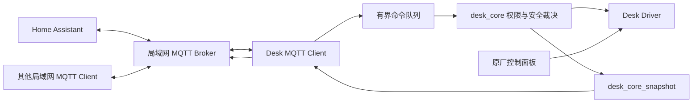

# Desk Gateway MQTT / Home Assistant 接入方案

| 项 | 内容 |
|---|---|
| 文档编号 | DG-ARCH-MQTT-001 |
| 版本 | 0.1.0 |
| 日期 | 2026-08-19 |
| 状态 | 固件 Client、Web 配置与本机 HA Discovery 已接通；完整真机安全矩阵待按清单关闭 |
| 适用范围 | `firmware/desk-gateway` Phase 3 MQTT / Home Assistant 扩展 |

> 本文定义 MQTT v1 的产品边界、Topic 契约、安全约束和实施门禁。
> 局域网接入步骤见 [用 Home Assistant 控制升降桌](../guides/home-assistant-mqtt.md)。
> 当前验收状态仍以 [架构总览](../architecture/overview.md) 和
> [当前状态与任务优先级](../status/current-status-and-priorities.md) 为准。

## 1. 结论

Desk Gateway 应作为 **MQTT Client** 连接用户已有的局域网 Broker，优先适配
Home Assistant Mosquitto，同时保持 Topic 契约可被其他局域网客户端直接使用。

明确结论：

- **GO**：局域网 MQTT Broker + Home Assistant Discovery。
- **GO**：MQTT 作为 `desk_core` 的独立控制来源，与 REST、Bluetooth、原厂面板并列。
- **NO-GO**：ESP32-S3 自己承担 MQTT Broker。
- **NO-GO**：首版接入公网 Broker 或提供云端远程控制。
- **NO-GO**：通过 MQTT 暴露需要依赖远端持续续期或可靠 STOP 的原始长按升降。
- **NO-GO**：MQTT 组件绕过 `desk_core` 直接调用 Desk Driver。

首个可交付闭环限定为：

1. Broker 连接、LWT、状态上报和连接诊断。
2. `SIT`、`STAND`、`STOP` 三个非保持命令。
3. 独立且默认关闭的 MQTT 控制来源权限。
4. Home Assistant 单实体 Discovery 和一个 MQTT Cover 主实体。
5. Broker 断线、Home Assistant 重启和设备重启后不补执行历史命令。

## 2. 目标与非目标

### 2.1 目标

- 让 Home Assistant 无需手写 YAML 即可发现 Desk Gateway。
- 在 HA 自动化中执行“请坐”“起立”“停止”并读取真实高度与运动状态。
- 继续复用童锁、最大高度、运动超时、面板抢占和 Driver 能力判断。
- Broker 或 Wi-Fi 不可用时不影响 Web、BLE、串口和原厂面板。
- 通过稳定的版本化 Topic/Payload 契约支持非 HA 的局域网客户端。
- 保持凭据、网络回调和运动控制之间的清晰边界，便于后续增加 TLS、Number 实体和更多 Driver。

### 2.2 非目标

- 不在 ESP32 上运行 Broker。
- 不提供云账号、NAT 穿透、端口映射或公网远程控制。
- 不把 MQTT 连接状态作为桌子本体能否工作的前提。
- 不在 MQTT v1 中提供任意百分比目标高度。
- 不在 MQTT v1 中提供持续 `UP` / `DOWN`，也不复用 BLE 的短租约续期协议。
- 不在 MQTT v1 中通过远端命令解除童锁。
- 不在本设计中承诺 Matter、米家或华为智慧生活兼容。

## 3. 架构与边界



### 3.1 依赖方向

- `connectivity/desk_mqtt` 可以依赖 `desk_core`，不能依赖具体 Driver。
  目录名不能叫 `mqtt`，否则会与 `espressif/mqtt` 组件重名并形成自依赖。
- MQTT 入站命令必须先经过协议校验，再由独立 worker 调用 `desk_core`。
- MQTT 状态只读取 `desk_core_snapshot()`，不读取 Driver 私有状态。
- `desk_core` 不依赖 MQTT，不感知 Topic、Broker 或 Home Assistant。
- Web 只负责配置和诊断 MQTT，不承担消息转发。

### 3.2 启动顺序

目标启动链路：

```text
app_main
  -> desk_core_init
  -> desk_ble_start
  -> desk_wifi_init
  -> on_wifi_ready
       -> desk_web_start
       -> desk_mqtt_start（仅 STA 已获得 IP 且 MQTT 已配置并启用）
```

SoftAP 配网状态只启动 Web，不连接 Broker。`desk_mqtt_start()` 必须幂等，避免 Wi-Fi
重复获得 IP 时创建多个 client/task。ESP-MQTT 自身负责 Broker 断线后的连接重试；
Wi-Fi 断开期间 MQTT 失败不得阻塞其他控制入口。

## 4. MQTT 控制来源

### 4.1 枚举兼容

现有来源的 NVS bit 已经形成持久化契约。新增 MQTT 时必须追加，不能插入现有成员之间：

```c
typedef enum {
    DESK_CONTROL_SOURCE_REST = 0,
    DESK_CONTROL_SOURCE_BLUETOOTH,
    DESK_CONTROL_SOURCE_PANEL,
    DESK_CONTROL_SOURCE_CONSOLE,
    DESK_CONTROL_SOURCE_MQTT,
    DESK_CONTROL_SOURCE_COUNT,
} desk_control_source_t;
```

这样 REST、Bluetooth、Panel、Console 的 bit 仍分别为 0、1、2、3。旧 NVS 掩码没有
bit 4，升级后 MQTT 自然保持关闭。

### 4.2 默认权限

`DESK_CONTROL_SOURCE_CONFIGURABLE_MASK` 应加入 MQTT，但
`DESK_CONTROL_SOURCE_DEFAULT_MASK` 不能继续简单等于“所有 configurable source + Console”，
而应显式保留当前默认来源，不包含 MQTT：

```text
默认开启：REST、Bluetooth、Console
默认关闭：Panel、MQTT
```

MQTT 存在两个不同开关：

| 开关 | 含义 |
|---|---|
| MQTT Client 启用 | 是否连接 Broker、发布状态和 Discovery |
| MQTT 控制启用 | `desk_core` 是否接受来自 MQTT 的运动命令 |

允许只启用 Client、保持控制关闭，以便 HA 只读监控桌子状态。

### 4.3 安全裁决

- `SIT` / `STAND` 调用 `desk_core_goto_preset(DESK_CONTROL_SOURCE_MQTT, 1/4)`。
- `STOP` 调用全局 `desk_core_stop()`，不受来源开关和童锁限制。
- 童锁开启时，所有 MQTT 运动命令返回 `ESP_ERR_NOT_ALLOWED`。
- 关闭 MQTT 控制来源时，沿用现有 fail-safe 行为，立即停止正在进行的运动。
- 原厂面板抢占和 Driver 的目标高度、上行阻断继续由现有实现裁决。

## 5. Broker、设备身份与配置

### 5.1 Broker 角色

Broker 由用户在局域网内提供，推荐 Home Assistant Mosquitto Broker。Desk Gateway 不负责：

- 创建或维护 Broker。
- 管理其他 MQTT 用户。
- 将 Broker 暴露到公网。
- 在设备离线期间缓存控制命令。

### 5.2 设备 ID

设备 ID 取 ESP32-S3 基础 MAC 的 12 位小写十六进制，不含分隔符：

```text
aabbccddeeff
```

派生值：

```text
MQTT client_id: desk-gateway-aabbccddeeff
Topic base:     desk-gateway/aabbccddeeff
HA unique_id:   desk_gateway_aabbccddeeff_<component>
```

设备 ID 不允许用户编辑，以避免两个设备使用同一 client ID 或覆盖对方 Discovery。

### 5.3 Web 配置字段

| 字段 | 约束 |
|---|---|
| Client 启用 | 默认 `false` |
| Broker Host | hostname 或 IP；不接受包含凭据的 URI |
| Port | `1...65535`；根据 TLS 模式建议 1883/8883 |
| TLS 模式 | `none`、`certificate_bundle`、预留 `custom_ca` |
| Username | 独立 MQTT 用户，不复用 Web 密码 |
| Password | 写入后只显示“已配置”，不回传明文 |
| Discovery Prefix | 默认 `homeassistant`，只允许安全 Topic 字符 |
| MQTT 控制 | 映射独立 source bit，默认 `false` |

保存配置后由 MQTT 组件在自己的任务中安全停止旧 client、重建配置并重新连接；不能从
MQTT event handler 内销毁 client。

## 6. Topic 契约

以下 `<id>` 均为设备 ID。协议版本从 `1` 开始，后续新增字段保持向后兼容；删除或改变
既有字段语义时必须升级协议版本。

| Topic | 方向 | QoS | Retain | 说明 |
|---|---|---:|---:|---|
| `desk-gateway/<id>/availability` | 设备发布 | 1 | 是 | `online` / `offline`，LWT 共用 |
| `desk-gateway/<id>/state` | 设备发布 | 1 | 是 | 当前完整状态快照 |
| `desk-gateway/<id>/command` | 设备订阅 | 1 | **否** | `SIT` / `STAND` / `STOP` |
| `desk-gateway/<id>/result` | 设备发布 | 1 | 否 | 最近收到命令的处理结果 |
| `<discovery_prefix>/cover/<id>/config` | 设备发布 | 1 | 否 | HA Cover Discovery |
| `<discovery_prefix>/sensor/<id>_height/config` | 设备发布 | 1 | 否 | HA 高度 Sensor |
| `<discovery_prefix>/binary_sensor/<id>_child_lock/config` | 设备发布 | 1 | 否 | HA 童锁 Binary Sensor |
| `homeassistant/status` | 设备订阅 | 0 | 否 | HA Birth，收到 `online` 后重发 Discovery 和状态 |

### 6.1 禁止的 Topic 行为

- 命令发布方不得设置 retain。
- 固件收到 retain command 必须拒绝，不能因为 Payload 合法就执行。
- 设备不得订阅 `desk-gateway/#`、`#` 等跨设备通配符。
- 设备不得把用户名、密码、IP 配置或证书内容发布到状态 Topic。
- 首版不定义广播控制 Topic。

## 7. 命令协议

MQTT v1 命令使用固定的大写 UTF-8 文本，不使用自由格式 JSON：

| Payload | 行为 | 允许重复 |
|---|---|---|
| `SIT` | 前往档位 1 | 是；目标动作幂等 |
| `STAND` | 前往档位 4 | 是；目标动作幂等 |
| `STOP` | 全局停止 | 是；始终安全 |

选择固定文本是为了直接映射 HA Cover，同时缩小解析面和内存开销。暂不提供：

- `UP` / `DOWN`
- `HOLD_UP` / `HOLD_DOWN`
- 任意毫米或百分比目标
- 档位保存
- 解除童锁
- 修改 Broker 或系统配置

### 7.1 入站处理

`MQTT_EVENT_DATA` 处理顺序：

1. 精确匹配本设备 command Topic。
2. 检查 retain，retain 为真立即拒绝。
3. 检查分片信息；只在完整消息已收齐后解析。
4. 限制 Payload 长度并做精确匹配，不接受前后空白或大小写变体。
5. 转换为内部枚举，放入有界命令队列。
6. worker 从队列取出命令并调用 `desk_core`。
7. 发布 result；随后发布最新 state。

队列满时不得覆盖旧命令；`STOP` 应进入队首或使用独立高优先级通知，保证本地处理优先级。

### 7.2 结果回执

成功示例：

```json
{
  "version": 1,
  "sequence": 42,
  "action": "STAND",
  "ok": true,
  "error": "ESP_OK"
}
```

拒绝示例：

```json
{
  "version": 1,
  "sequence": 43,
  "action": "STAND",
  "ok": false,
  "error": "ESP_ERR_NOT_ALLOWED",
  "reason": "child_lock"
}
```

`sequence` 是单次启动内递增计数，仅用于诊断，不承担跨重启幂等键职责。

## 8. 状态协议

状态 Topic 发布完整快照，不依赖消费者合并增量：

```json
{
  "version": 1,
  "status": "idle",
  "cover_state": "stopped",
  "height_mm": 820,
  "height_known": true,
  "position": 47,
  "child_lock": false,
  "upward_blocked": false,
  "max_height_mm": 1020,
  "preset1_height_mm": 640,
  "preset4_height_mm": 1020,
  "mqtt_control_enabled": true,
  "driver": "mxtark",
  "firmware_version": "0.1.0"
}
```

### 8.1 字段约束

- `status` 保留 `idle`、`moving_up`、`moving_down`、`goto_preset`、`error`。
- 高度未知时 `height_mm` 和 `position` 使用 JSON `null`，不能伪造默认高度。
- `position` 以“请坐档位 = 0、起立档位 = 100”归一化：

```text
position = clamp(round((height_mm - preset1_height_mm)
                       / (preset4_height_mm - preset1_height_mm) * 100), 0, 100)
```

- 若档位配置非法或高度未知，则不计算 position。
- `cover_state` 映射为 `opening`、`closing` 或 `stopped`。
- `goto_preset` 的方向通过连续可信高度变化推断；没有足够样本时使用 `stopped`，不能猜测。

### 8.2 发布节流

MQTT 不复用 Web 的 250ms 无条件发布：

- 状态、童锁、权限或配置发生变化时立即发布。
- 运动中高度变化达到 5mm，或距离上次状态发布达到 500ms 时发布。
- 静止状态每 30 秒发布一次心跳快照。
- Broker 重连和 HA Birth 后立即发布一次完整快照。
- 序列化与网络发布在 MQTT task 中完成，不阻塞 Driver/ISR 路径。

## 9. 连接、LWT 与重连

### 9.1 会话策略

- MQTT 协议首版使用 3.1.1，优先兼容现有 Broker 和 HA。
- 使用 clean session，不让 Broker 为离线设备排队控制命令。
- command QoS 1 允许重复，因此命令集合只包含可安全重复的目标动作和 STOP。
- 状态和 availability 使用 retain，重连后由最新真实快照覆盖旧值。
- 设备重连只恢复订阅、Discovery 和状态，不恢复或补执行任何运动命令。

### 9.2 Availability

连接配置：

```text
LWT topic:   desk-gateway/<id>/availability
LWT payload: offline
LWT QoS:     1
LWT retain:  true
```

`MQTT_EVENT_CONNECTED` 后按顺序：

1. 订阅 command。
2. 订阅 `homeassistant/status`。
3. 发布 retained `online`。
4. 发布 Discovery。
5. 发布 retained state。

如果固件能正常停止 client，应先发布 retained `offline`；异常断电或网络断开由 Broker 的 LWT 完成。

## 10. Home Assistant Discovery

### 10.1 Discovery 类型

采用单实体 Discovery，三份配置共用同一组 `device.identifiers`，HA 会把它们归到同一台设备：

```text
<discovery_prefix>/cover/<id>/config
<discovery_prefix>/sensor/<id>_height/config
<discovery_prefix>/binary_sensor/<id>_child_lock/config
```

不采用 `homeassistant/device/<id>/config`。那条 Device Discovery 路径要 Home Assistant
2024.11 之后才会订阅；更早的版本可以在 MQTT 监听页看到 JSON，但不会创建设备。
已经能发现涂鸦开关的 HA 走的就是单实体 `homeassistant/<component>/.../config`，桌子必须用同一套。

每份 Discovery 必须携带稳定 `unique_id`、设备标识和 `origin`。

Discovery 默认不 retain：

- Desk Gateway 每次连接 Broker 时发布。
- 订阅 `homeassistant/status`，收到 `online` 后随机延迟一个很短窗口，再重发 Discovery 和 state。
- 关闭 MQTT 集成时，不依赖 retained ghost config；若未来改为 retained Discovery，必须同步实现空 Payload 清理。

### 10.2 MQTT v1 实体

| 实体 | 默认状态 | 用途 |
|---|---|---|
| Cover：Desk Gateway | 启用 | `OPEN=STAND`、`CLOSE=SIT`、`STOP=STOP` |
| Sensor：高度 | 启用 | 读取厘米或毫米高度 |
| Binary Sensor：童锁 | 启用 | 只读显示童锁状态 |
| Sensor：固件版本 | 默认关闭 | 诊断 |

Cover 不设置 `set_position_topic`，避免 HA 显示固件当前无法安全执行的任意百分比定位。
Cover 只用 `state_topic`，因此 `optimistic=false`。不写 `position_topic`：现代 Cover schema
要的是 `get_position_topic`，旧键会被丢掉。

### 10.3 后续实体

在 MQTT 基础闭环和真机安全矩阵通过后，再增加：

- Number：最大高度。
- Number：请坐高度。
- Number：起立高度。
- 可选诊断 Sensor：连接状态、Driver、上行阻断。
- 童锁控制实体；是否允许 MQTT 解除童锁需要单独安全决策，不能随只读状态一起默认开放。

所有 Number command 必须 non-retained，并继续调用 `desk_core` 的范围校验和 NVS 持久化接口。

## 11. 安全模型

### 11.1 网络边界

- MQTT v1 仅支持局域网 Broker。
- Web UI 必须提示不要将 Broker 或 Desk Gateway 端口映射到公网。
- MQTT 不复用 Web 密码；每台设备使用独立 Broker 用户。
- Broker ACL 必须把设备限制在自己的 Topic 前缀。

Mosquitto ACL 目标示例：

```text
topic read  desk-gateway/aabbccddeeff/command
topic read  homeassistant/status
topic write desk-gateway/aabbccddeeff/availability
topic write desk-gateway/aabbccddeeff/state
topic write desk-gateway/aabbccddeeff/result
topic write homeassistant/cover/aabbccddeeff/config
topic write homeassistant/sensor/aabbccddeeff_height/config
topic write homeassistant/binary_sensor/aabbccddeeff_child_lock/config
```

### 11.2 传输安全

支持方向：

| 模式 | 适用范围 | 要求 |
|---|---|---|
| `mqtt://` | 受信任的隔离局域网 | 独立账号、强密码、严格 ACL、UI 明确警告 |
| `mqtts://` + certificate bundle | 使用公开 CA 的 Broker | 必须校验 Broker 身份和 hostname |
| `mqtts://` + custom CA | 自签名局域网 Broker | 后续阶段；安全存储、长度和更新流程另行实现 |

禁止设置 `skip_cert_common_name_check=true`。不实现 MQTT over WebSocket/WSS，因为 ESP32 到
Broker 的原生 MQTT TCP/TLS 已足够，额外 transport 只增加固件体积和配置面。

### 11.3 凭据存储

当前固件未启用 NVS Encryption、Flash Encryption 或 Secure Boot。因此：

- MQTT 密码与现有 Wi-Fi 凭据一样，物理读取 Flash 时可能被恢复。
- Web API 不得回传已保存的 MQTT 密码。
- 日志不得打印 Broker 密码、完整认证 URI、证书私钥或 Authorization 数据。
- 当前安全状态只允许局域网原型和自托管 Broker。
- 接入公网 Broker、保存客户端私钥或产品化前，必须先完成 NVS/Flash Encryption 与密钥生命周期设计。

## 12. 故障与安全矩阵

| 场景 | 必须行为 |
|---|---|
| MQTT 未配置或关闭 | 不创建 client，不影响其他入口 |
| Broker 鉴权失败 | 保持重连退避，Web 显示诊断；桌子本地功能正常 |
| Wi-Fi 断开 | MQTT 离线；不重放、不补执行命令 |
| 收到 retained command | 拒绝并发布 result，不运动 |
| 收到未知或超长 Payload | 拒绝，不入队，不运动 |
| command 分片 | 完整重组后再校验；不能把片段当命令 |
| 命令队列满 | 拒绝新命令；STOP 使用独立高优先级路径 |
| 童锁开启 | SIT/STAND 拒绝；STOP 仍执行 |
| MQTT 来源被关闭 | 立即停止当前运动，后续 SIT/STAND 拒绝 |
| 原厂面板抢占 | 沿用 Driver 仲裁，MQTT 不自动恢复被打断的命令 |
| 高度未知 | 不发布虚假 position；STAND 仍服从现有上行探测和安全限制 |
| 上行阻断 | STAND 失败并报告 Driver/core 返回原因 |
| 设备重启 | 不恢复旧命令；连上 Broker 后只发布在线、Discovery 和当前状态 |

## 13. 固件组件与实施阶段

### 13.1 目标文件结构

```text
firmware/desk-gateway/
  components/
    connectivity/
      desk_mqtt/
        CMakeLists.txt
        idf_component.yml
        include/desk_mqtt.h
        desk_mqtt.c
        desk_mqtt_protocol.c
        test/desk_mqtt_protocol_test.c
```

职责：

- `desk_mqtt.c`：client 生命周期、NVS 配置、event handler、队列、状态任务。
- `desk_mqtt_protocol.c`：纯 C Topic/Payload 校验、状态与结果序列化、HA Discovery 构建。
- `desk_mqtt_protocol_test.c`：不依赖 Broker 的 host 测试向量。
- Web：增加鉴权后的 MQTT 配置和状态 API，不复制 MQTT 协议实现。

ESP-IDF 6.0 已将 ESP-MQTT 移为独立组件，目标依赖固定为 `espressif/mqtt 1.1.0`，并提交
生成的 dependency lock，避免构建时漂移。

### 13.2 阶段 A：协议与权限

- 追加 MQTT source enum，保持旧 NVS bit。
- 调整 configurable/default mask。
- 增加来源策略和旧掩码兼容测试。
- 完成纯 C command/topic/state/result 测试。

### 13.3 阶段 B：MQTT 基础闭环

- NVS Broker 配置和 Web 配置页。
- STA 获得 IP 后启动 client。
- LWT、重连、command queue、result、state。
- Broker 断线不影响其他控制入口。

### 13.4 阶段 C：Home Assistant

- 单实体 MQTT Discovery（Cover / Height / Child lock）。
- Cover、Height Sensor、Child Lock Binary Sensor。
- HA Birth 重发和实体删除/禁用策略。
- Mosquitto ACL 示例和用户操作指南。

### 13.5 阶段 D：增强与安全

- Number 配置实体。
- custom CA。
- NVS/Flash Encryption。
- 评估任意目标高度 API；只有 `desk_core` 和 Driver 能提供安全闭环后才允许 HA set position。

## 14. 验证与验收门禁

### 14.1 自动化测试

- 枚举 bit 与旧 NVS 掩码兼容。
- MQTT 默认控制关闭。
- command Topic 精确匹配。
- retained、未知、超长、带空白、大小写错误命令均拒绝。
- 分片重组和队列满行为。
- SIT/STAND/STOP 映射。
- child lock/source disabled 的 result reason。
- position 归一化、clamp、高度未知和非法档位配置。
- Discovery unique ID、device ID 和 Topic 稳定。
- `git diff --check` 与 `./scripts/check-firmware.sh`。
- 记录 MQTT/TLS 引入前后的固件体积、启动 heap 和稳定态 heap。

### 14.2 Broker 联调

使用本地 Mosquitto 覆盖：

- 正确/错误账号密码。
- Broker 启停和自动重连。
- LWT offline 与重连 online。
- HA Birth 后重发 Discovery/state。
- non-retained command 不在设备离线期间排队。
- 人工发布 retained command 时固件拒绝。
- ACL 阻止设备访问其他设备 Topic。

### 14.3 Home Assistant 验收

- 无需 YAML 自动发现一个 Desk Gateway 设备。
- Cover 的打开、关闭、停止分别对应起立、请坐、停止。
- 高度未知时不显示伪造位置。
- HA 重启后实体恢复且状态正确。
- MQTT 控制关闭时实体保持可读，控制命令明确失败。
- 禁用 MQTT 集成后不留下可误操作的幽灵实体。

### 14.4 真机验收

以下只能在真实桌子、真实 Broker 和真实 HA 上关闭：

- SIT、STAND 到达配置档位并自动停止。
- STOP 在运动中立即生效。
- 童锁阻止 SIT/STAND。
- 原厂面板立即打断 MQTT 运动，且 MQTT 不自动恢复。
- 关闭 MQTT source 时停止当前运动。
- Wi-Fi/Broker 在运动前后断开均不触发旧命令。
- 上行阻断、最大高度和 Driver 错误正确回传。
- 连续运行期间无明显 heap 泄漏、重连风暴或状态洪泛。

构建通过、host 测试通过或 Mosquitto 模拟通过，都不能代替上述真机验收。

## 15. 待后续决策

下列事项不阻塞 MQTT v1 基础闭环，但在对应阶段开始前必须确认：

1. 是否在同一版本加入 Number 实体，还是先只交付 Cover + 只读 Sensor。
2. 是否允许 MQTT 解除童锁；默认结论是不允许。
3. 自签名 Broker 的 custom CA 如何录入、更新和删除。
4. 是否启用 NVS Encryption，以及量产密钥如何生成和恢复。
5. 是否需要任意目标高度；若需要，应先新增 transport-neutral 的 `desk_core` 目标高度 API。
6. Discovery 配置是否最终采用 retain；默认采用 HA Birth 重发。

## 16. 官方参考

- [ESP-IDF 6.0.2：ESP-MQTT 已迁移为独立组件](https://docs.espressif.com/projects/esp-idf/en/v6.0.2/esp32/api-reference/protocols/mqtt.html)
- [ESP-MQTT Programming Guide](https://docs.espressif.com/projects/esp-mqtt/en/latest/esp32/)
- [ESP Component Registry：espressif/mqtt](https://components.espressif.com/components/espressif/mqtt)
- [Home Assistant MQTT Discovery](https://www.home-assistant.io/integrations/mqtt/)
- [Home Assistant MQTT Cover](https://www.home-assistant.io/integrations/cover.mqtt/)
- [Home Assistant MQTT Number](https://www.home-assistant.io/integrations/number.mqtt/)
