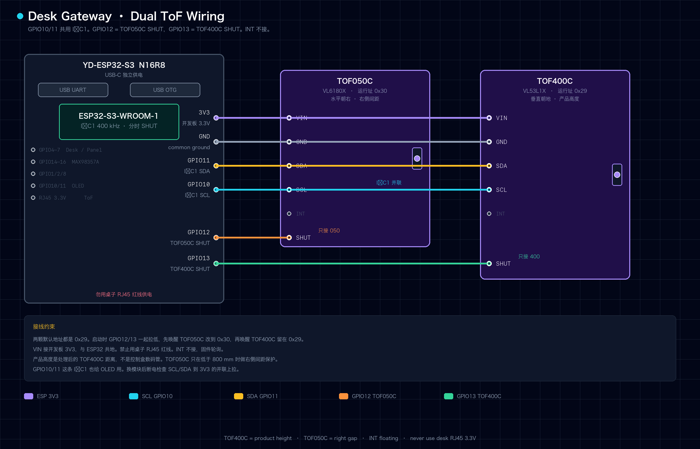
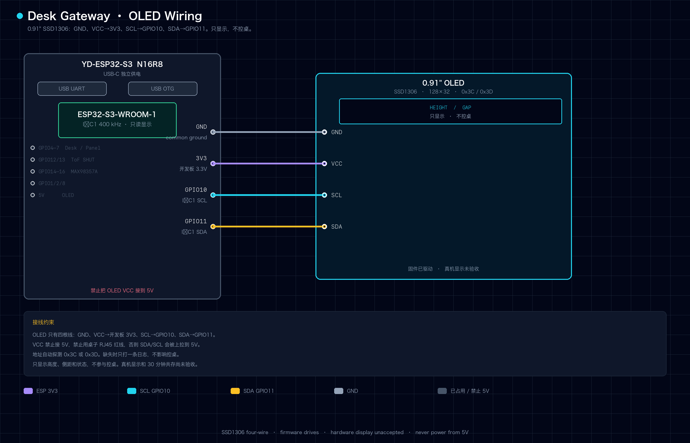
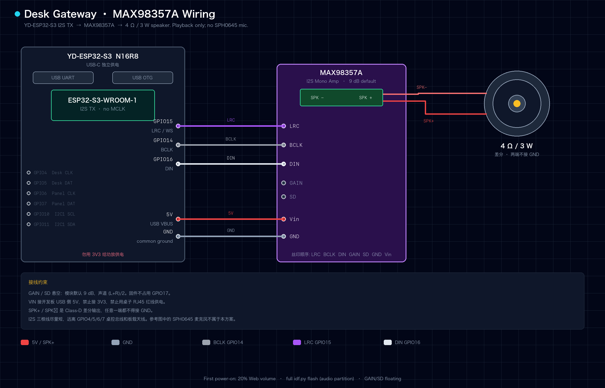
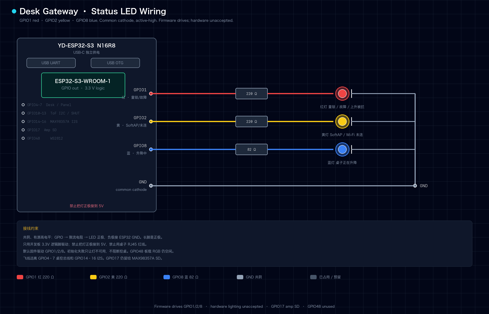
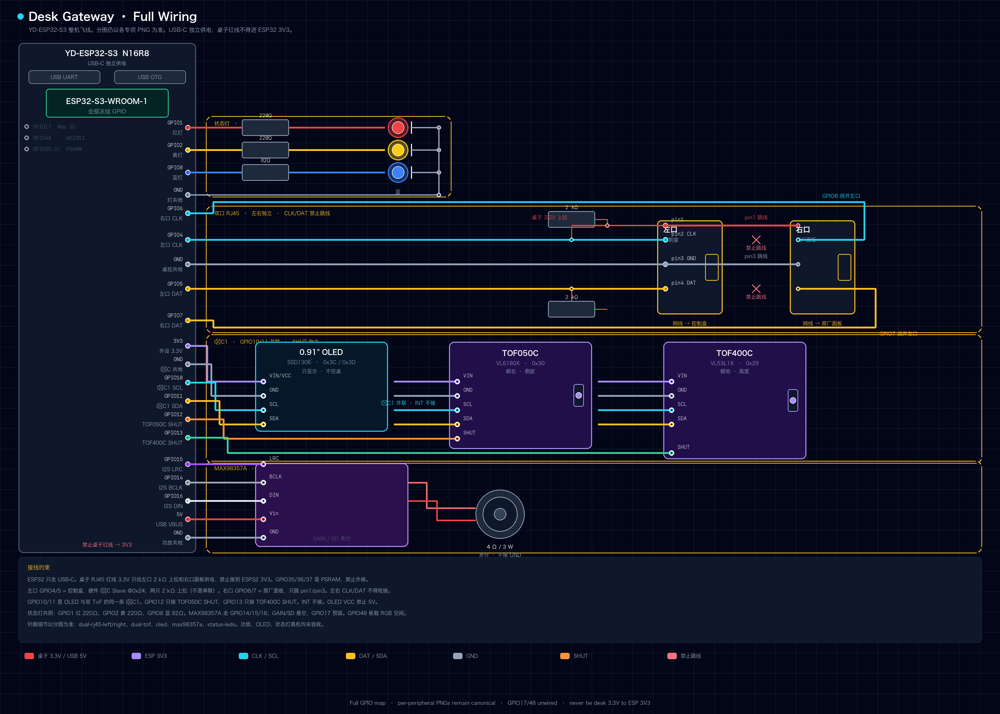
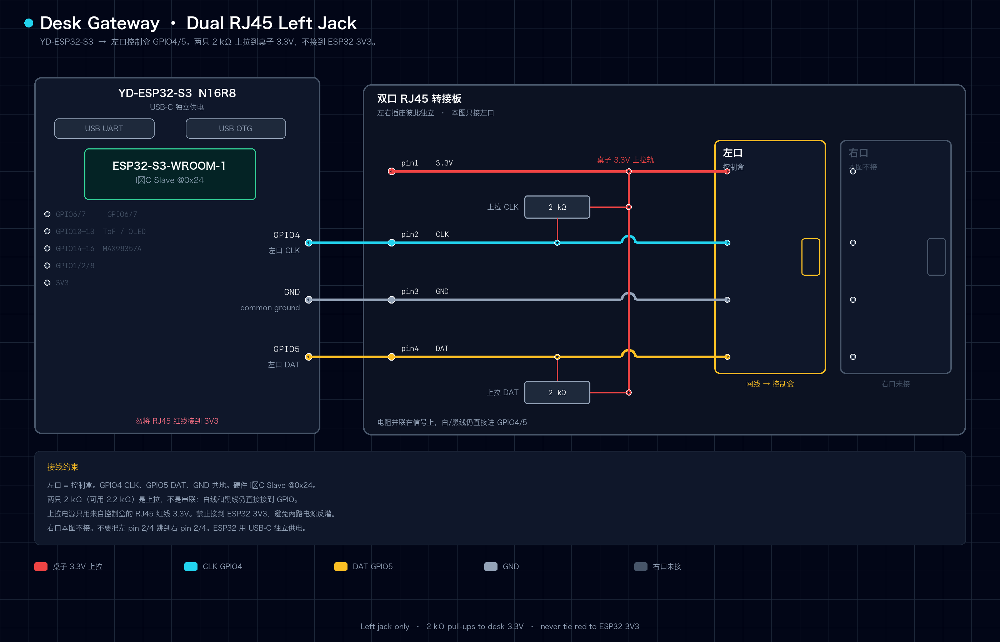
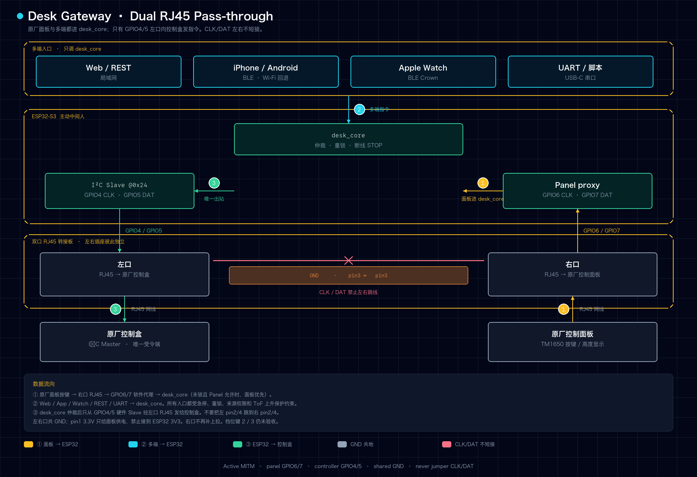
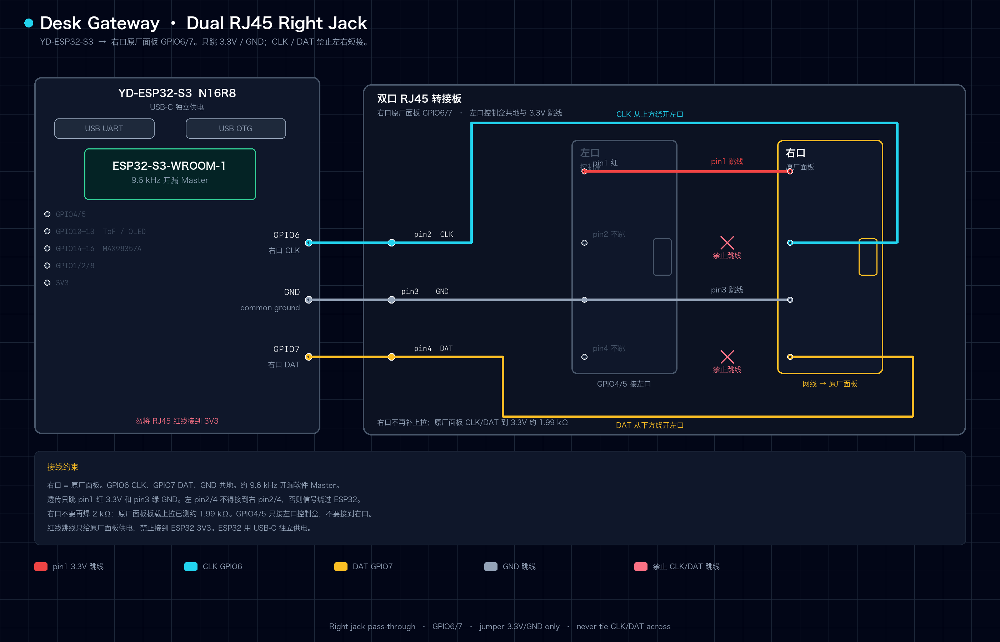

# Desk Gateway 真机接线、排障与验收清单

按顺序勾选；移动测试时必须有人在桌旁。稳定产品路径使用硬件 I²C Slave `@0x24` 驱动
控制盒，TOF400C 提供产品高度，TOF050C 提供低位右侧间距保护。此前软件多地址 I²C 的
控制盒 digit 高度验收只作为历史结果，不代表当前固件能力。

2026-08-17 负责人确认 Phase 2 透传、异常停止、三客户端并发和双 ToF 安全矩阵已在真桌通过。
自定义档位/B12、OLED 30 分钟共存、番茄语音和移动端内测包仍按未勾选项执行。

## A. 软件（可不接线）

- [x] `get-idf` → `idf.py build` / `flash` 成功（目标 esp32s3）
- [x] 无凭证时出现 SoftAP：`DeskGateway` / `desk-gateway`
- [x] 手机打开 `http://192.168.4.1/` 能配 2.4G WiFi
- [x] Flash 后 NVS 保留，一般**不必**重配 WiFi
- [x] 浏览器登录 Web（默认密码 `desk-gateway`）
- [x] 按住升/降：状态 `moving_*`，松手回 `idle`；点「停」可停
- [x] Web、REST、BLE 与 App 显示一致的 TOF400C 高度；传感器失效后统一显示未知，不得回退 SIM 或旧 digit 缓存
- [x] 改密：设置里保存后，重新登录用新密码
- [x] 设置最高安全高度，刷新和重启后仍显示已保存值
- [x] 断网提示：拔掉板子 USB 或断 WiFi 后，页面出现连接失败横幅

### A.1 BLE / LightBlue（不需要额外接线）

- [x] 串口出现 `desk_ble: GATT ready lease=750 ms` 和 `advertising as DeskGateway`
- [x] LightBlue 能扫描并连接 `DeskGateway`
- [x] 能 Read/Notify State `7f4e0003-...`，TOF400C 高度及未知标志与 Web 一致
- [x] 首次向 Command `7f4e0002-...` 写入时完成 Just Works 配对
- [x] 写 `01` 后上升约 `750ms` 自动停止；重复续期可持续上升
- [x] 写 `02` 后下降约 `750ms` 自动停止；写 `00` 立即停止
- [x] 写 `11` / `14` 可前往 550 / 870 mm；高度未知或上升受限时安全停止且连接保持正常
- [x] HOLD 或档位运动期间断开 LightBlue，桌子立即停止
- [x] 童锁开启后所有 BLE 运动 Write 失败，桌子不动
- [x] 关闭 Bluetooth 来源权限后所有 BLE 运动 Write 失败；重新开启恢复
- [x] 重启后手机 bond 仍保留，State Notify 能重新订阅

完整 UUID、字节格式和操作步骤见
[`architecture/ble-accessory-profile.md`](../architecture/ble-accessory-profile.md)。

### A.2 BLE 三客户端与配对设备管理

自动化门禁（截至 2026-08-15）：

- [x] ESP-IDF v6.0.2 隔离固件构建与 BLE/Web 主机测试通过
- [x] Web Bond 管理 JavaScript 语法与策略测试通过
- [x] 手机端 `npm run typecheck` 与 56 项测试通过
- [x] 手机端通用 iOS 无签名构建通过
- [x] Watch `swift test` 18 项与通用 watchOS 无签名构建通过
- [x] `git diff --check` 通过

三台真机门禁（固定使用 iPhone、Apple Watch、Android，测试运动时必须有人在桌旁）：

- [x] 三台依次在 120 秒窗口内配对并同时保持连接，且持续收到一致 State / Config Notify
- [x] 第一台控制运动后，另两台显示“另一台设备正在控制”且 BLE 不断开
- [x] 任意非所有者 STOP 可立即停止并释放所有权
- [x] 非所有者断开不影响运动；所有者断开、杀进程或失联在安全时限内停止
- [x] 三台在线时 HOLD 续租不因 Wi-Fi 共存超时
- [x] 单删在线所有者先 STOP、再断开并删除 Bond；单删离线设备不影响其他连接
- [x] 删除全部先 STOP、断开三台、清除 Bond，并恢复可配对广播
- [x] 配对窗口关闭或 Bond 满额时第四台无法占用名额，三个旧 Bond 不被淘汰
- [x] 被删除设备重新打开窗口后进入系统配对；本地旧 Bond 冲突时 App 给出系统设置提示
- [x] Web/App 可设置同一 Bond 的中文或英文别名，另一端刷新后显示一致
- [x] Gateway 重启后别名仍保留；清空别名后恢复系统生成的设备类型和标识后缀
- [x] 从旧版固件升级后，已有 Bond 和匿名 ID 保留，首次设置别名后写入新版元数据
- [x] REST 或原厂面板接管后，旧 BLE 所有者断开不停止新的运动来源
- [x] 重启后配对窗口关闭，Bond 列表、客户端类型和三连接能力符合预期

2026-08-17 负责人确认本节三台真机门禁已通过，BLE 多客户端结论为 **产品验收 GO**。

### A.3 双 ToF、显示与上升保护

接线和策略细节见[双 ToF 距离传感器接入与安全策略](../architecture/tof-safety.md)。



OLED 与双 ToF 共用 GPIO10/11，接线见[0.91 英寸 OLED 状态屏](../architecture/oled-status-display.md)：



- [x] 启动日志确认 TOF050C / VL6180X 位于 `0x30`，TOF400C / VL53L1X 位于 `0x29`
- [x] Web 与 OLED 实时显示处理后的高度和“桌面右侧 → 障碍物”距离
- [x] 原厂面板显示与 TOF400C 四舍五入后的厘米值一致
- [x] 坐姿约 550 mm、站姿约 870 mm 静置时，显示不会因毫米级噪声持续跳动
- [x] 任一路超过 1 秒没有有效样本后变为未知，不沿用旧值
- [x] 从不同起点执行 550 / 870 mm 档位，均在目标 `±5 mm` 范围停止
- [x] Web/App 将最低档位和坐姿档位保存为 550 mm，刷新、BLE Notify 和 Gateway 重启后均保持一致
- [x] 手动下降到机械最低位时 Gateway 不因 `min_height_mm` 或 TOF400C 读数跳动主动发送 STOP
- [x] Web/App 均可新增、修改和删除自定义档位，最多 16 个；请坐和站立没有删除入口
- [x] Web 新增自定义档位后 App 在 5 秒内同步，反向修改或删除同样同步
- [x] Gateway 重启后自定义档位名称、高度和稳定 ID 均保留
- [x] 从高低不同起点执行自定义档位，均使用真实高度闭环停止；高度未知时拒绝执行
- [x] 手动上升到最高 940 mm 时停止，继续按上升不得再次启动
- [x] 高度低于 800 mm 时，右侧距离未知或小于 80 mm 会停止并禁止上升
- [x] 高度达到或超过 800 mm 后，右侧距离出现 `7.x cm` 不会误停；最高 940 mm 仍生效
- [x] TOF400C 运动中失效时，上升和档位停止；下降与 STOP 始终可用
- [x] 暗光、室内照明、浅色地面、深色地面和地垫下分别记录稳定性和无效样本率

2026-08-17 负责人确认双 ToF 档位、最高高度和右侧障碍物真机安全矩阵已通过。
自定义档位增删改仍按上面未勾选项执行。

### A.4 番茄时钟与 MAX98357A 语音提醒

自动化门禁（2026-08-15）：

- [x] ESP-IDF v6.0.2 隔离构建通过，3 MiB Factory App 剩余 57%
- [x] 4 MiB `audio` SPIFFS 镜像随完整 `idf.py flash` 进入烧录参数
- [x] 三段中文语音和提示音均通过 16 kHz / 16-bit / Mono PCM WAV 校验
- [x] 番茄状态机、WAV 解析、PCM 音量与 Web 展示规则 Host tests 通过
- [x] REST/Web 支持开始、暂停、继续、跳过、停止、延后、音量、静音和试听
- [x] 到期逻辑没有调用任何升降、档位或运动接口

MAX98357A 到货后的接线：



| ESP32-S3 | MAX98357A | 说明 |
|---|---|---|
| USB 输入侧 `5V` | `VIN` | YD-ESP32-S3 排针 `5V` 出厂不通。飞线先接 `3V3`；要 5V 需短接板背 `IN-OUT` 焊盘。不要用桌子 RJ45 红线 |
| `GND` | `GND` | ESP、功放、USB 电源共地 |
| `GPIO14` | `BCLK` | I2S Bit Clock |
| `GPIO15` | `LRC` / `WS` | I2S Word Select |
| `GPIO16` | `DIN` | ESP 到功放的数据 |
| — | `SPK+` / `SPK-` | 扬声器接在两端之间，任意一端都不接 GND |

首次实物门禁：

- [ ] 断电确认模块丝印、VIN/GND、BCLK/LRC/DIN 和 SPK+/SPK-，无反接或短路
- [ ] 确认 GPIO14/15/16 在实际开发板上已引出且无底板冲突
- [ ] 使用完整 `idf.py flash`，不能只烧录 `app`，否则语音分区不会更新
- [ ] 首次上电将 Web 音量设为 20%，分别试听提示音和三段中文语音
- [ ] 一米距离语音完整清晰，无吞字、重复、明显 click/pop 或持续失真
- [ ] 连续播放 10 分钟无 brownout、USB 断连、功放或扬声器异常发热
- [ ] 播放期间 Web、BLE、原厂面板、升降和 STOP 响应正常
- [ ] 关闭 Web/Wi-Fi 后，设置 1 分钟专注仍只在 ESP 本地到期播放一次
- [ ] 暂停、继续、跳过、停止和延后不会触发旧定时器二次播放
- [ ] 重启后回到 `idle`，时长、语音开关和音量配置保留，但不补播旧提醒

本节真机项完成前，结论保持**代码 GO、语音与整机产品验收 NO-GO**。详细设计和错误边界见
[`architecture/pomodoro-reminder.md`](../architecture/pomodoro-reminder.md)。

### A.5 红黄蓝状态灯

三颗普通灯珠作一眼状态：红 = 童锁 / 故障 / 上升被拦，黄 = SoftAP 或 Wi-Fi 未连，蓝 = 桌子正在升降。默认固件会驱动 GPIO1 / GPIO2 / GPIO8；初始化失败只让灯不可用，不阻断控桌。GPIO48 板载 WS2812 仍空闲，GPIO17 仍留给功放 `SD`。亮灯音质式真机观感仍未验收。



| 灯 | GPIO | 电阻 | 含义 |
|---|---|---|---|
| 红 | GPIO1 | 220 Ω～330 Ω | 童锁 ON，或故障 / 上升被拦 |
| 黄 | GPIO2 | 220 Ω～330 Ω | SoftAP 配网中，或 STA 未连上 |
| 蓝 | GPIO8 | 68 Ω～100 Ω（图示 82 Ω） | 桌子正在升降 |

共阴、有源高电平：GPIO → 限流电阻 → LED 正极，负极接 ESP32 `GND`。长脚是正极。只用开发板 3.3V GPIO，**不要**把灯正极接到 5V，**不要**用桌子 RJ45 红线。飞线远离 GPIO4–7 桌控总线和 GPIO14–16 I2S。

```text
GPIO1 ── 220Ω ──►| 红 LED ── GND
GPIO2 ── 220Ω ──►| 黄 LED ── GND
GPIO8 ──  82Ω ──►| 蓝 LED ── GND
```

实物核对（未勾选 = 未验收）：

- [ ] 断电确认灯珠极性、电阻值和 GPIO1 / GPIO2 / GPIO8，无与桌控或 I2S 短路
- [ ] 三颗灯负极共地接到 ESP32 `GND`，正极经电阻接到对应 GPIO
- [ ] 未把灯正极接到 5V，未使用桌子 RJ45 红线
- [ ] 启动日志出现 `desk_status_led: status LEDs red=1 yellow=2 blue=8`
- [ ] SoftAP 或 STA 未连时黄灯亮；STA 拿到 IP 后黄灯灭
- [ ] 童锁 ON、上升被拦或 `ERROR` 时红灯亮；解除后灭
- [ ] 桌子升降或档位运动时蓝灯亮；停止后灭
- [ ] 灯驱动失败时 Web / BLE / 原厂面板 / STOP 仍可用

## B. 接线（mxtark + RJ45）

整机 GPIO 飞线总图。左口 / 右口 / ToF / OLED / 功放 / 状态灯的针脚细节仍以各专项图为准。





电源与安全：

- [ ] ESP32 **仅 USB 供电**，桌子 3.3V **不接到** ESP32 供电
- [ ] 主机与 ESP32 **共地（GND）**
- [ ] 人在旁，首次升降行程短测

信号（面板模拟 / Phase 1，原厂面板断开）：

| RJ45 | 信号 | 连接 |
|------|------|------|
| pin 1 / 红线 | 控制盒 3.3V | 仅作为两个上拉电阻的电源端 |
| pin 2 / 白线 | CLK | GPIO4 |
| pin 3 / 绿线 | GND | ESP32 GND |
| pin 4 / 黑线 | DAT | GPIO5 |

原厂面板断电、完全断开后的实测值：

```text
红线 3.3V ↔ 白线 CLK = 1.99 kΩ
红线 3.3V ↔ 黑线 DAT = 1.99 kΩ
```

拔掉原厂面板也会拔掉这两只上拉。ESP32 替换面板时必须补回：

```text
红线 3.3V ── 2 kΩ（可用 2.2 kΩ）── 白线 CLK / GPIO4
红线 3.3V ── 2 kΩ（可用 2.2 kΩ）── 黑线 DAT / GPIO5
绿线 GND ─────────────────────────── ESP32 GND
```

两个电阻是并联到信号线的上拉，不是串联电阻；白线和黑线仍分别直接连接 GPIO4/GPIO5。
红线不得直接连接 ESP32 `3V3`，避免两路 3.3V 电源互相反灌。

### B.1 断电检查

- [ ] 红↔白约 `2 kΩ`
- [ ] 红↔黑约 `2 kΩ`
- [ ] 白↔黑约 `4 kΩ`
- [ ] 红↔绿不短路

### B.2 通电检查

- [x] 红↔绿约 `3.3V`
- [ ] 用逻辑分析仪确认 CLK/DAT 高电平、`0x24` 地址 ACK 和实际 `DR`

活动总线上万用表显示的是平均值。本次故障排查曾测得 `CLK≈2V`、`DAT≈1.4V`，只能说明线上
存在活动，不能据此认定上拉和 I²C 应答正常。

### B.3 动作验收

- [ ] 上电后桌子静止，启动日志出现硬件 I²C `slave @0x24`，且不出现 `software I2C addrs=...`
- [ ] Web 按住升：串口见 `DR=0x47`，桌子连续上升；松手 `DR=0x2E` 立即停止
- [ ] Web 按住降：串口见 `DR=0x4F`，桌子连续下降；松手 `DR=0x2E` 立即停止
- [ ] REST、BLE 和旋钮的手动升降与 Web 使用同一稳定路径
- [ ] 启动和运动期间 `height_mm` 使用 TOF400C；数据失效后 `height_known=false`，不回退旧 digit 或启动下降探测
- [ ] 高度未知时禁止上升和档位；下降、STOP 保持可用，不自动猜测方向
- [ ] 已保存的档位和最高安全高度重启后仍存在，并按 A.3 的双 ToF 策略参与运动
- [ ] 下降约 15s 超时自动停止；上升、下降均可由松手或显式 STOP 停止
- [ ] 旋钮单个刻度只进入待命，桌子不运动；`700 ms` 内第二个同向刻度才启动
- [ ] 连续旋转事件间隔稳定小于 `500 ms` 时运动不意外中断，停转后约 `500 ms` 自动停止
- [ ] 上升时第一个反向刻度立即出现 `DR=0x2E`，第二个反向刻度才开始下降
- [ ] 下降转上升执行相同的“先 STOP、再反向启动”逻辑，手动 `stop` 始终立即停止
- [ ] 童锁开关写入 status，重启后 NVS 状态仍保留
- [ ] 童锁开启瞬间停止当前运动；Web/REST/串口运动命令返回拒绝，`STOP` 始终有效
- [ ] REST 权限关闭后 Web、Shell、旋钮均不能运动；重新开启后恢复
- [ ] Bluetooth / Panel 权限写入 `control_sources`，重启后仍保留
- [ ] API 返回 TOF400C 高度；传感器失效时 `height_mm=null`，Web 和 App 不显示 SIM 或旧控制盒 digit 高度

2026-08-12 的全局复盘确认：统一软件多地址 Slave 虽能 ACK `0x24` 与 `0x34–0x37`，但返回
升降键码时大量事务被中断，导致控制盒间歇读不到 `0x47`。产品固件已恢复硬件 I²C：

```text
I (...) mxtark: I2C slave @0x24 SCL=4 SDA=5
I (...) mxtark: control-box height input disabled; waiting for external TOF source
```

已知稳定提交 `3269faa` 证明硬件 I²C 键码返回可连续驱动桌子；本次恢复后的新固件仍需按
上面的三项手动动作重新验收。完整原因和切换边界见
[`hardware/i2c-restoration.md`](../hardware/i2c-restoration.md)。

当前可以验收 Web/REST/串口的全局童锁和 NVS 持久化；原厂面板入口已按 B.4 完成真屏蔽。

### B.4 Phase 2 双口 RJ45 透传接线



左口用网线接原厂控制盒，右口用网线接原厂控制面板。面板按键经 GPIO6/7 进 `desk_core`，Web / App / Watch 等经同一套仲裁后，只从 GPIO4/5 左口发给控制盒。针脚级接线见左口图和下面的右口图。



双口模块的左右 RJ45 彼此独立。控制盒网线插左口，原厂面板网线插右口，按下面连接：

| 线序 | 左口（控制盒侧） | 右口（原厂面板侧） |
|------|------------------|--------------------|
| pin 1 红 / 3.3V | 保留现有两只 `2 kΩ` 上拉的电源端 | 与左口 pin 1 直接跳线 |
| pin 2 白 / CLK | GPIO4 | GPIO6 |
| pin 3 绿 / GND | ESP32 GND | 与左口 pin 3 直接跳线 |
| pin 4 黑 / DAT | GPIO5 | GPIO7 |

不要连接“左 pin 2 ↔ 右 pin 2”或“左 pin 4 ↔ 右 pin 4”，否则信号绕过 ESP32，无法拦截按键。
右侧不再补上拉：原厂面板板载的两只约 `1.99 kΩ` 上拉已经存在。红线只给原厂面板和上拉
供电，依然禁止连接 ESP32 `3V3`。

#### B.4.1 焊接后断电检查

- [x] 左 pin 1 ↔ 右 pin 1 接近 `0 Ω`
- [x] 左 pin 3 ↔ 右 pin 3 接近 `0 Ω`
- [x] 左 pin 2 ↔ 右 pin 2 不导通
- [x] 左 pin 4 ↔ 右 pin 4 不导通
- [x] GPIO4/5/6/7 之间无意外短路，红线与绿线不短路

#### B.4.2 首次通电与短行程验收

- [x] 通电后右口红↔绿约 `3.3V`
- [x] 启动见 `mxtark_panel: software panel proxy SCL=6 SDA=7 9.6kHz split-STOP ACK+STOP`
- [x] 原厂面板接入后见 `mxtark_panel: original panel connected raw DR=0x2E`
- [x] 按键时见 `mxtark_panel: panel raw DR=0x47/0x4F`，松开恢复 `0x2E`
- [x] TOF400C 数据有效时，原厂面板数码管显示与 Web 一致的厘米高度
- [x] 只短按原厂面板下降并松开：桌子下降，松开立即停止
- [x] 只短按原厂面板上升并松开：桌子上升，松开立即停止
- [x] 按住运动时拔掉右口面板网线，桌子进入空闲并停止
- [x] 面板按键期间 Web 上升/下降请求被拒绝；松开后 Web 恢复可用
- [x] 童锁开启时，面板/Web/串口均不能启动运动，STOP 始终有效
- [x] 关闭 Panel 权限后面板按键无效；重新开启时一直按住按键不会立即恢复，松开再按才生效

#### B.4.3 控制盒 B12 重置验收

仅在控制盒确实显示 B12 等需要重置的故障时执行；正常状态不反复触发。

- [ ] 桌子空闲、童锁关闭且 REST 权限开启时，Web“控制盒故障重置”按钮可用
- [ ] 确认后日志出现 `controller reset source=rest hold=8000 ms` 和 `DR=0x7F`
- [ ] 重置期间状态接口返回 `controller_reset_active=true`，Web 禁用升降和档位操作
- [ ] 重复重置和 Web 升降请求被拒绝，不会覆盖当前重置序列
- [ ] 点击“停”可提前中断，并立即恢复 `DR=0x2E`
- [ ] 不手动中断时，约 8 秒后日志出现 `reason=controller_reset_complete` 并恢复 `DR=0x2E`
- [ ] Web/App 持续操作升降 2.5 秒且真实高度变化不足 8 mm 时，仅提示一次“可能是 B12”并先停止输出
- [ ] 桌子处于最低/最高边界或操作时间不足 2.5 秒时，不出现 B12 误提示
- [ ] Web/App 接受提示后可分别通过 REST/BLE 启动同一条 8 秒重置序列
- [ ] Watch 收到 B12 建议状态后仅提示一次；确认后通过 BLE System Characteristic 启动
  同一条 8 秒重置序列，重置期间上升、下降和档位入口均禁用
- [ ] 控制盒 B12 错误清除，随后原厂面板和 Web 均可正常升降

首轮不要按原厂面板档位 1/4。先完成基础透传，再按上述短行程步骤验证童锁和 Panel 权限；
原厂档位键的完整序列和安全高度约束仍是后续真机阶段。

## C. 已解决故障：DR 日志变化但桌子不动

| 项 | 记录 |
|---|---|
| 现象 | Web 操作时串口出现 `DR=0x47/0x4F`，桌子不动作 |
| 容易误判 | `DR` 日志只是 ESP32 本地状态变化，不能证明控制盒已轮询、ACK 或读到该字节 |
| 电压 | 红线 `3.3V`；CLK 约 `2V`；DAT 约 `1.4V`（活动总线平均值） |
| 关键测量 | 原厂面板 `3.3V↔CLK`、`3.3V↔DAT` 均为 `1.99 kΩ` |
| 根因 | 原厂面板拔掉后，两只总线上拉也被移除 |
| 解决 | 红线分别经 `2 kΩ` 上拉到白线 CLK、黑线 DAT |
| 结果 | 2026-08-10 Web 按住升/降及松手停止真机通过 |

若再次出现“日志变化但桌子不动”，按以下顺序排查：

1. 断电检查两只上拉的电阻值和红↔绿短路。
2. 确认 ESP32 已启动为 `I2C slave @0x24 SCL=4 SDA=5`，再给控制盒上电。
3. 逻辑分析仪接 `D0=CLK`、`D1=DAT`、`GND=绿线`，分析仪 VCC 不接。
4. 以 12 MHz 从 idle 开始采集，覆盖按住和松开；检查 `0x48/0x49`、ACK 和返回 `DR`。

### C.1 已解决故障：高度固件启动后循环重启、Web 不可用

| 项 | 记录 |
|---|---|
| 现象 | 启动到 Wi-Fi 初始化后反复打印 boot log，Web 始终无法访问 |
| Panic | `Cache disabled but cached memory region accessed`，PC 指向 `gpio_get_level` |
| 根因 | 高度嗅探 ISR 在 Wi-Fi/NVS 关闭 Flash cache 期间调用了未驻留 IRAM 的 GPIO 函数 |
| 解决 | `sdkconfig.defaults` 启用 `CONFIG_GPIO_CTRL_FUNC_IN_IRAM=y`；驱动增加编译期门禁 |
| 二次现象 | monitor 的 `Device not configured` 是芯片重启造成 USB 串口断开，不是独立故障 |
| 自动验证 | ELF 中 ISR 与 `gpio_get_level` 均位于 `0x4037xxxx` IRAM 地址段 |

如果再次见到同类 panic，不要只看 `IRAM_ATTR`：ISR 调用链上的函数也必须全部 IRAM-safe。

### C.2 已解决回归：高度实验启用后无法正常升降

| 项 | 记录 |
|---|---|
| 现象 | Web 可访问，但按住升/降无法稳定驱动桌子，高度仍为未知 |
| 根因 1 | SCL 每个上升沿和 SDA 边沿产生高频 GPIO ISR，与 GPIO4/5 上的硬件 I²C Slave 竞争 |
| 根因 2 | 控制盒很可能在 `0x34–0x37` 地址 NACK 后终止写入，纯监听无法得到段码 data |
| 结论 | 当前 GPIO 被动嗅探方案 **NO-GO**，不能进入稳定固件 |
| 恢复 | 实验开关默认关闭；不安装 GPIO ISR、不创建高度任务、Driver 不声明真实高度能力 |
| 后续 | 软件多地址方案同样判定为产品 NO-GO；默认恢复硬件 `0x24`，高度改由独立 ToF 提供 |

### C.3 坑点：BLE 初始化时 Brownout 导致重复启动

| 项 | 记录 |
|---|---|
| 现象 | 烧录后进入 monitor，启动高度探测和整段 boot log 重复出现多次 |
| 关键日志 | `E BOD: Brownout detector was triggered`；随后出现 `rst:0x3 (RTC_SW_SYS_RST)`，Saved PC 指向 `rtc_brownout_isr_handler` |
| 如何判断次数 | 时间戳重新从约 `240 ms` 开始且再次出现 `ESP-ROM`，表示发生了一次完整重启；高度探测本身每次启动只执行一次 |
| 已确认原因 | ESP32-S3 电源轨在 BLE 射频初始化时跌破 Brownout 阈值；不是高度探测在同一次启动中循环执行 |
| 常见诱因 | Hub 供电能力、USB 电缆或接插件压降，以及开发板电源路径无法承受无线初始化的瞬时电流 |
| 处理方式 | `USB` 口继续连接 Hub 负责烧录/监视器，`COM` 口连接稳定的 5V 1A/2A USB 电源；先接稳定电源，再接 Hub 并复位 |
| 安全约束 | 5V 不接 `3V3`；不使用桌子红线 3.3V 给 ESP32 供电；非官方或板型不明时先核对双口电源隔离 |
| 通过标准 | 单次启动完成 BLE、Wi-Fi 和 Web 初始化；日志中不再出现 `E BOD`，也不再重复 `ESP-ROM` 启动段 |

本项目曾观察到“共 4 次启动高度探测”：第一次 USB 复位启动后连续发生 3 次 Brownout，
第四次才完整启动。它对应 4 次启动、每次各探测一次，而不是一次启动内发出 4 组 DOWN/STOP。
供电与双 Type-C 接法详见[主控选型文档 §3.1](../hardware/esp32-s3-n16r8.md#31-双-type-c-供电与-brownout)。

## D. 验收通过后再排期

- [x] 软件多地址 I²C Slave：同时处理键通道与 digit 高度通道
- [x] Phase 2 双 RJ45 MITM：短行程、断线 STOP、仲裁和童锁真屏蔽已在真桌通过
- [x] BLE GATT 核心路径已通过 LightBlue、iPhone、Watch 和 Android 真机操作；异常停止见 A.1 / A.2
- [ ] Matter（按需）

## E. 配网备忘

| 方式 | 说明 |
|------|------|
| **SoftAP（主）** | 热点 `DeskGateway` → `http://192.168.4.1/` |
| 串口（辅） | `wifi <ssid> <pass>`；VS Code 监视器输入常不可靠 |

激活环境：`get-idf`（勿每次写长 source 路径）。
