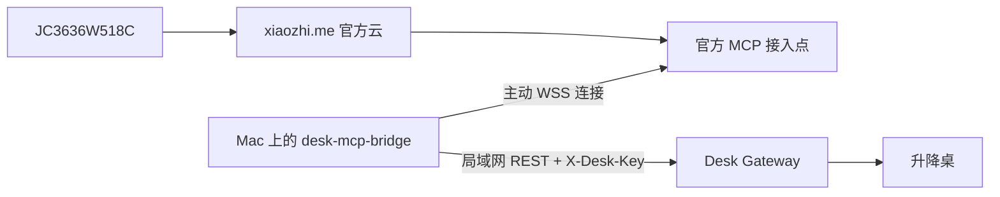

# 小智 AI 硬件固件与本地 Server 部署

| 项 | 内容 |
| --- | --- |
| 文档编号 | DG-XIAOZHI-001 |
| 版本 | 0.2.0 |
| 日期 | 2026-08-16 |
| 状态 | JC3636W518C 固件已完成实机刷写；本地 Server 流程已补齐，服务尚未部署 |
| 适用硬件 | JC3636W518C、Xmini-C3 普通版 |

本文整理现有两台小智 AI 硬件的资料、固件选择、烧录方法，以及
`xiaozhi-esp32-server` 的本地部署和设备接入方式。文中的版本和链接以
2026-08-16 的仓库状态为基准；实际操作前应再检查最新 Release 是否改变了板卡命名或部署要求。

## 1. 结论

### 1.1 固件选择

| 硬件 | 已确认型号 | 推荐固件 | 不应刷写 |
| --- | --- | --- | --- |
| 1.8 inch 圆屏 | `JC3636W518C`，ESP32-S3R8、16 MB Flash、8 MB PSRAM | 产品标签批次号不大于 `2528` 时使用 [`v2.4.2_taiji-pi-s3.zip`](https://github.com/78/xiaozhi-esp32/releases/download/v2.4.2/v2.4.2_taiji-pi-s3.zip) | 未核对批次时不要刷 `taiji-pi-s3-pdm` |
| 1.8 inch 圆屏新批次 | 产品标签批次号大于 `2528` | [`v2.4.2_taiji-pi-s3-pdm.zip`](https://github.com/78/xiaozhi-esp32/releases/download/v2.4.2/v2.4.2_taiji-pi-s3-pdm.zip) | `taiji-pi-s3` 的 STD 麦克风版本 |
| 0.96 inch OLED 小板 | Xmini-C3 普通版，二维码内容为 `Xmini-C3-_250208_0104` | [`v2.4.2_xmini-c3.zip`](https://github.com/78/xiaozhi-esp32/releases/download/v2.4.2/v2.4.2_xmini-c3.zip) | [`v2.4.2_xmini-c3-v3.zip`](https://github.com/78/xiaozhi-esp32/releases/download/v2.4.2/v2.4.2_xmini-c3-v3.zip) |

当前小智官方最新 Release 是
[`v2.4.2`](https://github.com/78/xiaozhi-esp32/releases/tag/v2.4.2)，发布时间为 2026-08-06。
官方固件默认连接 `xiaozhi.me`；刷好官方固件后，可以在配网页面的“高级选项”中把 OTA
地址改为本地 Server，无需为了切换服务器重新编译固件。

### 1.2 源码和服务端边界

- 小智 ESP32 官方固件源码：[`78/xiaozhi-esp32`](https://github.com/78/xiaozhi-esp32)。
- 小智官方网站及控制台：[`xiaozhi.me`](https://xiaozhi.me/home/zh/)。
- 小智开发文档：[`xiaozhi.me/home/zh/docs`](https://xiaozhi.me/home/zh/docs/)。
- 本地兼容后端：[`xinnan-tech/xiaozhi-esp32-server`](https://github.com/xinnan-tech/xiaozhi-esp32-server)。

`xinnan-tech/xiaozhi-esp32-server` 是按小智通信协议实现的社区开源兼容后端，不是
`xiaozhi.me` 线上生产服务端的源码。它提供 Python Server、Java manager-api、Web
智控台、MySQL、Redis 和 MCP 等模块，适合在局域网内搭建独立服务。

## 2. JC3636W518C 硬件与原始资料

### 2.1 硬件信息

本地资料目录：

```text
/Users/dong4j/Synology/driver/Others/小智 AI
```

厂商 PDF 标识为深圳市晶彩智能有限公司，主要参数如下：

| 项目 | 参数 |
| --- | --- |
| SKU | `JC3636W518C` |
| 主控 | ESP32-S3R8，双核 240 MHz |
| 存储 | 16 MB Flash、8 MB PSRAM |
| 屏幕 | 1.8 inch、360 x 360、ST77916、QSPI |
| 触摸 | CST816 电容触摸 |
| 音频 | I2S 数字麦克风、I2S DAC |
| 其他 | TF 卡、无线供电、USB-C |

资料中没有给出由硬件厂商维护的公开 GitHub 仓库。可以使用以下三个不同性质的地址：

| 地址 | 性质 | 用途 |
| --- | --- | --- |
| [`guition.com`](https://www.guition.com/) | 晶彩智能厂商网站 | 厂商和产品资料入口 |
| [`78/xiaozhi-esp32/main/boards/taiji-pi-s3`](https://github.com/78/xiaozhi-esp32/tree/main/main/boards/taiji-pi-s3) | 小智官方固件板卡适配源码 | 编译小智固件时的直接依据 |
| [`moononournation/JC3636W518`](https://github.com/moononournation/JC3636W518) | 社区示例，不是厂商官方仓库 | Arduino/LVGL/MJPEG 等硬件实验参考 |

不要把社区示例仓库描述为硬件厂商官方源码。当前最完整的原始硬件资料仍是本地保存的
PDF、原理图、Arduino Demo 和烧录包。

### 2.2 本地三个固件文件

已经在 ESP-IDF v6.0.2 环境中读取三个 BIN 的镜像头、分区表和 App 描述：

| 文件 | 内容 | 镜像信息 | 建议 |
| --- | --- | --- | --- |
| `小智固件/1.85_xiaozhi_new.bin` | 厂商提供的小智固件 | App `1.2.1`，ESP-IDF `v5.3.2`，构建于 2025-02-19，ESP32-S3，16 MB | 保留为原厂回退镜像，不作为当前首选 |
| `小智固件/xiaozhi-jc3636w518.bin` | 更早的小智固件 | App `1.1.2`，ESP-IDF `v5.4-dev-3951-g9106c43acc-dirty`，构建于 2025-02-12 | 不建议继续使用 |
| `9-烧录/Burn files/1.85_demo.bin` | 晶彩原始功能 Demo | Arduino 构建，ESP-IDF `v5.1.4-51-g442a798083-dirty`，构建于 2024-05-13 | 只用于恢复副屏、天气、音乐、相册等演示功能，不是小智固件 |

SHA-256：

```text
d81a5b21467b51941fd6e167392aa3d163b7c1b1c0ea68b42c1e32bdbff5b672  1.85_xiaozhi_new.bin
f7cbd69568c9ffe629f246fab1bfe0786d8fce2f511d10fcda8e714b311392d0  xiaozhi-jc3636w518.bin
ba39e0d0f1c631aa1433fd0269bf6e3940fdc1b3ecd597b18599e3964bb1e1ef  1.85_demo.bin
```

`2-样例/Demo_Arduino/ST77916_LVGL_DEMO` 中保存了硬件演示源码，原资料要求：

- Arduino ESP32 Core `3.0.1` 或以上；
- `ESP32_Display_Panel 0.1.4`；
- `ESP32_IO_Expander 0.0.2`；
- LVGL `8.4.0` 或以下。

这份 Arduino 示例可以用于屏幕和触摸开发，但不能证明它与 `1.85_demo.bin` 的完整产品
源码一一对应。原始 Demo 还包含 AIDA64 副屏、MP3、MJPEG、相册、天气和主题时钟等功能。

### 2.3 `taiji-pi-s3` 与 `taiji-pi-s3-pdm`

小智源码明确说明：2025 年 7 月之后，JC3636W518 更换了麦克风和屏幕玻璃。产品标签
批次号大于 `2528` 时必须选择 PDM 版本：

- 原麦克风版本：`taiji-pi-s3`，`CONFIG_TAIJIPAI_I2S_TYPE_STD=y`；
- 新麦克风版本：`taiji-pi-s3-pdm`，`CONFIG_TAIJIPAI_I2S_TYPE_PDM=y`。

当前本地原厂小智固件构建于 2025 年 2 月，说明配套资料来自更早批次，但最终仍以硬件
产品标签上的批次号为准。未发现批次号大于 `2528` 时，首选 `taiji-pi-s3`。

## 3. Xmini-C3 普通版

### 3.1 型号确认

这台设备是 Xmini-C3 普通版，不是 V3，依据如下：

1. 二维码内容为 `Xmini-C3-_250208_0104`，其中 `250208` 对应 2025-02-08；官方硬件页的
   V3.0 更新记录是 2025-07-17。
2. 实物照片中 RGB LED 和麦克风位于 PCB 顶部；V3.0 更新说明将 RGB LED 和 MIC 移到
   中间附近。
3. 普通版使用 `LGS4056`，V3 改为 `TP4057`；芯片丝印仍可作为最终交叉验证。

硬件及固件地址：

| 地址 | 用途 |
| --- | --- |
| [`oshwhub.com/tenclass01/xmini_c3`](https://oshwhub.com/tenclass01/xmini_c3) | Xmini-C3 官方开源硬件工程 |
| [`xiaozhi.me/home/zh/docs`](https://xiaozhi.me/home/zh/docs/) | 用户提供的 Xmini-C3/V3 教程来源 |
| [`main/boards/xmini/c3`](https://github.com/78/xiaozhi-esp32/tree/main/main/boards/xmini/c3) | 普通版固件源码 |
| [`main/boards/xmini/c3-v3`](https://github.com/78/xiaozhi-esp32/tree/main/main/boards/xmini/c3-v3) | V3 固件源码，仅用于对照 |

用户保存的旧教程以小智 v1.5.5/v1.8.8、ESP-IDF 5.3/5.4 为例。当前主线已经迁移到
ESP-IDF 6.0，官方首选稳定版为 ESP-IDF v6.0.2，因此不应继续按旧截图选择 SDK。

### 3.2 为什么不能试刷 V3 固件

普通版和 V3 的音频及 I2C 引脚不同。当前普通版源码还会在确认 ES8311 后执行：

```cpp
esp_efuse_write_field_bit(ESP_EFUSE_VDD_SPI_AS_GPIO);
```

这是不可逆的 eFuse 写入。官方源码注释明确提示，不兼容的板卡可能被永久损坏。因此：

- 本机只刷 `v2.4.2_xmini-c3.zip`；
- 不使用“普通版和 V3 各刷一次”的方式试错；
- 刷写前再次确认下载文件名中没有 `-v3` 或 `-4g`。

## 4. 固件备份和烧录

### 4.1 通用准备

1. 使用支持数据传输的 USB 线，不要使用只有供电功能的线。
2. 记录当前 Wi-Fi、设备绑定和服务器配置；写入完整合并镜像会覆盖相关分区。
3. 先备份整片 16 MB Flash，再写入新固件。
4. 下载 ZIP 后解压，官方 Release 包内的目标文件都叫 `merged-binary.bin`，不要混放。
5. 为解压目录增加板卡名称，例如 `taiji-pi-s3/merged-binary.bin` 和
   `xmini-c3/merged-binary.bin`。

在 macOS 上先确定串口：

```bash
ls /dev/cu.usb*
```

如果设备没有自动进入下载模式：

- 按住 `BOOT`；
- 插入 USB 或按一下 `RESET`；
- 识别到串口后释放 `BOOT`。

Xmini-C3 首次烧录时，可按住 `BOOT` 再打开板上电源开关。

下面的 CLI 命令需要在装有 `esptool` 的 Python 环境中执行。本机可以直接使用第 5 节的
ESP-IDF v6.0.2 环境；先运行 `python -m esptool version` 确认工具可用。

### 4.2 备份原始固件

以下命令中的串口需要替换为实际值。JC3636W518C：

```bash
python -m esptool \
  --chip esp32s3 \
  --port /dev/cu.usbmodemXXXX \
  read-flash 0x0 0x1000000 jc3636w518c-original-16m.bin
```

Xmini-C3：

```bash
python -m esptool \
  --chip esp32c3 \
  --port /dev/cu.usbmodemXXXX \
  read-flash 0x0 0x1000000 xmini-c3-original-16m.bin
```

备份完成后计算校验值并另行保存：

```bash
shasum -a 256 *-original-16m.bin
```

### 4.3 推荐方式：ESP Launchpad

1. 使用 Chrome 或 Edge 打开 [ESP Launchpad](https://espressif.github.io/esp-launchpad/)。
2. 点击连接，选择对应 USB 串口。
3. 选择解压后的 `merged-binary.bin`。
4. 起始地址填写 `0x0`。
5. 开始烧录，等待成功提示后断电重启。
6. 不要在写入过程中拔线、关浏览器或切断电源。

### 4.4 CLI 方式

JC3636W518C 标准麦克风批次：

```bash
python -m esptool \
  --chip esp32s3 \
  --port /dev/cu.usbmodemXXXX \
  --baud 460800 \
  write-flash 0x0 taiji-pi-s3/merged-binary.bin
```

Xmini-C3 普通版：

```bash
python -m esptool \
  --chip esp32c3 \
  --port /dev/cu.usbmodemXXXX \
  --baud 460800 \
  write-flash 0x0 xmini-c3/merged-binary.bin
```

### 4.5 首次配网和官方服务验证

1. 重启后连接设备创建的 `Xiaozhi-XXXXXX` Wi-Fi 热点。
2. 如果没有自动弹出配网页面，打开 `http://192.168.4.1`。
3. 选择 2.4 GHz Wi-Fi，输入密码并保存。
4. 先保持默认 OTA 地址，通过 `xiaozhi.me` 完成一次对话，验证麦克风、喇叭、屏幕和网络。
5. 确认硬件正常后，再把 OTA 地址改成本地 Server。

将“刷写成功”和“硬件功能正常”分开验收。程序成功写入只证明 Flash 写入完成，不能证明
麦克风类型、喇叭、屏幕、触摸和服务器地址全部正确。

## 5. 从源码编译固件

当前源码首选 ESP-IDF v6.0.2。下面命令使用本机已经安装的固定环境：

```bash
git clone https://github.com/78/xiaozhi-esp32.git
cd xiaozhi-esp32

export IDF_PYTHON_ENV_PATH=/Users/dong4j/.espressif/tools/python/v6.0.2/venv
export IDF_PYTHON_CHECK_CONSTRAINTS=no
source /Users/dong4j/.espressif/v6.0.2/esp-idf/export.sh
idf.py --version
```

必须先看到：

```text
ESP-IDF v6.0.2
```

然后按板卡构建。JC3636W518C 标准版：

```bash
python scripts/build.py taiji-pi-s3 --name taiji-pi-s3 --zip
```

JC3636W518C PDM 新批次：

```bash
python scripts/build.py taiji-pi-s3 --name taiji-pi-s3-pdm --zip
```

Xmini-C3 普通版：

```bash
python scripts/build.py xmini/c3 --name xmini-c3 --zip
```

构建脚本会选择目标芯片、应用板卡配置、执行构建并生成 `build/merged-binary.bin`；带
`--zip` 时还会在 `releases/` 下生成带版本和板卡名的 ZIP。

需要连接本地 Server 时，优先使用第 7 节的配网高级选项，不必修改源码。只有要固定默认
OTA 地址、修改 UI、唤醒词或板载 MCP 工具时，才需要自行编译固件。

## 6. 本地部署 `xiaozhi-esp32-server`

### 6.1 部署目标和固定版本

本文使用全模块安装，保留本地智控台、设备绑定、多智能体、模型管理和后续 MCP 管理能力。
服务端采用当前最新正式版，不直接跟随 `main` 或 `latest`：

| 项目 | 固定值 |
| --- | --- |
| 服务端仓库 | [`xinnan-tech/xiaozhi-esp32-server`](https://github.com/xinnan-tech/xiaozhi-esp32-server) |
| Release | [`v0.9.6`](https://github.com/xinnan-tech/xiaozhi-esp32-server/releases/tag/v0.9.6) |
| Commit | `f5ed1aaec88471ba00ac778045331514066d63dc` |
| 宿主机 | Apple Silicon Mac，`arm64` |
| 容器运行时 | OrbStack + Docker Compose |
| 当前 Mac 局域网地址 | `192.168.21.249` |
| 当前 JC3636W518C 地址 | `192.168.21.251` |

源码保存在独立仓库，不放进 Desk Gateway 仓库：

```text
/Users/dong4j/Developer/1.AI/ai-incubator/xiaozhi-esp32-server
```

运行时数据放在源码仓库的 `main/xiaozhi-server` 下，方便按照上游目录结构更新配置，但所有
密码、数据库、模型、上传文件和 `server.secret` 都只保留在本机，不提交到 Git。

完整部署包含：

| 组件 | 对外端口 | 作用 |
| --- | ---: | --- |
| `xiaozhi-esp32-server` | `8000` | 设备 WebSocket 语音连接 |
| `xiaozhi-esp32-server` HTTP | `8003` | 视觉接口；简化部署时也可提供 OTA |
| `manager-api` + `manager-web` | `8002` | 智控台、设备管理和全模块 OTA |
| MySQL | 不映射到宿主机 | 用户、设备、智能体和模型配置 |
| Redis | 不映射到宿主机 | 缓存和服务协作 |
| SenseVoiceSmall | 文件挂载 | 默认本地 ASR |

最终使用的局域网地址是：

```text
智控台：    http://192.168.21.249:8002
OTA：       http://192.168.21.249:8002/xiaozhi/ota/
WebSocket： ws://192.168.21.249:8000/xiaozhi/v1/
```

设备不能使用 `127.0.0.1`、`localhost`、`host.docker.internal` 或 Docker 服务名访问 Mac。
应在路由器中为 Mac 设置 DHCP 地址保留；如果地址变化，智控台参数和两台硬件都要重新配置。

### 6.2 Apple Silicon 和部署方式

上游文档说明，从 `0.8.2` 开始，发行 Docker 镜像只支持 x86。M2 Ultra 是 ARM64，不能把
发布镜像当作原生镜像直接运行。本机需要依次构建：

1. Python、Opus、FFmpeg 和依赖所在的 `server-base`；
2. Python 语音 Server；
3. Vue 智控台和 Java manager-api。

不要用 `platform: linux/amd64` 长期依赖模拟层。它可以用于临时排查，但性能、功耗和依赖
兼容性都不适合作为这台机器的正式方案。

另一种方式是直接从源码启动全部模块，但需要同时维护 JDK 21、Maven、Node.js、Python
3.10、MySQL、Redis、Opus、FFmpeg 和多个前后台进程。本文不采用这种方式。

### 6.3 宿主机预检

先启动 OrbStack：

```bash
open -a OrbStack
orb status
docker version
docker compose version
```

必须满足：

- `orb status` 显示运行中；
- `docker version` 同时包含 Client 和 Server；
- Docker Server 架构是 `arm64`；
- `docker compose version` 可以正常输出版本。

检查架构、磁盘、端口和设备路由：

```bash
uname -m
df -h /Users/dong4j/Developer/1.AI/ai-incubator

for port in 8000 8002 8003; do
  lsof -nP -iTCP:${port} -sTCP:LISTEN
done

route -n get 192.168.21.251
```

预期结果：

- `uname -m` 输出 `arm64`；
- 预留至少 25 GB 可用空间；
- `8000`、`8002`、`8003` 没有被其他进程监听；
- 到硬件的路由走当前局域网接口，宿主机地址为 `192.168.21.249`。

MySQL 和 Redis 只在 Compose 网络中开放，不应把 `3306`、`6379` 映射到宿主机。macOS
防火墙需要允许 OrbStack/Docker 接收局域网对 `8000`、`8002`、`8003` 的访问。不要在路由器
上配置公网端口转发。

### 6.4 获取并固定源码

确认目标目录不存在同名仓库后执行：

```bash
cd /Users/dong4j/Developer/1.AI/ai-incubator

git clone \
  --branch v0.9.6 \
  --depth 1 \
  https://github.com/xinnan-tech/xiaozhi-esp32-server.git

cd xiaozhi-esp32-server
git rev-parse HEAD
git status --short
```

`git rev-parse HEAD` 必须输出：

```text
f5ed1aaec88471ba00ac778045331514066d63dc
```

如果上游移动了 Tag 或 Commit 不一致，停止部署并重新核对 Release，不要继续使用未知源码。

### 6.5 构建三个 ARM64 镜像

`Dockerfile-server` 默认依赖上游的 `server-base`。为避免拉到 x86 基础镜像，先本地构建
ARM64 基础镜像：

```bash
cd /Users/dong4j/Developer/1.AI/ai-incubator/xiaozhi-esp32-server

docker build \
  --platform linux/arm64 \
  -f Dockerfile-server-base \
  -t local/xiaozhi-esp32-server-base:v0.9.6 \
  .
```

复制一份本地 Dockerfile：

```bash
cp Dockerfile-server Dockerfile-server.arm64

sed -i '' \
  's#^FROM .*server-base$#FROM local/xiaozhi-esp32-server-base:v0.9.6#' \
  Dockerfile-server.arm64

head -n 1 Dockerfile-server.arm64
```

第一行必须是：

```dockerfile
FROM local/xiaozhi-esp32-server-base:v0.9.6
```

继续构建 Server 和智控台：

```bash
docker build \
  --platform linux/arm64 \
  -f Dockerfile-server.arm64 \
  -t local/xiaozhi-esp32-server:v0.9.6 \
  .

docker build \
  --platform linux/arm64 \
  -f Dockerfile-web \
  -t local/xiaozhi-esp32-server-web:v0.9.6 \
  .
```

构建过程需要从 Python、npm 和 Maven 仓库下载依赖。完成后检查镜像架构：

```bash
for image in \
  local/xiaozhi-esp32-server-base:v0.9.6 \
  local/xiaozhi-esp32-server:v0.9.6 \
  local/xiaozhi-esp32-server-web:v0.9.6; do
  docker image inspect \
    --format '{{.RepoTags}} {{.Os}}/{{.Architecture}}' \
    "${image}"
done
```

三个镜像都必须显示 `linux/arm64`。出现 `exec format error` 时，不要继续启动服务，先检查
`Dockerfile-server.arm64` 的基础镜像和构建参数。

### 6.6 准备运行目录和本地密码

```bash
cd /Users/dong4j/Developer/1.AI/ai-incubator/xiaozhi-esp32-server/main/xiaozhi-server

mkdir -p \
  data \
  models/SenseVoiceSmall \
  uploadfile \
  mysql/data \
  redis/data

cp config_from_api.yaml data/.config.yaml
cp docker-compose_all.yml docker-compose.local.yml
```

生成独立数据库密码。命令不会把密码打印到终端：

```bash
umask 077
XIAOZHI_DB_PASSWORD="$(openssl rand -hex 24)"
printf 'XIAOZHI_DB_PASSWORD=%s\n' "${XIAOZHI_DB_PASSWORD}" > .env
unset XIAOZHI_DB_PASSWORD
chmod 600 .env
```

不要使用上游示例中的 `123456`。不要提交以下文件和目录：

```text
.env
Dockerfile-server.arm64
docker-compose.local.yml
data/
models/
uploadfile/
mysql/
redis/
```

其中 `data/.config.yaml` 会保存 `server.secret`；`.env` 保存数据库密码。排查问题时不要把
这些文件完整粘贴到聊天、Issue 或公开日志中。

### 6.7 完整的本地 Compose 配置

将 `docker-compose.local.yml` 改成下面的内容。MySQL 和 Redis 只有 `expose`，没有宿主机
端口映射；三项对外服务明确监听局域网：

```yaml
name: xiaozhi-local

services:
  xiaozhi-esp32-server:
    image: local/xiaozhi-esp32-server:v0.9.6
    container_name: xiaozhi-esp32-server
    restart: unless-stopped
    depends_on:
      xiaozhi-esp32-server-db:
        condition: service_healthy
      xiaozhi-esp32-server-redis:
        condition: service_healthy
    ports:
      - "0.0.0.0:8000:8000"
      - "0.0.0.0:8003:8003"
    environment:
      TZ: Asia/Shanghai
    volumes:
      - ./data:/opt/xiaozhi-esp32-server/data
      - ./models/SenseVoiceSmall/model.pt:/opt/xiaozhi-esp32-server/models/SenseVoiceSmall/model.pt:ro
    security_opt:
      - seccomp:unconfined
    networks:
      - xiaozhi

  xiaozhi-esp32-server-web:
    image: local/xiaozhi-esp32-server-web:v0.9.6
    container_name: xiaozhi-esp32-server-web
    restart: unless-stopped
    depends_on:
      xiaozhi-esp32-server-db:
        condition: service_healthy
      xiaozhi-esp32-server-redis:
        condition: service_healthy
    ports:
      - "0.0.0.0:8002:8002"
    environment:
      TZ: Asia/Shanghai
      SPRING_DATASOURCE_DRUID_URL: jdbc:mysql://xiaozhi-esp32-server-db:3306/xiaozhi_esp32_server?useUnicode=true&characterEncoding=UTF-8&serverTimezone=Asia/Shanghai&nullCatalogMeansCurrent=true&connectTimeout=30000&socketTimeout=30000&autoReconnect=true&failOverReadOnly=false&maxReconnects=10
      SPRING_DATASOURCE_DRUID_USERNAME: root
      SPRING_DATASOURCE_DRUID_PASSWORD: ${XIAOZHI_DB_PASSWORD:?XIAOZHI_DB_PASSWORD is required}
      SPRING_DATA_REDIS_HOST: xiaozhi-esp32-server-redis
      SPRING_DATA_REDIS_PASSWORD: ""
      SPRING_DATA_REDIS_PORT: 6379
    volumes:
      - ./uploadfile:/uploadfile
    networks:
      - xiaozhi

  xiaozhi-esp32-server-db:
    image: mysql:8.4
    container_name: xiaozhi-esp32-server-db
    restart: unless-stopped
    expose:
      - "3306"
    environment:
      TZ: Asia/Shanghai
      MYSQL_ROOT_PASSWORD: ${XIAOZHI_DB_PASSWORD:?XIAOZHI_DB_PASSWORD is required}
      MYSQL_DATABASE: xiaozhi_esp32_server
    command:
      - --character-set-server=utf8mb4
      - --collation-server=utf8mb4_unicode_ci
    volumes:
      - ./mysql/data:/var/lib/mysql
    healthcheck:
      test: ["CMD", "mysqladmin", "ping", "-h", "localhost"]
      interval: 10s
      timeout: 5s
      retries: 20
      start_period: 30s
    networks:
      - xiaozhi

  xiaozhi-esp32-server-redis:
    image: redis:8.0
    container_name: xiaozhi-esp32-server-redis
    restart: unless-stopped
    expose:
      - "6379"
    command: ["redis-server", "--appendonly", "yes"]
    volumes:
      - ./redis/data:/data
    healthcheck:
      test: ["CMD", "redis-cli", "ping"]
      interval: 10s
      timeout: 5s
      retries: 10
    networks:
      - xiaozhi

networks:
  xiaozhi:
    driver: bridge
```

先做静态展开，确认 `.env` 已加载且 YAML 有效：

```bash
docker compose -f docker-compose.local.yml config --quiet
```

不要把不带 `--quiet` 的展开结果保存或公开，因为展开后的内容可能包含数据库密码。

### 6.8 下载本地 ASR 模型

```bash
cd /Users/dong4j/Developer/1.AI/ai-incubator/xiaozhi-esp32-server/main/xiaozhi-server

curl \
  --fail \
  --location \
  --retry 3 \
  --continue-at - \
  https://modelscope.cn/models/iic/SenseVoiceSmall/resolve/master/model.pt \
  --output models/SenseVoiceSmall/model.pt

test -s models/SenseVoiceSmall/model.pt
shasum -a 256 models/SenseVoiceSmall/model.pt \
  > models/SenseVoiceSmall/model.pt.sha256
```

ModelScope 没有在本文固定公开校验值，因此这里记录本次实际下载文件的 SHA-256，用于后续
备份和恢复时比对。启动容器前必须确认 `model.pt` 是普通文件而不是目录；模型缺失时 Docker
可能创建同名目录，导致 Server 启动后无法加载 ASR。

### 6.9 分阶段完成首次启动

不要第一次就启动全部服务。先启动数据库、Redis 和智控台：

```bash
docker compose -f docker-compose.local.yml up -d \
  xiaozhi-esp32-server-db \
  xiaozhi-esp32-server-redis \
  xiaozhi-esp32-server-web

docker compose -f docker-compose.local.yml ps
docker compose -f docker-compose.local.yml logs \
  --tail 100 \
  xiaozhi-esp32-server-web
```

等待智控台日志出现 `Started AdminApplication`，然后检查：

```bash
curl --fail --silent --show-error \
  http://127.0.0.1:8002/ \
  > /dev/null
```

浏览器打开：

```text
http://127.0.0.1:8002
```

注册第一个账号。第一个注册成功的账号是超级管理员，因此首次初始化期间只在可信局域网内
开放，不要把 `8002` 暴露到公网。

登录后进入“参数管理”，找到 `server.secret` 并复制参数值。只修改
`data/.config.yaml` 中的 `manager-api`：

```yaml
manager-api:
  url: http://xiaozhi-esp32-server-web:8002/xiaozhi
  secret: <智控台中的 server.secret>
```

不要把 URL 写成 `127.0.0.1`。在 Server 容器里，`127.0.0.1` 指向 Server 容器自身，不是
智控台容器。

现在启动语音 Server：

```bash
docker compose -f docker-compose.local.yml up -d xiaozhi-esp32-server

docker compose -f docker-compose.local.yml logs \
  --follow \
  --tail 100 \
  xiaozhi-esp32-server
```

成功日志应包含 WebSocket 服务监听 `8000`，并显示类似地址：

```text
ws://192.168.21.249:8000/xiaozhi/v1/
```

日志持续出现 manager-api 认证失败时，重新核对 `server.secret`；不要反复重建容器或清空
数据库。

### 6.10 配置服务地址并完成健康检查

在智控台“参数管理”中设置：

```text
server.websocket = ws://192.168.21.249:8000/xiaozhi/v1/
server.ota       = http://192.168.21.249:8002/xiaozhi/ota/
```

保存后检查智控台、OTA 和端口：

```bash
curl --fail --silent --show-error \
  http://127.0.0.1:8002/ \
  > /dev/null

curl --fail --silent --show-error \
  http://192.168.21.249:8002/xiaozhi/ota/

nc -vz 127.0.0.1 8000
nc -vz 192.168.21.249 8000

docker compose -f docker-compose.local.yml ps
```

OTA 页面应提示接口运行正常，并显示可用 WebSocket 集群。`ws://` 不是普通网页地址，浏览器
打不开不能作为失败证据；使用 Server 日志、`nc` 或协议客户端验收。

### 6.11 配置 ASR、LLM 和 TTS

“Server 在本地运行”和“推理完全离线”是两个验收目标：

| 模块 | 可用方案 | 是否需要互联网 |
| --- | --- | --- |
| ASR | 本地 `FunASR` / SenseVoiceSmall | 模型下载后不需要 |
| LLM | 智谱、豆包等 API | 需要 |
| LLM | `OllamaLLM` | 模型下载后不需要 |
| TTS | `EdgeTTS` 或云 API | 需要 |
| TTS | FishSpeech、Index-TTS、PaddleSpeech 等本地服务 | 模型下载后不需要 |

第一阶段先配置本地 SenseVoiceSmall，再任选一个能正常工作的 LLM/TTS 跑通设备链路。第二阶段
再替换成本地 LLM 和本地 TTS，最后断开外网验证。

本机 Ollama 在 macOS 上运行、Server 在 Docker 中运行时，智控台里的 Ollama 地址必须是：

```text
http://host.docker.internal:11434
```

不是 `http://localhost:11434`。先在宿主机检查：

```bash
curl --fail --silent --show-error \
  http://127.0.0.1:11434/api/tags \
  > /dev/null
```

再从 Server 容器检查：

```bash
docker exec xiaozhi-esp32-server \
  python -c 'import urllib.request; print(urllib.request.urlopen("http://host.docker.internal:11434/api/tags", timeout=5).status)'
```

返回 `200` 后，在智控台创建或修改 `OllamaLLM`，填写地址和本机已经下载的模型名，再把该
模型分配给目标智能体。工具调用是否稳定需要单独验收，不能只以普通问答成功代替。

如果 TTS 仍使用 EdgeTTS，即使 ASR 和 LLM 已经本地化，整条链路仍然依赖互联网。完成本地
TTS 部署后，应关闭外网但保留局域网，重新执行唤醒、识别、回答和播报，才能标记为完全
离线。

### 6.12 日常启动、停止和日志

```bash
cd /Users/dong4j/Developer/1.AI/ai-incubator/xiaozhi-esp32-server/main/xiaozhi-server

# 启动
docker compose -f docker-compose.local.yml up -d

# 查看状态
docker compose -f docker-compose.local.yml ps

# 查看最近日志
docker compose -f docker-compose.local.yml logs --tail 200

# 只重启语音 Server
docker compose -f docker-compose.local.yml restart xiaozhi-esp32-server

# 停止并保留数据
docker compose -f docker-compose.local.yml down
```

不要使用 `down -v`，也不要直接删除 `mysql/data`、`redis/data`、`data` 或 `uploadfile`。
OrbStack 停止、Mac 休眠或局域网地址变化都会使硬件暂时无法连接本地 Server。

### 6.13 备份、恢复和升级

升级前先停止容器并备份运行目录：

```bash
docker compose -f docker-compose.local.yml down

cd /Users/dong4j/Developer/1.AI/ai-incubator/xiaozhi-esp32-server/main

tar -czf \
  "xiaozhi-server-backup-$(date +%Y%m%d-%H%M%S).tar.gz" \
  xiaozhi-server/.env \
  xiaozhi-server/data \
  xiaozhi-server/uploadfile \
  xiaozhi-server/mysql \
  xiaozhi-server/redis \
  xiaozhi-server/models/SenseVoiceSmall/model.pt.sha256 \
  xiaozhi-server/docker-compose.local.yml
```

模型文件较大，备份策略可以只保存校验文件并在恢复时重新下载。数据库目录只能在 MySQL
容器停止后做文件级备份。重要环境建议再增加 `mysqldump` 逻辑备份，不能只依赖目录压缩包。

升级时不要覆盖现有运行目录后直接跟随 `main`。推荐：

1. 查看新的正式 Release 和迁移说明；
2. 记录新 Tag 与 Commit；
3. 使用新版本号构建一组新镜像；
4. 备份数据库和配置；
5. 修改 `docker-compose.local.yml` 的镜像 Tag；
6. 启动后重新执行本节健康检查和第 10 节验收；
7. 验收完成前保留上一组镜像和备份。

恢复时先在独立目录解压，检查 `.env`、`data/.config.yaml` 和数据库版本，再启动容器。不要
直接覆盖一个正在运行的 MySQL 数据目录。

### 6.14 常见故障定位

| 现象 | 优先检查 |
| --- | --- |
| `docker version` 只有 Client | OrbStack 没有启动或 Docker Context 指向失效的 Socket |
| 容器报 `exec format error` | 镜像是 amd64；重新检查本地 `server-base` 和 `--platform linux/arm64` |
| `8002` 正常但 `8000` 不监听 | `server.secret` 未填写、manager-api URL 错误或 ASR 模型挂载失败 |
| OTA 页面提示没有 WebSocket 集群 | Server 未启动，或 `server.websocket` 没有填写局域网地址 |
| MySQL 反复认证失败 | `.env` 两处密码不一致；已有数据库仍保存旧密码 |
| `model.pt` 被识别成目录 | 模型下载前容器已经启动；停止容器，修正挂载目标后重试 |
| 容器访问不到 Ollama | 使用了 `localhost:11434`；Docker 内应使用 `host.docker.internal:11434` |
| Mac 能打开智控台，硬件打不开 OTA | macOS 防火墙、访客网络隔离、Mac IP 变化或路由器 AP 隔离 |
| 硬件仍连接官方云 | 配网高级选项仍保存官方 OTA 地址，或本地 OTA 健康检查失败 |
| 对话识别正常但不播报 | TTS Provider、音色、网络或本地 TTS 服务未配置 |
| 断网后不能对话 | LLM、TTS 或模型下载仍依赖云服务，不能标记为完全离线 |

遇到故障时先保存以下信息，不要立即清空数据库或重建全部容器：

```bash
docker compose -f docker-compose.local.yml ps
docker compose -f docker-compose.local.yml logs --tail 300
docker image inspect local/xiaozhi-esp32-server:v0.9.6 \
  --format '{{.Os}}/{{.Architecture}}'
```

日志中如果包含 API Key、`server.secret`、设备 Token 或用户信息，分享前必须脱敏。

### 6.15 后端部署验收标准

本地 Server 只有同时满足以下条件才算部署完成：

- 三个本地业务镜像都是 `linux/arm64`；
- MySQL、Redis、智控台和语音 Server 容器均为 `running/healthy`；
- `http://192.168.21.249:8002` 可以从局域网访问；
- OTA 页面显示运行正常并发现 WebSocket 集群；
- `8000` 在宿主机和局域网地址上都可连接；
- `server.secret`、`server.websocket`、`server.ota` 配置一致；
- JC3636W518C 能获得本地验证码并绑定本地智能体；
- 设备完成一次唤醒、ASR、LLM 回复和 TTS 播报；
- Server 日志证明设备连接的是本地 WebSocket，不是 `mqtt.xiaozhi.me`；
- 使用本地 LLM/TTS 时，断开外网后仍能完成相同对话，才能标记为完全离线。

上游原始文档：

- [全模块部署](https://github.com/xinnan-tech/xiaozhi-esp32-server/blob/v0.9.6/docs/Deployment_all.md)
- [本地编译 Docker 镜像](https://github.com/xinnan-tech/xiaozhi-esp32-server/blob/v0.9.6/docs/docker-build.md)
- [使用预编译固件连接自定义 Server](https://github.com/xinnan-tech/xiaozhi-esp32-server/blob/v0.9.6/docs/firmware-setting.md)

## 7. 让两台硬件连接本地 Server

### 7.1 接入前提

先在同一局域网的手机或另一台电脑上打开：

```text
http://192.168.21.249:8002/xiaozhi/ota/
```

页面必须显示 OTA 接口正常并发现 WebSocket 集群。不能只在 Mac 本机使用 `127.0.0.1`
验证，因为硬件访问的是 Mac 的局域网地址。

当前局域网参数：

```text
Mac：             192.168.21.249
JC3636W518C：     192.168.21.251
本地 OTA：        http://192.168.21.249:8002/xiaozhi/ota/
本地 WebSocket：  ws://192.168.21.249:8000/xiaozhi/v1/
```

官方云和本地智控台的设备、智能体、模型配置相互独立。切换到本地 Server 后，需要在本地
智控台重新添加设备，`xiaozhi.me` 中原有的绑定不会自动迁移。

### 7.2 JC3636W518C 进入配网

`taiji-pi-s3` 固件在启动阶段检测到一次短触摸时会进入配网模式。操作顺序：

1. 重启设备；
2. 屏幕刚亮、设备仍处于启动状态时短触屏幕一次，不要持续按住；
3. 等待设备提示进入配网模式；
4. 手机连接 `Xiaozhi-XXXX` 热点；
5. 手机提示“无互联网”时选择继续使用当前 Wi-Fi；
6. 浏览器打开 `http://192.168.4.1`。

当前 v2.4.2 源码把小于 500 ms 的启动阶段触摸识别为短触并进入配网。固件 UI 后续如果提供
网络设置入口，优先使用 UI；不要为了修改 OTA 地址重新烧录固件。

### 7.3 Xmini-C3 进入配网

1. 关闭板上电源；
2. 按住 `BOOT`；
3. 打开电源或按 `RESET`；
4. 设备进入配网后释放 `BOOT`；
5. 连接 `Xiaozhi-XXXX` 热点并打开 `http://192.168.4.1`。

Xmini-C3 普通版不能使用 V3 固件。进入配网只是修改 NVS，不涉及前文所述 eFuse 风险。

### 7.4 保存 Wi-Fi 和本地 OTA

在配网页面中：

1. 选择 2.4 GHz Wi-Fi；
2. 输入密码，不要把密码记录到本文或命令历史；
3. “Wi-Fi 最大发送功率”设置为 `20 dBm`；
4. 展开“高级选项”；
5. OTA 地址填写：

```text
http://192.168.21.249:8002/xiaozhi/ota/
```

6. 保存并等待设备重启。

如果路由器使用双频合一，优先确认 2.4 GHz 已启用、不是访客网络，并关闭会阻止无线客户端
访问有线设备的 AP 隔离。不要把 OTA 地址写成 `127.0.0.1`、容器 IP 或 `localhost`。

### 7.5 绑定本地设备并验证

查看 Server 日志：

```bash
cd /Users/dong4j/Developer/1.AI/ai-incubator/xiaozhi-esp32-server/main/xiaozhi-server

docker compose -f docker-compose.local.yml logs \
  --follow \
  --tail 200 \
  xiaozhi-esp32-server
```

日志应出现来自硬件的连接，并使用：

```text
ws://192.168.21.249:8000/xiaozhi/v1/
```

如果设备播报六位验证码：

1. 打开 `http://192.168.21.249:8002`；
2. 进入准备使用的本地智能体；
3. 添加设备并输入本地验证码；
4. 不要把该验证码输入 `xiaozhi.me`；
5. 分别完成唤醒、识别、回答和播报测试。

至少保存以下验收证据：设备 MAC/SKU、本地 IP、连接时间、Server 日志中的连接目标、使用的
智能体，以及麦克风和喇叭实测结果。日志出现连接只证明协议链路建立，不能代替实机音频
验收。

### 7.6 连接失败和恢复官方云

设备仍然连接官方云时依次检查：

- 配网页面保存的 OTA 是否仍是 `https://api.tenclass.net/xiaozhi/ota/`；
- 本地 OTA 页面能否从手机访问；
- Mac 局域网 IP 是否变化；
- macOS 防火墙是否允许 OrbStack/Docker 接收 `8000`、`8002`、`8003`；
- `server.websocket` 是否填写为设备可以访问的局域网地址；
- `server.secret` 是否与 `data/.config.yaml` 一致；
- 路由器是否开启访客网络隔离或 AP 隔离。

需要恢复官方云时，重新进入配网高级选项，将 OTA 改回：

```text
https://api.tenclass.net/xiaozhi/ota/
```

保存并重启后，串口日志应重新出现 `mqtt.xiaozhi.me` 或官方 WebSocket 连接。恢复官方云不会
删除本地智控台中的设备记录，后续重新切换回来仍需按实际验证码和绑定状态验收。

## 8. 不部署本地 Server：使用官方云 MCP 桥接

本地 Server 不是控制 Desk Gateway 的强制前提。设备可以继续连接 `xiaozhi.me`，只在 Mac
上运行轻量 MCP 桥接进程：



这种方式不需要部署 Python 语音 Server、智控台、MySQL、Redis、ASR、LLM 或 TTS。桥接进程
主动连接官方 MCP WebSocket，因此不需要公网 IP、域名或路由器端口映射。但它仍然是一个
需要常驻的本地进程；Mac 休眠或进程退出后，升降桌工具会离线。

使用官方示例 [`78/mcp-calculator`](https://github.com/78/mcp-calculator) 的运行方式：

```bash
export MCP_ENDPOINT='<xiaozhi.me 智能体中的 MCP 接入点>'
export DESK_GATEWAY_URL='http://<Desk Gateway 局域网地址>'
export DESK_GATEWAY_KEY='<本地 X-Desk-Key>'

python mcp_pipe.py desk_mcp.py
```

`MCP_ENDPOINT` 和 `DESK_GATEWAY_KEY` 都是凭据，不能写进 Git、智能体提示词或公开日志。桥接
工具只能映射固定 REST 路由，不能让模型传入任意 URL、HTTP Method 或认证头。

两种方案的选择：

| 目标 | 推荐方案 |
| --- | --- |
| 最快跑通小智控制升降桌 | 官方云 + 轻量 MCP 桥接 |
| ASR、LLM、TTS、账号和设备都自己管理 | 本地全模块 Server |
| 完全不运行 Mac 端进程 | 改造 Desk Gateway 固件直接连接云 MCP；当前尚未实现 |
| 最终完全离线 | 本地 Server + 本地 ASR/LLM/TTS + 本地 MCP |

完整的 Desk MCP 工具、安全语义和桥接代码设计见
[通过小智 AI 控制升降桌](xiaozhi-ai-desk-control.md)。

## 9. 通过小智控制 Desk Gateway

无论设备使用本地 Server 还是官方云，最终都通过受控 MCP 工具访问 Desk Gateway REST。
本地 Server 方案的链路如下：


当前 Desk Gateway 已使用 TOF400C 完成最高安全高度和档位 1/4 的设备侧闭环。默认最高安全
高度为 `940 mm`，最低档位和档位 1 默认为 `550 mm`，档位 4 默认为 `870 mm`。“最高”和“站立档位”必须作为
两个不同动作处理；只有启用 ToF 的当前产品固件完成真桌验收后，才能开放持续上升到安全
上限的语音工具。

完整架构、MCP Endpoint 部署、桥接代码、工具语义、安全前提和验收步骤见
[通过小智 AI 控制升降桌](xiaozhi-ai-desk-control.md)。

## 10. 验收清单

### 10.1 固件

- [ ] 两台设备的 16 MB 原始 Flash 已备份并保存 SHA-256。
- [ ] JC3636W518C 产品标签批次号已经核对。
- [ ] JC3636W518C 使用正确的 STD 或 PDM 固件，麦克风录音正常。
- [ ] Xmini-C3 只刷了 `xmini-c3`，没有刷 `xmini-c3-v3`。
- [ ] 两台设备的屏幕、按键、麦克风、喇叭和 2.4 GHz Wi-Fi 均已实测。

### 10.2 本地 Server

- [ ] ARM64 Base、Server 和 Web 镜像在本机从源码构建完成。
- [ ] MySQL、Redis、manager-web/api、Server 容器健康。
- [ ] `server.secret` 已同步，且未提交到仓库。
- [ ] `server.websocket` 和 `server.ota` 使用固定局域网 IP。
- [ ] OTA 页面显示正常，Server 日志能看到两台设备连接。
- [ ] 两台设备已经在本地智控台完成绑定并能完整对话。
- [ ] 如果目标是完全离线，断开外网后 ASR、LLM、TTS 仍可工作。

### 10.3 官方云 MCP 桥接

- [ ] 目标智能体的 `MCP_ENDPOINT` 只保存在本机凭据配置中。
- [ ] 桥接进程只建立出站 WSS，不开放公网端口。
- [ ] `DESK_GATEWAY_KEY` 未写入 Git、提示词或公开日志。
- [ ] Mac 休眠、桥接退出和自动重连行为已经测试。
- [ ] 官方云对话正常，桥接日志能看到 `tools/list` 和 `tools/call`。

### 10.4 升降桌控制

- [ ] `desk.raise_to_max` 只在 TOF400C 高度有效、最高安全高度已配置并完成真桌验收后启用。
- [ ] “升到最高”和“站立档位”分别映射到安全上限与档位 4，没有混用。
- [ ] 上升到最高、档位 1/4、传感器失效和右侧障碍均由 ESP32 本地闭环停止。
- [ ] `desk.stop` 不受对话状态或普通来源权限阻塞。
- [ ] 已完成真桌短行程、断网、Server 退出和紧急停止测试。

## 11. 参考资料

- [小智 AI 官方固件源码](https://github.com/78/xiaozhi-esp32)
- [小智 AI v2.4.2 Release](https://github.com/78/xiaozhi-esp32/releases/tag/v2.4.2)
- [JC3636W518C / 太极派板卡源码](https://github.com/78/xiaozhi-esp32/tree/main/main/boards/taiji-pi-s3)
- [Xmini-C3 开源硬件](https://oshwhub.com/tenclass01/xmini_c3)
- [Xmini-C3 普通版固件源码](https://github.com/78/xiaozhi-esp32/tree/main/main/boards/xmini/c3)
- [Xmini-C3 V3 固件源码](https://github.com/78/xiaozhi-esp32/tree/main/main/boards/xmini/c3-v3)
- [小智 AI 开发文档](https://xiaozhi.me/home/zh/docs/)
- [社区本地后端源码](https://github.com/xinnan-tech/xiaozhi-esp32-server)
- [社区后端 v0.9.6 Release](https://github.com/xinnan-tech/xiaozhi-esp32-server/releases/tag/v0.9.6)
- [社区后端 v0.9.6 全模块部署文档](https://github.com/xinnan-tech/xiaozhi-esp32-server/blob/v0.9.6/docs/Deployment_all.md)
- [社区后端 v0.9.6 Docker 构建文档](https://github.com/xinnan-tech/xiaozhi-esp32-server/blob/v0.9.6/docs/docker-build.md)
- [社区后端固件接入文档](https://github.com/xinnan-tech/xiaozhi-esp32-server/blob/v0.9.6/docs/firmware-setting.md)
- [SenseVoiceSmall 模型](https://modelscope.cn/models/iic/SenseVoiceSmall)
- [小智官方 MCP 示例](https://github.com/78/mcp-calculator)
