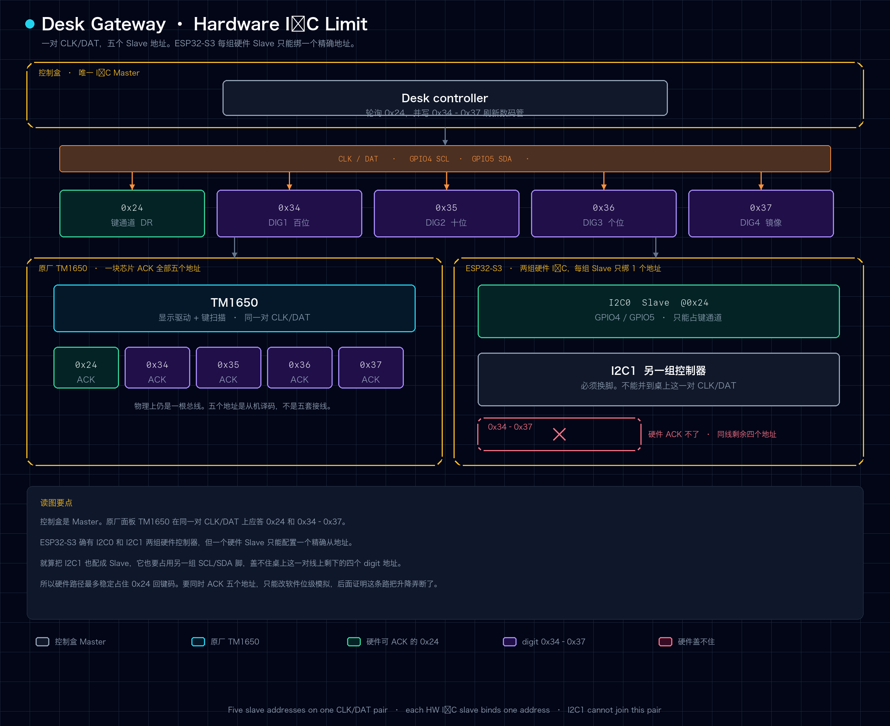

# 高度数据解析与通信方案调整

| 项 | 内容 |
|---|---|
| 文档编号 | DG-INV-001 |
| 日期 | 2026-08-17 |
| 已确认稳定基线 | `3269faa` |
| 适用硬件 | ESP32-S3 + mxtark 控制盒 |
| 最终决策 | 控制盒侧只用硬件 I²C Slave 响应 `0x24`，不再解析数码管高度。产品高度改由独立 ToF 提供 |

本文记录 Desk Gateway 为什么从「能稳定升降」走到「为了读高度改软件模拟」，又为什么退回硬件 I²C。双 ToF 的选型、精度、滤波和上升限制见 [双 ToF 距离传感器接入与安全策略](../architecture/tof-safety.md)，不在本章展开。

协议键码、digit 段码和抓包细节以 [协议逆向笔记](../architecture/protocol-reverse-notes.md) 为准。

---

## 1. 硬件 I²C 已经能稳定升降

Phase 1 的产品路径很窄：ESP32-S3 用硬件 I²C Slave 顶替原厂 TM1650 面板，只应答控制盒对 `0x24` 的键轮询。业务代码更新当前键码，ACK、移位和总线时序都交给 I²C 外设。

已知稳定提交 `3269faa` 在真桌上证明：

- 按住升高连续运行
- 按住降低连续运行
- 松手后正常停止
- 没有后来那种反复启动、停下的顿挫

键码契约没有变：

```text
停止  0x2E
上升  0x47
下降  0x4F
```

这一阶段网关能控桌，但不能告诉用户桌子现在有多高。Web、REST、BLE 没有真实高度，档位闭环和最高安全高度也做不了，因为固件不知道当前毫米值。

---

## 2. 高度不在键通道里

原厂面板有三位七段数码管。第一反应是：既然 ESP32 已经在同一组 CLK/DAT 上应答控制盒，能不能把高度一并读出来？

抓包结论把两件事拆开了：

| 通道 | 地址 | 方向 | 内容 |
|---|---|---|---|
| 键通道 | `0x24` | 控制盒读面板 | 当前按键，`DR` 里是 `0x2E / 0x47 / 0x4F` 这类键码 |
| 显示通道 | `0x34–0x37` | 控制盒写面板 | TM1650 digit 段码，面板拿它刷新数码管 |

`DR` 里找不到 64、102 这种厘米字面量。高度是控制盒写给数码管的段码。旁路嗅探 `0x34–0x37` 的写事务，再用本面板标定过的经验字库，可以把显示高度还原成整数厘米。离线金标准向量已经通过。

产品上要的不只是「能解一段抓包」，而是运动过程中持续可用的高度：Web 实时显示、档位在目标附近停下、升到最高安全位时主动 STOP。这些都要求网关在控制盒刷新数码管的同时拿到当前高度，而且不能把已经稳定的升降弄坏。

---

## 3. 硬件 Slave 只能占一个地址

### ESP32-S3 硬件 I²C 资源限制

要在 ESP32-S3 中同时处理按键和高度，需要响应同一对 `CLK/DAT` 上的五个 Slave 地址。`0x24` 用于按键，`0x34` 至 `0x37` 用于四个数码管位置。

ESP32-S3 有两组硬件 I²C 控制器，但一个硬件 I²C Slave 只能配置一个精确地址。

两组控制器无法同时覆盖这五个地址。这里的限制是五个 Slave 地址，不是五组 I²C 线，物理连接仍然只有一对 `CLK/DAT`。



产品路径已经占用 `@0x24` 回键码。同一组 GPIO4/5 上再去 ACK `0x34–0x37`，硬件外设做不到。

于是出现两条实验路：

**GPIO 边沿嗅探。** 硬件 Slave 继续只应答 `0x24`，另用 GPIO ISR 听 CLK/DAT，试图在不 ACK 的情况下偷看 digit 写。真机结果是 NO-GO：SCL 每个上升沿和 SDA 边沿都会打高频中断，和硬件 Slave 抢同一组脚。控制盒在 `0x34–0x37` 被 NACK 后往往会停写，纯监听拿不到段码 data。更糟的是升降本身开始不稳，高度仍然未知。这条路径默认关闭，不能进稳定固件。

**软件多地址 Slave。** 放弃这组脚上的硬件外设，改成 GPIO 中断驱动的位级状态机，同时 ACK `0x24` 和 `0x34–0x37`。提交 `f9506a0` 走的就是这条路。短时间里它看起来成功：主机波形对得上，IRAM 门禁补过之后不再 cache panic，真机升降和 `64–80 cm` 高度解码都通过过。

问题在于，关键时序从硬件外设挪进了实时软件中断。大约 9.6 kHz 的 SCL 上，每个边沿都要软件决定何时拉低或释放 DAT。Wi-Fi、BLE、日志、任务调度，以及 GPIO 自己产生的 DAT 边沿，都可能让状态机错过或误判一次边沿。

---

## 4. 升降开始断续

新固件能显示控制盒返回的真实高度，按住升高时桌子却反复启动、停止。下降一度比较顺，后来随着软件 I²C 时序修补增加，也出现过同样回归。Web、REST、BLE 和旋钮都能复现，所以不是某一个客户端入口的问题。

排查时已经排除过：

- Web 指针事件提前发 STOP
- REST / BLE 长按续租超时
- 最高安全高度提前触发
- 高度帧没跟上导致固件主动停止
- 档位闭环或童锁策略主动停止

日志里运动期间没有对应的 `DR=0x2E`，桌子仍会短暂停下。ESP32 没有主动改成停止键码，是控制盒没有持续读到完整的上升键码。

把 `3269faa` 重新烧回去，连续升、连续降、松手停止全部恢复。对比范围因此缩小到：为了同时处理按键和高度而改掉的那层传输。

---

## 5. 日志里的完成率只有约 5%

故障版本的诊断日志出现过：

```text
key_tx=102/8 abort=94
key_tx=164/8 abort=156
key_tx=128/4 abort=124
```

三段合计发起 394 次按键响应，完整发送只有 20 次，374 次中途被打断，完成率约 5%。控制盒只有偶尔能读到完整的 `0x47`，桌子上的体感就是：

```text
完整读到 0x47  → 上升
本轮读取失败   → 控制盒认为按键没有持续
再次读到 0x47  → 又升一段
```

下降用 `0x4F`，bit 排列不同，同一套软件状态机里有时看起来好一些。这不能证明软件 I²C 控制链路可靠，只说明失败模式和字节图案有关。

后面还试过边沿过滤、START/STOP 保护、ULP 采样、任务优先级和发送阶段保护。日志数字有时好看一点，真机连续升降回不到 `3269faa`，而且一度把原来正常的下降也弄回归。继续在同一实现上叠时序规则，等于把升降安全绑在越来越复杂的中断状态机上。

结论：软件 I²C 同时负责按键和高度，不能作为产品方案。

---

## 6. 回到硬件 I²C，把高度从这条总线拆走

同一块 ESP32-S3 继续跑 Web、BLE、童锁和仲裁，底层职责拆开：

```text
ESP32-S3
├── desk_core / Web / REST / BLE / 童锁 / 来源权限
├── I2C0 硬件 Slave @0x24（GPIO4 / GPIO5）
│   └── 只应答上升、下降、停止
└── I2C1 硬件 Master（GPIO10 / GPIO11）
    └── 独立距离传感器，提供产品高度和右侧间距
```

默认关闭 `CONFIG_DESK_MXTARK_SOFT_I2C_MULTI_ADDRESS`，实验性 GPIO 高度嗅探保持关闭。控制盒侧不再响应 `0x34–0x37`，也不再把数码管段码当成产品高度。软件多地址实现留作历史实验代码，不进默认构建。

这一步换回来的是运动链路：启动日志出现 `I2C slave @0x24 SCL=4 SDA=5`，按住升、按住降重新连续，松手或 STOP 立即停下。代价也很明确：固件再次没有高度。`height_known=false`，界面显示未知，禁止用 SIM 或旧 digit 缓存冒充真实高度。档位闭环和最高安全高度在独立传感器就绪前不可用。童锁、来源权限和断连 STOP 不受影响。

---

## 7. 遗留的高度问题，以及为什么不再解析控制盒

控制盒 digit 高度有几处不适合做产品源：

它和键通道共享同一组 CLK/DAT。要解析它，就要在这条已经证明不能丢拍的总线上再占地址或再挂 ISR。硬件做不到双地址，软件做过一次，把升降弄断了。

它给出的是数码管厘米显示，不是桌面到地面的毫米距离。运动中完整四元组少，需要滤波才能跟上，静置锚点可靠、连续跟踪只是部分可用。原厂面板档位 2 / 3 的键码仍未抓包验收，不能把「解出了显示值」写成「已经有安全档位闭环」。

最低高度由控制盒自己的下止点处理。网关再拿一份可能跳动的 digit 去发下行 STOP，会和机械限位打架。

所以产品高度改走另一条总线。当时复盘里写的是等待外接 ToF。后来落地的是桌板朝地的 TOF400C 做高度、桌面朝右的 TOF050C 做低位上升保护，两者与 OLED 共用 GPIO10/11 的 I²C1，SHUT 脚独立。控制盒 `@0x24` 的实现从此不再为了高度改动。

接线、滤波、档位容差、最高 940 mm 和「低于 800 mm 时右侧不足 80 mm 禁止上升」的矩阵，见 [双 ToF 距离传感器接入与安全策略](../architecture/tof-safety.md)。

---

## 8. 实施范围与真机验收

本次通信方案调整只做这些：

1. 默认关闭 `CONFIG_DESK_MXTARK_SOFT_I2C_MULTI_ADDRESS`
2. 保持实验性 GPIO 高度嗅探关闭
3. 恢复 ESP-IDF 硬件 I²C Slave `@0x24`
4. 保留现有上层 API 和客户端 UI
5. 高度改为未知，直到独立 ToF 驱动接入。不实现新的模拟高度，不继续调软件 I²C 时序

烧录后必须满足：

- 启动日志出现 `I2C slave @0x24 SCL=4 SDA=5`
- 启动日志不出现 `software I2C addrs=0x24,0x34-0x37`
- Web、REST、BLE 分别按住升高和降低，运动全程连续。测试时必须有人在桌旁
- 松手或显式 STOP 后立即停止
- 在 ToF 接入前，高度显示为未知，不出现 `SIM` 或控制盒 digit 解析值
- 童锁开启后所有入口拒绝运动，STOP 始终可用
- 连续运行过程中无 `key_tx abort` 类软件 I²C 诊断

自动化构建和主机测试只能证明代码路径可编译。升降是否连续，以真桌为准。
