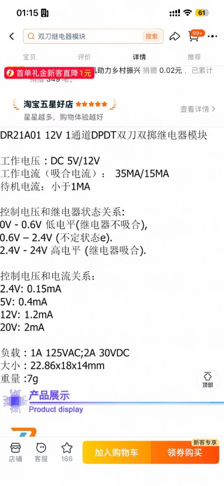
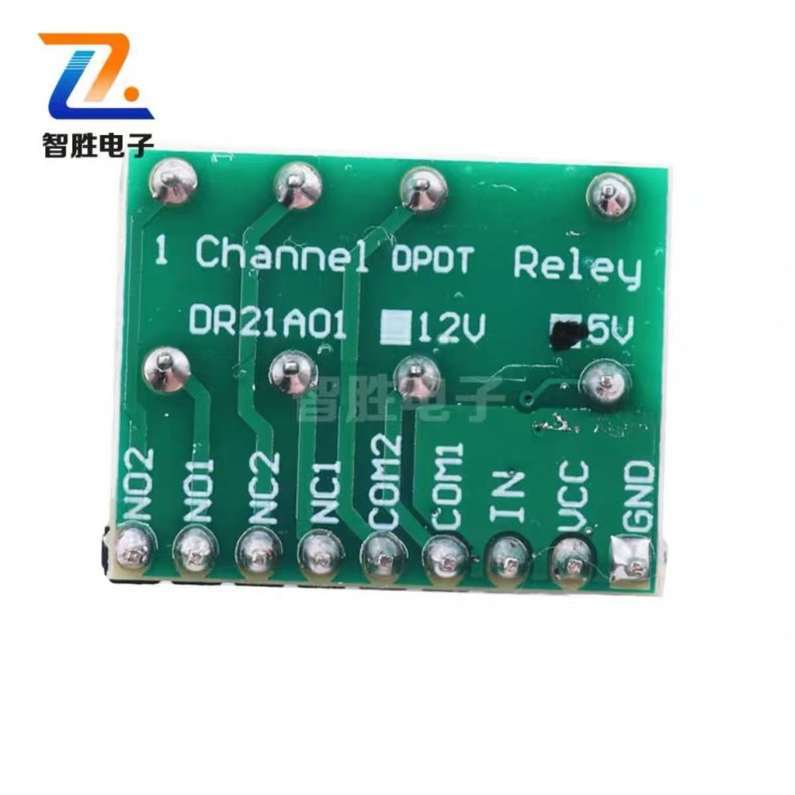
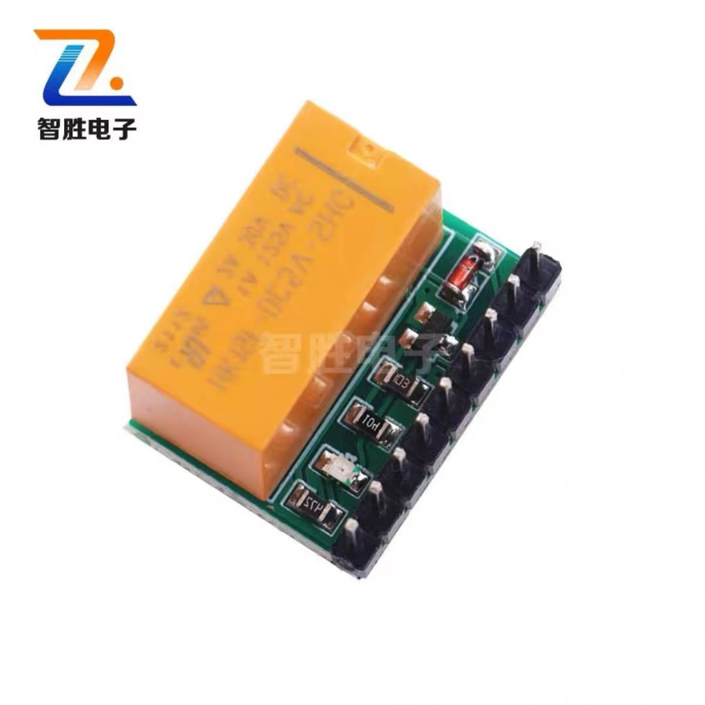

# 原厂面板 / 控制盒继电器旁路落地方案

| 项 | 内容 |
|---|---|
| 文档编号 | DG-HW-004 |
| 日期 | 2026-08-20 |
| 状态 | **方案已选定，真机未接线、固件未实现、未验收** |
| 适用硬件 | YD-ESP32-S3 + 双口 RJ45 + mxtark 控制盒 + 原厂面板 |
| 选定模块 | 智胜电子 DR21A01，**5V** 版，1 路 DPDT，继电器 HK19F |
| 前置文档 | [真机接线清单 B.4](../guides/bringup-checklist.md)、[架构总览](../architecture/overview.md)、[协议逆向笔记](../architecture/protocol-reverse-notes.md) |

本文冻结「不拔网线、把原厂面板切回控制盒直连」的硬件方案。当前 Phase 2 仍是 ESP32 主动中间人；本旁路 **没有** 改变已验收的透传路径。未完成接线与真机门禁前，不得把本节写成已完成。

测试运动时必须有人在桌旁。不要把「继电器吸合了」当成桌子真的动了。

---

## 1. 背景：现在为什么一出问题就要拔网线

Phase 2 把原厂四线 RJ45 拆成两条独立总线，ESP32 做主动中间人：

| 口 | 接到谁 | ESP32 | 上拉 |
|---|---|---|---|
| 左口 | 原厂控制盒 | GPIO4 = CLK，GPIO5 = DAT | 左口已焊两只 `2 kΩ`（红→白、红→黑） |
| 右口 | 原厂控制面板 | GPIO6 = CLK，GPIO7 = DAT | 面板板载约 `1.99 kΩ`，右口不再补 |

红线（控制盒 3.3V）和绿线（GND）左右口已经跳在一起，只给面板和上拉供电，**不得**接到 ESP32 `3V3`。ESP32 继续 USB 独立供电，与桌子共地。

这是产品路径：面板按键进 `desk_core`，和 Web / BLE / Watch 一起仲裁，只有左口 GPIO4/5 向控制盒发令。童锁、断线 STOP、面板优先都依赖这条中间人。

代价是：ESP32 死机、烧录、欠压或你想临时回到原厂行为时，必须把控制盒网线从左口拔出、插到面板上。左口电阻焊死在模块上，不能靠「左右 CLK/DAT 直接短接」冒充原厂直连。

## 2. 需求

在 **不拔两根 RJ45 网线** 的前提下，在两种电气状态之间切换：

| 模式 | 谁跟控制盒说话 | ESP32 四根 GPIO | 典型场景 |
|---|---|---|---|
| **网关** | 只有 ESP32 硬件 Slave `@0x24` | 接到左右口 CLK/DAT | 日常：Web / BLE / 面板透传 |
| **直连旁路** | 只有原厂面板 | 全部离开总线 | ESP32 没电、死机、烧录、排障 |

成功标准：USB 拔掉或 ESP32 挂死时，拨一下机械开关，原厂面板能升、能降、能停。Web 只能当 ESP32 仍活着时的便捷入口，**不能当唯一手段**。

直连模式下童锁、仲裁、ToF 上升保护全部失效，这是回到原厂，属于预期。

## 3. 为什么不能把左右口 CLK/DAT 直接短接

[接线清单 B.4](../guides/bringup-checklist.md) 明确禁止左 pin2↔右 pin2、左 pin4↔右 pin4。短接会同时出现：

1. 控制盒（Master）、原厂 TM1650（Slave `@0x24` / `0x34–0x37`）、ESP32 硬件 Slave `@0x24` 抢应答。
2. 控制盒与 GPIO6/7 软件代理抢时钟。
3. 左口 `2 kΩ` 与面板上拉并联成约 `1 kΩ`（9.6 kHz 通常还能工作，但这是次要问题）。

所以开关要做的不是「多并一根线」，而是 **四刀、先断后接**：左 CLK、左 DAT、右 CLK、右 DAT 全部离开 ESP32，再把左右 CLK、左右 DAT 分别连在一起。红 / 绿保持常通。

左口两只 `2 kΩ` **不拆**。直连时它们会留在合并后的总线上，与面板上拉并联成约 `1 kΩ`；拉低电流约 3.3 mA，9.6 kHz 可先真机试。只有波形或按键异常，再把电阻改焊到继电器的 ESP32 侧（NO 脚）。

## 4. 选定方案：两块 5V DPDT 信号继电器 + 机械切断线圈

方案 C：继电器断电常闭 = 直连旁路；吸合 = 网关。USB 掉电自动回到原厂。ESP32 GPIO 卡在高电平时，用钮子开关切断模块 `VCC`。

不选「只靠 ESP32 供电、没有机械旁路的模拟开关」：那正好在 ESP32 挂掉时切不回去。

### 4.1 已确认模块

智胜电子 **DR21A01**，1 路双刀双掷，**必须买 5V 版（两块，建议三块含备用）**。12V 版开发板供不起。

选购规格（高电平 2.4–24V 触发，ESP32 3.3V GPIO 可直接打 `IN`；吸合约 35 mA @ 5V）：



脚位（9 个焊盘，少了 NC/NO 就退货）：



继电器本体是 **HK19F** 类 2A 信号继电器，不是松乐 10A 功率继电器：



| 项 | 值 | 对本方案 |
|---|---|---|
| 型号 | DR21A01 | 1 路 DPDT，一块切一对 CLK 或一对 DAT |
| 线圈 | DC **5V**（丝印 5V 点选） | 两块吸合约 70 mA，走 USB 5V |
| 触发 | 0–0.6V 不吸合；2.4–24V 吸合 | GPIO 3.3V 直接接 `IN`；0.6–2.4V 是不确定区，禁止悬空 |
| 负载 | 1A 125VAC / 2A 30VDC | 总线是 3.3V 毫安级，余量足够 |
| 板上电路 | 三极管 + 续流二极管 + 指示灯 | 不必再买 S8050 / 1N4148 |
| 常闭 NC | 线圈断电时 COM↔NC | 直连旁路 |
| 常开 NO | 线圈吸合时 COM↔NO | 接到 ESP32 GPIO |

### 4.2 还要买的

| 数量 | 零件 | 用途 |
|---|---|---|
| 2（建议 3） | DR21A01 **5V** | CLK 一块、DAT 一块 |
| 1 | MTS-102 钮子开关（ON-ON） | 串在两块模块的 `VCC` 上，强制直连 |
| 1 | 10 kΩ 直插电阻 | 两块 `IN` 下拉到 GND，没固件 / 复位时默认直连 |
| 若干 | 杜邦线、螺钉端子或洞洞板 | 插在现有飞线中间，不要改 RJ45 模块焊点 |

不要买松乐 SRD 功率继电器模块、固态继电器、或只有 2 路单刀的模块。

## 5. 接线（改现有四根飞线，不改左右口短接）

红 / 绿左右口跳线 **保持不动**，不要进继电器。左口 `2 kΩ` **保持不动**。

把现在这四根线从「RJ45 模块 → ESP32」中间切开，插入两块 DR21A01：

| 现在的飞线 | 改接到 |
|---|---|
| 左口白 / CLK → GPIO4 | 左口 CLK → CLK 模块 COM1；GPIO4 → CLK 模块 NO1 |
| 右口白 / CLK → GPIO6 | 右口 CLK → CLK 模块 COM2；GPIO6 → CLK 模块 NO2 |
| 左口黑 / DAT → GPIO5 | 左口 DAT → DAT 模块 COM1；GPIO5 → DAT 模块 NO1 |
| 右口黑 / DAT → GPIO7 | 右口 DAT → DAT 模块 COM2；GPIO7 → DAT 模块 NO2 |

**CLK 模块**

| 脚 | 接什么 |
|---|---|
| COM1 | 左口 CLK（控制盒白线） |
| COM2 | 右口 CLK（面板白线） |
| NO1 | ESP32 **GPIO4** |
| NO2 | ESP32 **GPIO6** |
| NC1 | 与 NC2 **短接** |
| NC2 | 与 NC1 短接 |
| IN | 与 DAT 模块 IN 并联，经 10 kΩ 下拉到 GND；以后固件用 **GPIO9** |
| VCC | 两块并联，先过 MTS-102，再接开发板 **5V** |
| GND | ESP32 GND（已与桌子共地） |

**DAT 模块**：COM1=左口 DAT，COM2=右口 DAT，NO1=GPIO5，NO2=GPIO7，NC1 短接 NC2。`IN` / `VCC` / `GND` 与 CLK 模块并联。

```text
断电 / GPIO9 低 / MTS-102 切断 VCC  →  直连旁路
  控制盒 CLK ── COM1 ── NC1 ── NC2 ── COM2 ── 面板 CLK    GPIO4、GPIO6 悬空
  控制盒 DAT ── COM1 ── NC1 ── NC2 ── COM2 ── 面板 DAT    GPIO5、GPIO7 悬空

GPIO9 高 且 MTS-102 接通 5V  →  网关
  控制盒 CLK ── COM1 ── NO1 ── GPIO4
  面板   CLK ── COM2 ── NO2 ── GPIO6
  控制盒 DAT ── COM1 ── NO1 ── GPIO5
  面板   DAT ── COM2 ── NO2 ── GPIO7
```

不要用「COM 接控制盒、NC 接面板、NO 接 ESP32」那种一刀接法。那样 GPIO6/7 仍留在总线上，软件 Master 没有离开。

### 5.1 5V 从哪来

YD-ESP32-S3 排针 `5V` 出厂不通，需要短接板背 `IN-OUT`，或从 USB 的 5V 取电。MAX98357A 若已按固件 README 要 5V，多半已经短接过。

- 可以：USB 5V、短接 `IN-OUT` 后的 `5V` 排针
- 禁止：桌子 RJ45 红线 3.3V、ESP32 `3V3` 给 5V 线圈、把红线接到 ESP32 `3V3`

GPIO9 不是 ToF XSHUT（那是 GPIO12/13），也不是功放 `SD`（GPIO17）、板载 RGB（GPIO48）、N16R8 内部脚（GPIO35–37）。

## 6. 行为约束

1. 先断后接：继电器本身是 break-before-make。两块必须同一 `IN`、同一 `VCC`，避免一只吸合、另一只还没吸。
2. 运动中不要拨 MTS-102、不要让 Web 切模式。能操作时先 STOP，再切。
3. 上电默认直连（`IN` 下拉）。固件以后若要进入网关：先把 I²C Slave 和面板代理准备好并输出空闲键 `0x2E`，再把 GPIO9 拉高。这样 ESP32 启动的几秒内，原厂面板仍能控桌。
4. 直连时产品高度、童锁、Web/BLE 控桌都不再经过总线。ToF / OLED 若仍有电，只是显示，不能挡原厂面板。

## 7. 分阶段落地

### 第一期（本文范围）：只加硬件，固件不改

现有固件假设 GPIO4–7 一直接在总线上。第一期把 `IN` 保持低（或先不接 GPIO9），用 MTS-102 只做两档：

- 开关切断 `VCC`：直连，原厂面板控桌（验证旁路）
- 开关接通 `VCC` 且把 `IN` 临时接到 3.3V：继电器吸合，回到现在的网关接线（验证没接错 NO）

第一期 **不** 改 `desk_core`、不增加 REST、不改 Web。GPIO9 飞线可以先空着，只靠下拉。

### 第二期（硬件第一期真机通过后再做）：GPIO9 + Web

固件拉高 GPIO9 = 请求网关；拉低 = 请求直连。REST 仅局域网、现有 Bearer。切到直连前必须 `desk_core` STOP。MTS-102 仍然优先：切断 `VCC` 后 GPIO9 无效。

第二期未实现前，不要在 [REST API](../guides/rest-api.md) 或 [控桌方式](../guides/control-methods.md) 里写「Web 切换旁路」。

## 8. 真机门禁（未执行）

有人在桌旁。断电焊接，通电前用万用表。

### 8.1 断电导通

- [ ] 两块都是 DR21A01 **5V**，各有 9 个脚
- [ ] CLK 模块 NC1↔NC2 接近 `0 Ω`；DAT 模块同样
- [ ] MTS-102 切断时，模块 `VCC` 到开发板 5V 不导通
- [ ] 左口 pin2 ↔ 右口 pin2：继电器未吸合时应导通（经 NC）；GPIO4/6 与左/右 CLK 不导通
- [ ] 左口 pin4 ↔ 右口 pin4：同上，对应 DAT / GPIO5/7
- [ ] 红线仍不接到 ESP32 `3V3`；GPIO4 与 GPIO6 在未吸合时不短路到对方的 NO

### 8.2 直连（`VCC` 断开或 `IN` 低）

- [ ] 原厂面板能下降、松开即停
- [ ] 原厂面板能上升、松开即停
- [ ] Web / BLE 不能带动桌子（ESP32 已离开总线；若 ESP32 仍通电，页面可能还在刷 ToF，这不表示它在控桌）
- [ ] 拔 ESP32 USB 后面板仍能升降

### 8.3 网关（`VCC` 接通且 `IN` 高）

- [ ] 启动日志仍见 `I2C slave @0x24 SCL=4 SDA=5` 与面板代理 `SCL=6 SDA=7`
- [ ] 原厂面板短行程、松开停止，与 B.4.2 一致
- [ ] Web 按住升/降、松手停止
- [ ] 童锁 ON 时面板和 Web 都不能启动运动，STOP 有效
- [ ] 运动中拔右口网线，桌子停止（仍是中间人，不是直连）

未勾选的项 = 无证据，不要抄进状态文档的「已完成」。

## 9. 明确不做什么

- 不拆左口 `2 kΩ`（第一期）
- 不把左右口 CLK/DAT 焊死短接
- 不把旁路当成 V1 已交付能力
- 不在 Driver 里为直连模式伪造键码；直连时 ESP32 不在总线上
- 原厂档位 2 / 3 与「上+下约 5 秒重置」仍未验收，与本旁路无关
